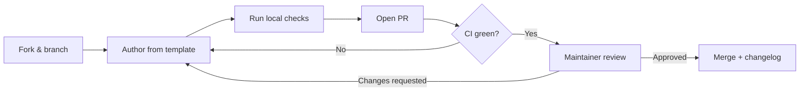

# Contributing to awesome-ai-runbooks

Thank you for helping build the definitive open library of AI agent runbooks!
This guide explains how to propose, author, and submit high-quality
contributions. Contributions of all sizes are welcome — from fixing a typo to
authoring a brand-new runbook.

## Table of contents

- [Ways to contribute](#ways-to-contribute)
- [Before you start](#before-you-start)
- [Authoring a new runbook](#authoring-a-new-runbook)
- [Quality bar](#quality-bar)
- [Local validation](#local-validation)
- [Commit & PR conventions](#commit--pr-conventions)
- [Review process](#review-process)
- [Style guide](#style-guide)
- [Code of Conduct](#code-of-conduct)

## Ways to contribute

- **Author a runbook** for an uncovered scenario (see the roadmap).
- **Improve an existing runbook** — deepen analysis, add diagrams, fix commands.
- **Add or refine prompts** in `prompts/`.
- **Improve tooling** in `scripts/` or CI in `.github/workflows/`.
- **Report issues** using the issue templates.

## Before you start

1. Check the [ROADMAP](./docs/planning/ROADMAP.md) and open issues to avoid
   duplicate work.
2. For a substantial addition, open an issue first to align on scope.
3. Read the [Runbook Specification](./templates/runbook-template.md) and the
   [AI Agent Standards](./docs/AI_AGENT_STANDARDS.md).

## Authoring a new runbook

1. Pick the correct category folder under `runbooks/` (create one only if no
   existing category fits, and explain why in your PR).
2. Copy the template:

   ```bash
   cp templates/runbook-template.md runbooks/<category>/<runbook-name>.md
   ```

3. Fill in **every** section and the YAML front matter. Do not delete headings.
4. Keep the `id` in front matter identical to the filename (without `.md`).
5. Run the validators locally (below) until they pass.

### Naming conventions

- Files: `kebab-case.md` (e.g. `redis-performance-diagnostics.md`).
- IDs: match the filename.
- Categories: lowercase, hyphenated (e.g. `cloud-cost`).

## Quality bar

Every runbook must:

- [ ] Contain all required sections from the template, in order.
- [ ] Include valid YAML front matter with all required keys.
- [ ] Be **≥ 1000 words** of real, specific content — no placeholders, no
      `TODO`, no filler.
- [ ] Include **at least two Mermaid diagrams** (Investigation Workflow and a
      Decision Tree).
- [ ] Provide concrete, runnable commands in fenced code blocks with language
      tags.
- [ ] Include action checklists, at least one table, and an example report
      excerpt.
- [ ] Follow least-privilege access and include a real Rollback Strategy and
      Escalation Process.
- [ ] Be vendor-neutral across the `supported_agents` it lists.

See [`docs/QUALITY_ASSURANCE.md`](./docs/QUALITY_ASSURANCE.md) for the full
scoring rubric. PRs are scored automatically in CI.

## Local validation

Requires Python 3.10+ and Node 18+ (for markdown lint / link checks).

```bash
# Python validators (structure, front matter, completeness scoring)
python scripts/validate_runbooks.py
python scripts/validate_structure.py
python scripts/score_repository.py
python scripts/check_links.py
python scripts/doc_coverage.py

# Markdown lint (Node)
npx --yes markdownlint-cli2 "**/*.md"
```

A convenience wrapper runs everything:

```bash
python scripts/run_all_checks.py
```

## Commit & PR conventions

- Use clear, imperative commit messages (Conventional Commits encouraged:
  `feat:`, `fix:`, `docs:`, `chore:`).
- One logical change per PR where possible.
- Fill out the PR template checklist.
- Ensure CI is green before requesting review.

## Review process

1. Automated checks run on every PR (structure, lint, links, scoring).
2. At least one maintainer reviews for technical accuracy and depth.
3. Runbooks touching security or high-risk operations get a second review.
4. On merge, `CHANGELOG.md` is updated (maintainers may batch this).



## Style guide

- ATX-style headings (`#`, `##`); one H1 per file.
- Blank lines around headings, lists, tables, and code fences.
- Language tags on all code fences (for example `bash`, `sql`, `yaml`, `mermaid`).
- Prefer tables for structured data; prefer checklists for actions.
- Wrap prose at a reasonable width; do not hard-wrap tables.
- American English spelling for consistency.
- Never include real secrets, credentials, or customer data.

## Code of Conduct

By participating you agree to abide by our
[Code of Conduct](./CODE_OF_CONDUCT.md).
