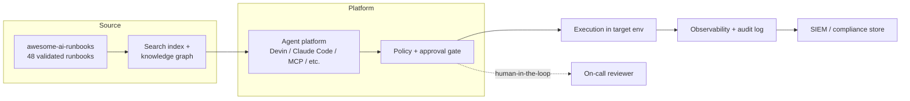

# Enterprise Adoption Guide

> A decision-maker and platform-team playbook for adopting `awesome-ai-runbooks`
> in production. This guide covers the business case, ROI, a 30/60/90-day
> rollout, integration architecture, procurement due diligence, TCO, staged
> autonomy, success metrics, and an FAQ.

This is an **adoption playbook**, not a governance manual. For governance
internals — private/overlay runbooks, approval workflows, audit logging, and
human-in-the-loop patterns — read
[`ENTERPRISE_GUIDE.md`](./ENTERPRISE_GUIDE.md). For platform-specific setup, see
[`docs/integrations/`](./docs/integrations/).

## 1. Executive summary

`awesome-ai-runbooks` provides 48 validated, agent-executable runbooks across 11
operational domains (reliability, security, migrations, databases, ai-ml,
kubernetes, cloud-cost, observability, messaging, architecture, cicd). Each is
schema-validated, scored (composite quality 99.1/100), and portable across 10
agent platforms. Adopting them lets your teams standardize incident response for
autonomous agents without building a runbook program from scratch.

## 2. Business case and ROI

The value is measured against three cost centers: incident duration, audit
effort, and operational toil.

- **Faster MTTR.** Agent-native runbooks encode diagnosis and remediation steps
  that an agent executes immediately, removing the "who knows this system"
  delay. Even a 20–30% reduction in mean time to resolution on common incidents
  is material for revenue-bearing services.
- **Consistent, auditable operations.** Every runbook is structured and
  validated, so responses are repeatable and each execution produces the same
  evidence trail — turning audit prep from a scramble into a query.
- **Reduced toil.** 48 ready runbooks displace bespoke, tribal procedures, and
  the scaffolder/generator under `tools/` makes new ones cheap to add.
- **Lower onboarding cost.** New engineers and new agents inherit
  reference-standard procedures (44 of 48 runbooks at maturity Level 5) instead
  of undocumented know-how.

A simple ROI model: `annual value = (incidents/yr x MTTR reduction x cost/min) +
(audit hours saved x loaded rate) + (toil hours reclaimed x loaded rate)`. For
most platform orgs the first term alone dwarfs adoption cost, which is near-zero
given the MIT license.

## 3. Integration architecture

Runbooks are consumed by your agent platform and gated by your existing
controls. A typical deployment:

Runbooks can be vendored into an internal fork, pulled at runtime via an MCP
server, or synced into your agent's context. Overlay private runbooks on top of
the public set as described in [`ENTERPRISE_GUIDE.md`](./ENTERPRISE_GUIDE.md).

## 4. 30/60/90-day rollout

- **Days 0–30 — Evaluate and pilot.** Fork or vendor the repo. Select one
  low-risk domain (e.g. observability or cloud-cost). Wire one agent platform
  using [`docs/integrations/`](./docs/integrations/). Run runbooks in read-only
  advisory mode. Baseline your MTTR and toil metrics.
- **Days 31–60 — Gated production.** Enable gated actions (human approves each
  step) on two or three domains. Integrate audit logging into your SIEM. Add
  your first two internal overlay runbooks with the scaffolder.
- **Days 61–90 — Scale and measure.** Expand to bounded autonomy on proven
  low-risk runbooks. Publish the success-metrics dashboard. Establish an
  internal review board using [`REVIEW_GUIDE.md`](./REVIEW_GUIDE.md) as a
  template. Decide on org-wide rollout.

## 5. Staged autonomy rollout

Never start agents on production-mutating work. Earn trust in stages:

1. **Read-only advisory** — agent proposes; humans act.
2. **Gated actions** — human approves each mutating step.
3. **Bounded autonomy** — pre-authorized, low-risk, reversible actions run
   unattended within guardrails.
4. **Supervised autonomy** — audited with sampled human review.
5. **Managed autonomy** — policy-enforced, exception-based review only.

Progression is per-runbook and per-domain, gated by observed success rates and
your risk appetite. Governance mechanics live in
[`ENTERPRISE_GUIDE.md`](./ENTERPRISE_GUIDE.md).

## 6. Procurement and security due diligence

A checklist for security, legal, and procurement reviewers:

- [ ] **License**: MIT (`LICENSE`) — permissive, no copyleft obligations.
- [ ] **Security policy**: disclosure process documented in `SECURITY.md`.
- [ ] **Security maturity**: 91/100, Level 4 (Measured); artifacts in
      [`security/`](./security/).
- [ ] **Supply chain**: dependency-review workflow + dependency scanner; pin and
      mirror into your internal registry.
- [ ] **Secret hygiene**: secret scanner in CI; runbooks contain no credentials.
- [ ] **Provenance**: verify commit history and CODEOWNERS review controls.
- [ ] **Quality evidence**: 1016 automated tests, composite quality 99.1/100 —
      see [`docs/QUALITY_ASSURANCE.md`](./docs/QUALITY_ASSURANCE.md).
- [ ] **Data handling**: runbooks are static content; no telemetry leaves your
      environment unless you configure it.
- [ ] **Standards alignment**: review
      [`docs/AI_AGENT_STANDARDS.md`](./docs/AI_AGENT_STANDARDS.md).

## 7. Total cost of ownership

| Cost element | Notes |
| --- | --- |
| License | $0 — MIT |
| Integration | One-time platform wiring per agent (days, not weeks) |
| Maintenance | Sync upstream; maintain internal overlay runbooks |
| Governance | Review board time; approval-gate operation |
| Tooling | Reuse CI patterns (10 workflows) and validators in `tools/` |
| Training | Low — reference-standard runbooks are self-documenting |

TCO is dominated by internal integration and governance labor, not licensing.
Reusing the repo's automation (schema validation, quality engine, scoring)
avoids building an equivalent internal program.

## 8. Success metrics and KPIs

| KPI | Baseline | 90-day target |
| --- | --- | --- |
| MTTR on covered incidents | Current | -25% |
| Runbook coverage of top incidents | Ad hoc | 80% |
| Agent runbook success rate | N/A | >90% at gated stage |
| Audit evidence prep time | Current | -50% |
| Toil hours reclaimed / month | Current | +40 hrs |
| Internal overlay runbooks | 0 | 5+ |

## 9. RACI

| Activity | Platform team | SRE / On-call | Security | Eng leadership |
| --- | --- | --- | --- | --- |
| Platform integration | R/A | C | C | I |
| Runbook selection | A | R | C | I |
| Approval-gate operation | C | R | A | I |
| Security due diligence | C | I | R/A | I |
| Autonomy stage decisions | C | C | C | R/A |
| Success-metrics reporting | R | C | I | A |

## 10. FAQ

- **How is this different from `ENTERPRISE_GUIDE.md`?** That document is the
  governance manual (private runbooks, audit logging, HITL). This guide is the
  buyer/adopter rollout playbook.
- **Do we have to use a specific agent platform?** No. Runbooks are portable
  across all 10 supported platforms; see [`docs/integrations/`](./docs/integrations/).
- **Can we keep proprietary runbooks private?** Yes — use overlay runbooks; the
  public set never needs your internal content.
- **Is it production-ready?** The library is at maturity Level 4–5 with 99.1/100
  composite quality and 1016 tests; production readiness of *actions* depends on
  your chosen autonomy stage.
- **What does it cost?** The content is MIT-licensed and free; cost is your
  integration and governance labor.

For governance depth continue to [`ENTERPRISE_GUIDE.md`](./ENTERPRISE_GUIDE.md);
for platform setup start in [`docs/integrations/`](./docs/integrations/).
