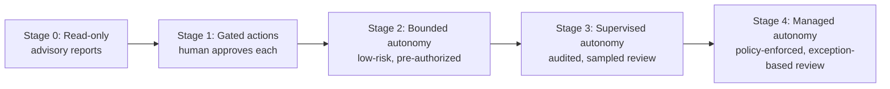
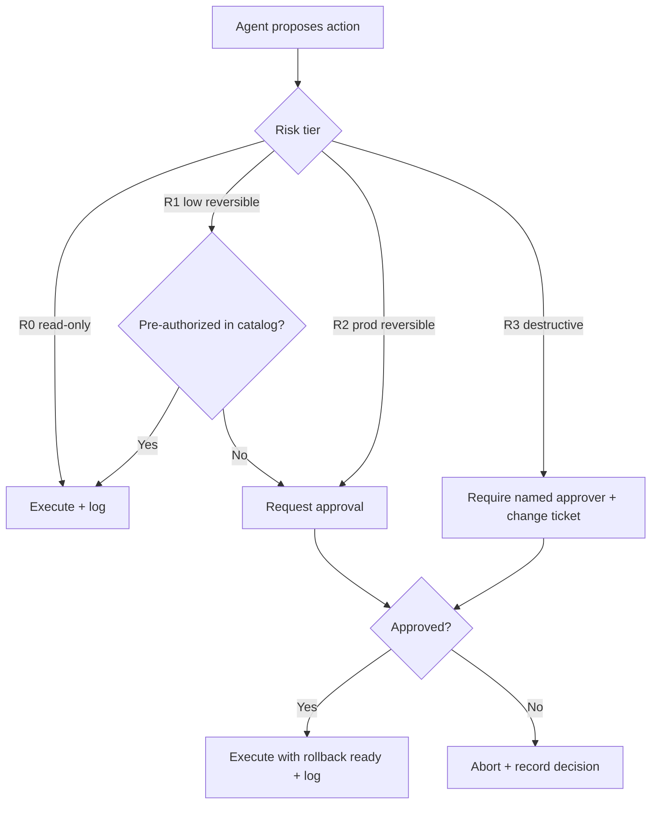
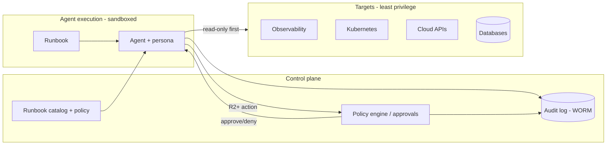

# Enterprise Adoption & Governance Guide

> How to adopt `awesome-ai-runbooks` safely and at scale inside an enterprise —
> covering internal adoption, private runbooks, governance, security reviews,
> compliance, agent oversight, audit logging, approval workflows, and
> human-in-the-loop patterns.

This guide is written for platform, security, SRE, and engineering-leadership
teams introducing autonomous agents into regulated or high-stakes environments.
It complements [`docs/AI_AGENT_STANDARDS.md`](./docs/AI_AGENT_STANDARDS.md) and
[`docs/QUALITY_ASSURANCE.md`](./docs/QUALITY_ASSURANCE.md).

## Contents

1. [Adoption model](#1-adoption-model)
2. [Internal adoption](#2-internal-adoption)
3. [Private & overlay runbooks](#3-private--overlay-runbooks)
4. [Governance](#4-governance)
5. [Security reviews](#5-security-reviews)
6. [Compliance](#6-compliance)
7. [Agent oversight](#7-agent-oversight)
8. [Audit logging](#8-audit-logging)
9. [Approval workflows](#9-approval-workflows)
10. [Human-in-the-loop patterns](#10-human-in-the-loop-patterns)
11. [Reference architecture](#11-reference-architecture)
12. [Adoption checklist](#12-adoption-checklist)

---

## 1. Adoption model

Adopt in graduated stages of autonomy. Do not start agents on production-mutating
work; earn trust with read-only value first.



| Stage | Agent may | Human role | Typical risk tier |
|-------|-----------|------------|-------------------|
| 0 | Investigate & report | Consume reports | R0 |
| 1 | Propose changes | Approve each action | R0–R1 |
| 2 | Execute pre-authorized low-risk actions | Review after | R1 |
| 3 | Execute within policy; escalate exceptions | Sample + exception review | R1–R2 |
| 4 | Operate within guardrails | Govern policy, review exceptions | R2 (gated R3) |

Advance a runbook to the next stage only after it meets its metrics (accuracy,
zero unsafe actions) over a defined observation window.

## 2. Internal adoption

1. **Fork or vendor** this repository into an internal `agent-runbooks` repo.
2. **Pin a release** (tag/commit) so agent behavior is reproducible and
   auditable; upgrade deliberately via PR.
3. **Curate a catalog** of approved runbooks per team/domain; disable the rest.
4. **Bind personas** from [`prompts/`](./prompts) to your agent platform's system
   prompt.
5. **Wire least-privilege credentials** per runbook `required_access`.
6. **Publish golden paths**: "To do X, point your agent at runbook Y with
   inputs Z."
7. **Measure** adoption and outcomes (see metrics below) and iterate.

## 3. Private & overlay runbooks

Keep public runbooks upstream and layer private ones on top without forking
divergence.

```text
internal-agent-runbooks/
├── upstream/            # git subtree/submodule of awesome-ai-runbooks (read-only)
├── runbooks/            # your private, company-specific runbooks
│   └── payments/refund-anomaly-triage.md
├── overlays/            # patches/extensions to upstream runbooks
│   └── postgresql-optimization.company.md
└── catalog.yaml         # which runbooks are approved + at which autonomy stage
```

- Author private runbooks from the same [`template`](./templates/runbook-template.md)
  and run the same validators in your internal CI.
- Never place secrets, hostnames, or customer data in runbooks — reference a
  secrets manager and use placeholders.
- Use `overlays/` for company-specific steps (naming conventions, internal
  tools) so upstream updates merge cleanly.

## 4. Governance

Establish a lightweight but explicit governance function.

| Governance element | Recommendation |
|--------------------|----------------|
| Ownership | Each runbook has an owner team (`owner` front-matter). |
| Approval authority | Define who can promote a runbook to each autonomy stage. |
| Change control | Runbook changes go through PR + review, like code. |
| Risk register | Track high/critical runbooks and their controls. |
| Review cadence | Re-review runbooks on a schedule (`last_reviewed`). |
| Policy as code | Encode which agents may run which runbooks in `catalog.yaml`. |

Create an **Agent Operations Review Board** (platform + security + SRE) that
approves new runbooks, autonomy promotions, and post-incident changes.

## 5. Security reviews

- Every runbook in `runbooks/security/` and any `risk_level: high|critical`
  runbook requires a **second security review** before approval.
- Enforce least privilege: issue scoped, short-lived credentials per run; never
  reuse a broad "agent admin" role.
- Sandbox agent execution (isolated network egress, no lateral access) and log
  all tool invocations.
- Red-team agent prompts for **prompt injection** and tool abuse before
  production (see the `ai-system-security-review` runbook).
- Treat runbook content as an attack surface: a malicious runbook could instruct
  an agent to act badly. Review runbook diffs like privileged code.

## 6. Compliance

Map agent operations to your control framework. Common mappings:

| Framework | Where agents intersect | Control this guide provides |
|-----------|------------------------|-----------------------------|
| SOC 2 | Change management, logical access, monitoring | Approval workflows, audit logs, least privilege |
| ISO 27001 | A.9 access control, A.12 operations | Scoped creds, change control, logging |
| NIST AI RMF | Govern/Map/Measure/Manage | Standards, risk scoring, agent evaluation |
| PCI DSS | Change control, least privilege (if in CDE) | Gated actions, audit trail, segregation |

Retain agent reports and audit logs per your data-retention policy. Ensure the
agent's data handling respects residency and PII rules — runbooks must not
instruct agents to move regulated data across boundaries.

## 7. Agent oversight

Continuously monitor agent behavior, not just outcomes.

- **Trajectory logging:** capture the plan, each tool call, inputs/outputs, and
  the final report per run.
- **Guardrail metrics:** unsafe-action attempts blocked, escalations raised,
  approvals requested vs granted.
- **Quality metrics:** finding accuracy, false-positive rate, rework rate.
- **Drift detection:** alert when an agent's action distribution changes after a
  model or prompt update.
- **Kill switch:** a single control to pause all autonomous execution.

## 8. Audit logging

Every autonomous run should emit a tamper-evident audit record.

```json
{
  "run_id": "2026-08-13T14:02:11Z-checkout-rca-7f3a",
  "runbook_id": "root-cause-analysis",
  "runbook_version": "1.0.0",
  "agent": "devin",
  "actor": "svc-agent-sre",
  "environment": "prod",
  "risk_tier_max": "R2",
  "plan_approved_by": "oncall-lead@corp",
  "actions": [
    {"ts": "…", "type": "read", "tool": "prometheus_query", "target": "checkout-api"},
    {"ts": "…", "type": "mutate", "tool": "kubectl_rollout_restart", "approved_by": "oncall-lead@corp", "rollback": "kubectl rollout undo …"}
  ],
  "escalations": [],
  "report_uri": "s3://agent-audit/…/report.md",
  "outcome": "complete"
}
```

Requirements:

- Immutable, centralized storage (WORM/append-only), retained per policy.
- Every **mutating** action records who approved it and the rollback used.
- Logs are queryable for incident review and compliance evidence.

## 9. Approval workflows

Gate actions by risk tier (see [Standards §8](./docs/AI_AGENT_STANDARDS.md#8-risk-framework)).



Implement approvals via your existing tooling (ChatOps approve/deny, PR review,
change-management ticket). Approvals must be **specific to the action**, not a
blanket grant, and must expire.

## 10. Human-in-the-loop patterns

| Pattern | When to use | How |
|---------|-------------|-----|
| **Plan approval** | High-risk runbooks | Agent submits plan; human approves before any action |
| **Action gate** | Individual R2/R3 steps | Human approves each mutating step |
| **Checkpoint review** | Long migrations | Human reviews at phase boundaries |
| **Confidence gate** | Ambiguous findings | Escalate when confidence < threshold |
| **Sampled review** | Mature, low-risk runbooks | Human reviews a % of runs |
| **Four-eyes** | Destructive/critical | Two humans approve independently |

Design gates to be **fast** (don't reintroduce the toil agents remove) and
**meaningful** (the human sees plan, evidence, and rollback, not just a yes/no).

## 11. Reference architecture



Principles: sandbox execution, scoped short-lived credentials, policy-enforced
approvals, and a centralized immutable audit trail.

## 12. Adoption checklist

- [ ] Repo forked/vendored and pinned to a release.
- [ ] Approved runbook catalog defined with autonomy stages.
- [ ] Personas bound to the agent platform.
- [ ] Least-privilege, short-lived credentials per runbook.
- [ ] Sandboxed execution with egress controls.
- [ ] Approval workflow wired for R2/R3 actions.
- [ ] Immutable audit logging in place.
- [ ] Guardrail + quality metrics dashboards live.
- [ ] Kill switch tested.
- [ ] Security review completed for security/high-risk runbooks.
- [ ] Compliance mappings documented.
- [ ] Governance/review board and cadence established.
