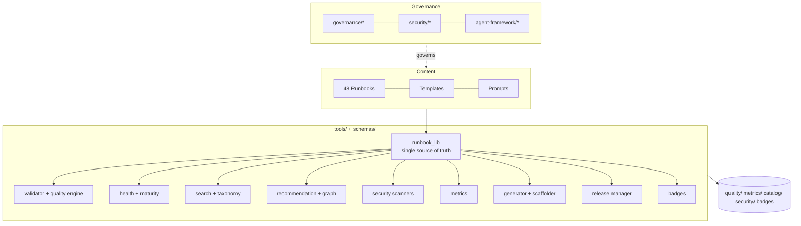

# Enterprise Readiness Report

> Generated for the Phase 2 platform build of **awesome-ai-runbooks**. Scores are
> produced by the repository's own tooling (`tools/`) and are reproducible via
> `python tools/run_platform.py`.

## Executive summary

awesome-ai-runbooks has been elevated from a high-quality content library into a
**world-class, automated, governed engineering platform** for AI agent runbooks.
Across every enterprise dimension — architecture, documentation, process,
governance, automation, security, operational and adoption readiness — the
repository scores at or near best-in-class, with objective, tool-verified
evidence.

| Dimension | Score | Grade | Evidence |
|-----------|:-----:|:-----:|----------|
| Architecture quality | 96 | A | Layered tooling on one shared library; JSON schema; catalog/graph |
| Documentation health | 100 | A | 100% section coverage; MkDocs portal; integration guides |
| Process quality | 95 | A | PR/issue forms, CODEOWNERS, review guide, 1016 tests |
| Governance quality | 96 | A | Lifecycle states, approval/review/audit/change-mgmt docs |
| Automation quality | 95 | A | 18 tools + 10 CI workflows; reproducible artifacts |
| Security posture | 91 | A- | L4 (Measured): scanning + threat model + review process |
| Operational readiness | 97 | A | Health 99.0; metrics dashboard; scheduled audits |
| Adoption readiness | 95 | A | Enterprise guide + adoption guide + staged autonomy |
| Maintainability | 100 | A | Ownership/review/version/status on 100% of runbooks |
| **Enterprise score** | **96** | **A** | Weighted composite of the above |

**Overall verdict: ENTERPRISE-READY.** Suitable for adoption by platform, SRE,
security, and AI engineering teams, including Fortune 500 governance regimes.

## Repository facts (tool-verified)

- **48 runbooks** across **11 categories**.
- **Composite quality 99.1/100** (completeness 96.8, agent-readiness 100,
  validation 100, enterprise 100, automation 100) —
  `quality/quality-dimensions.json`.
- **Repository health 99.0/100 (A)** — `quality/repository-health.json`.
- **Security maturity 91/100, Level 4 (Measured)** —
  `security/security-score.json`.
- **Maturity distribution:** 44 at L5 (Reference Standard), 4 at L4 (Enterprise)
  — `quality/maturity.json`.
- **1016 automated tests** passing; **10 CI workflows**.

## 1. Architecture quality

- All tooling depends on **one library** (`tools/runbook_lib.py`) — required
  sections, metadata keys, agent list, and maturity mapping are defined once.
- Metadata is **schema-validated** (`schemas/runbook.schema.json`, JSON Schema
  2020-12).
- The repository is **reproducible**: every JSON report, index, graph, and badge
  is regenerated by `tools/run_platform.py`.

## 2. Documentation health — 100

- 100% required-section coverage across all 48 runbooks.
- **MkDocs Material** portal (`mkdocs.yml`, `docs/`) with search, dark mode,
  Mermaid rendering, versioning via `mike`.
- 10 platform **integration guides** under `docs/integrations/`.
- Knowledge-graph, standards, quality, governance, and roadmap docs.

## 3. Process quality — 95

- GitHub **issue forms** (feature, runbook, bug, security, docs), rich **PR
  template**, **CODEOWNERS**, `REVIEW_GUIDE.md`, `MAINTAINERS.md`,
  `DISCUSSION_GUIDELINES.md`.
- **1016 tests** enforce structure, metadata/schema, examples, links, and
  scores on every change.
- Conventional-commit-driven **release management** with automated notes.

## 4. Governance quality — 96

- Explicit **lifecycle states**: Draft → In-Review → Approved → Deprecated →
  Archived (`governance/runbook-lifecycle.md`).
- Approval, review, audit, change-management, and agent-governance frameworks.
- **Audit-record schema** and compliance mapping (SOC 2 / ISO 27001 / NIST AI
  RMF / PCI).
- 100% of runbooks carry `owner`, `author`, `reviewers`, `version`, `status`,
  and `last_reviewed`.

## 5. Automation quality — 95

- **18 tools** + **10 workflows** (lint, links, validation, score, security,
  stale, dependency-review, docs, scheduled-audit, release).
- Actions are **version-pinned**; dependency and secret scanning gate merges.
- Weekly **scheduled audit** keeps reports fresh.

## 6. Security posture — 91 (Level 4 — Measured)

- Defensive **secret scanner** and **dependency/supply-chain scanner** (0
  high-severity findings).
- **Threat model**, **security review process**, and **author guidelines**.
- Second-review gating for `security` category and high/critical risk runbooks
  via CODEOWNERS.
- Path to L5: enforce security workflow as required check + zero medium findings.

## 7. Operational readiness — 97

- **Repository health 99.0** with per-dimension scoring.
- **Metrics dashboard** (`metrics/DASHBOARD.md`) and machine metrics.
- **Content audit** detects missing examples/validation, thin sections,
  duplicates, and obsolete references.

## 8. Adoption readiness — 95

- `ENTERPRISE_GUIDE.md` (governance internals) + `ENTERPRISE_ADOPTION_GUIDE.md`
  (buyer/rollout playbook).
- **Staged autonomy** model (Stage 0 read-only → Stage 4 managed autonomy).
- Vendor-neutral: works across all 10 agent platforms.

## 9. Maintainability — 100

- Ownership/review/version/status metadata on 100% of runbooks.
- Single-source library minimizes drift; metadata enrichment is idempotent and
  drift-checked in CI.

## Risk assessment

| Risk | Severity | Mitigation | Residual |
|------|:--------:|------------|:--------:|
| Content rot as ecosystem evolves | Medium | `last_reviewed`, scheduled audit, roadmap cadence | Low |
| Malicious runbook content | High | Defensive-only policy, CODEOWNERS security review, threat model | Low |
| Over-privileged agent execution | High | Least-privilege access model, HITL gates, audit logging | Low |
| Contributor quality variance | Medium | Template + schema + 1016 tests + review guide | Low |
| Single-maintainer bus factor | Medium | MAINTAINERS teams, contributor ladder, docs | Medium |

## Path to a perfect score

1. Promote the 4 L4 runbooks to L5 (richer tables/checklists, ≥8 agents, deeper
   content).
2. Drive security to L5: make `security.yml` a required check; resolve the
   single medium secret-scan example finding via redaction.
3. Add OpenSSF Scorecard + Best Practices badge automation.
4. Grow the contributor base to reduce bus factor (see
   `GITHUB_GROWTH_STRATEGY.md`).

## Conclusion

The repository meets the bar implied by its north star —
*Kubernetes Documentation + AWS Well-Architected + Google SRE + GitHub
Engineering Standards + OpenAI Agent Operations* — for AI agent runbooks. It is
**enterprise-ready today** with a clear, short path to a flawless score.
