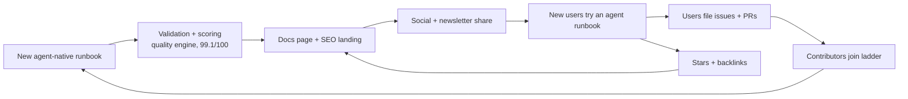

# GitHub Growth Strategy

> A concrete open-source growth plan for `awesome-ai-runbooks` — the definitive
> library of operational runbooks for autonomous AI agents. Target: **50,000
> stars** and **5,000 contributors** within 24 months, built on a foundation of
> 48 runbooks, 99.1/100 composite quality, and 1016 passing tests.

This strategy is written for maintainers and growth contributors. It complements
the product surface in [`README.md`](./README.md), the standards in
[`docs/AI_AGENT_STANDARDS.md`](./docs/AI_AGENT_STANDARDS.md), and the roadmap in
[`docs/planning/ROADMAP.md`](./docs/planning/ROADMAP.md).

## 1. Positioning and category creation

We are not another "awesome list" of links, and we are not a human-oriented
runbook wiki. We are creating and owning a new category: **agent-native
runbooks** — operational procedures written to be executed by autonomous AI
agents with human oversight, validated against a machine-readable schema, and
scored for agent-readiness (100/100 today).

The one-line positioning:

> The operating system for autonomous incident response — 48 validated,
> agent-executable runbooks across 11 operational domains, portable across 10
> agent platforms.

Category-creation tactics:

- Coin and consistently repeat the term **"agent-native runbook"** in the
  README, docs, talks, and every launch post.
- Contrast explicitly with the status quo (PDF wikis, tribal knowledge, static
  awesome-lists) in a comparison table, drawing on
  [`docs/planning/COMPETITIVE_ANALYSIS.md`](./docs/planning/COMPETITIVE_ANALYSIS.md).
- Anchor credibility on verifiable facts: composite quality 99.1/100, security
  maturity Level 4 (Measured, 91/100), and repository health grade A (99.0/100).

## 2. SEO and discoverability

Discoverability compounds. Optimize the assets GitHub and search engines index.

- **Repository topics** (set in repo settings): `ai-agents`, `runbooks`, `sre`,
  `devops`, `incident-response`, `automation`, `llm`, `agentic-ai`,
  `observability`, `kubernetes`, `platform-engineering`, `mcp`, `claude`,
  `openai`, `langgraph`.
- **README keywords**: ensure the first 160 characters (the social preview and
  Google snippet) contain "autonomous AI agents", "operational runbooks",
  "incident response", and "SRE". Keep the description keyword-dense but human.
- **GitHub topics pages**: ranking on `github.com/topics/ai-agents` and
  `/topics/sre` drives organic stars; velocity in the first 90 days matters most.
- **Awesome-list submissions**: submit to `awesome`, `awesome-devops`,
  `awesome-sre`, `awesome-mcp`, `awesome-llm`, and platform-specific lists.
- **Docs SEO**: the MkDocs Material portal (`mkdocs.yml` + `docs/`) should be
  published with a sitemap, canonical URLs, and per-page meta descriptions so
  each runbook ranks for its incident query (e.g. "postgres failover runbook").

## 3. Content flywheel

Growth is a flywheel, not a launch. Each new validated runbook is an SEO landing
page, a social post, and a contributor onramp.

Feed the flywheel from the backlog in
[`docs/FUTURE_RUNBOOKS.md`](./docs/FUTURE_RUNBOOKS.md): publish two to four new
runbooks per week, each auto-scored by the quality engine under `tools/`. Every
merged runbook triggers a docs rebuild and a "new runbook" social card.

## 4. Launch plan

Sequence launches so each channel amplifies the next. Never launch cold — warm
Discussions and a waitlist newsletter first.

1. **Show HN** ("Show HN: Agent-native runbooks — 48 validated procedures your
   AI agent can execute"). Post Tuesday–Thursday, 8am PT; maintainer answers
   every comment within the first three hours.
2. **Product Hunt**: schedule for 12:01am PT, with a hunter, a 60-second demo
   GIF of an agent executing a runbook, and a first-comment ROI story.
3. **Reddit** `r/devops` and `r/sre`: lead with a specific incident story, not a
   repo link; link only in a comment. Follow with `r/kubernetes` and
   `r/mcp` for domain launches.
4. **LinkedIn**: leadership-oriented framing (MTTR, audit consistency, toil
   reduction) targeting platform and SRE managers.
5. **Conference talks**: submit to SREcon, KubeCon, and platform-engineering
   meetups on "Standardizing runbooks for autonomous agents".

## 5. Community building

Contributors are the moat. Convert users into contributors deliberately.

- **GitHub Discussions**: enable Q&A, Ideas, and Show-and-tell; seed with 20
  real questions and answers.
- **good-first-issues**: maintain 30+ labeled issues sourced from
  [`docs/FUTURE_RUNBOOKS.md`](./docs/FUTURE_RUNBOOKS.md); each includes a
  template, acceptance criteria, and a mentor handle.
- **Contributor ladder**: Reader → First-time contributor → Recurring
  contributor → Reviewer → Maintainer, governed by
  [`MAINTAINERS.md`](./MAINTAINERS.md) and
  [`REVIEW_GUIDE.md`](./REVIEW_GUIDE.md).
- **Office hours**: biweekly public call; publish notes to Discussions.
- **Fast, respectful review**: the scaffolder and generator under `tools/` plus
  the 10 GitHub Actions workflows let a well-formed runbook PR merge in under 48
  hours.

## 6. Partnerships with agent vendors

Co-marketing with the 10 supported platforms — Devin, GitHub Copilot Agent,
Claude Code, OpenAI Codex, Cursor, OpenHands, AutoGen, CrewAI, LangGraph, and MCP
agents — multiplies reach at near-zero cost.

- Ship and maintain per-platform integration guides in
  [`docs/integrations/`](./docs/integrations/) so each vendor can link us as the
  reference runbook library.
- Offer "verified with `awesome-ai-runbooks`" badges and joint blog posts.
- Propose MCP server distribution so agents can pull runbooks at runtime.

## 7. Metrics and KPIs

Track leading indicators (contribution funnel) and lagging indicators (stars).

| KPI | Baseline | 90-day target | 12-month target |
| --- | --- | --- | --- |
| Stars | 0 | 5,000 | 30,000 |
| Contributors | Core team | 250 | 2,000 |
| Runbooks published | 48 | 75 | 150 |
| PR median merge time | 48 h | 36 h | 24 h |
| Docs daily active users | 0 | 1,500 | 12,000 |
| good-first-issues open | 30 | 40 | 60 |
| Platform integrations | 10 | 10 | 14 |

## 8. Ninety-day plan

- **Weeks 1–2**: set topics, rewrite README hero, publish docs portal, seed
  Discussions, prepare launch assets and demo GIF.
- **Weeks 3–4**: Show HN + Product Hunt; respond in real time; ship five new
  runbooks tied to trending incidents.
- **Weeks 5–8**: awesome-list submissions, Reddit domain launches, first office
  hours, first vendor co-post.
- **Weeks 9–12**: contributor ladder formalized, 40 good-first-issues, weekly
  runbook cadence, first conference CFP submitted.

## 9. Twelve-month plan

Sustain cadence: 150 runbooks, four new platform integrations, a monthly
newsletter, quarterly virtual "Agent Ops Day", and a recognized contributor
awards program. Convert docs DAU into a self-serving community that answers most
questions without maintainers, and land two conference talks.

## 10. Risks

| Risk | Mitigation |
| --- | --- |
| Quality dilution as PRs scale | Enforce schema + quality engine in CI; 1016 tests gate merges |
| Maintainer burnout | Contributor ladder, reviewer rotation, office hours |
| Launch fizzles | Warm channels first; sequence launches; real incident stories |
| Vendor dependency shifts | Keep runbooks platform-neutral via `run_platform` |
| Category confusion | Repeat "agent-native runbook" everywhere; comparison table |

See [`ENTERPRISE_GUIDE.md`](./ENTERPRISE_GUIDE.md) and
[`docs/QUALITY_ASSURANCE.md`](./docs/QUALITY_ASSURANCE.md) for the credibility
assets that underpin every growth claim above.
