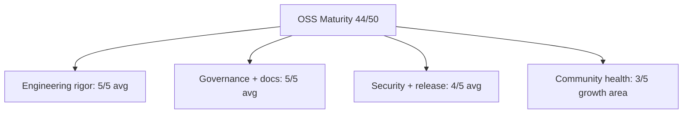

# Open Source Maturity Report

> An independent-style assessment of `awesome-ai-runbooks` against recognized
> open-source health models — CHAOSS community metrics and the OpenSSF Best
> Practices (formerly CII Best Practices) criteria. This report scores ten
> dimensions, assigns an overall maturity level, and lists prioritized gaps.

Assessment inputs: [`README.md`](./README.md),
[`docs/QUALITY_ASSURANCE.md`](./docs/QUALITY_ASSURANCE.md),
[`governance/`](./governance/), [`security/`](./security/), and the tooling
under `tools/`. Verified facts: 48 runbooks across 11 categories, composite
quality 99.1/100, repository health 99.0/100 (grade A), security maturity 91/100
(Level 4, Measured), 1016 automated tests, and 10 GitHub Actions workflows.

## 1. Methodology

We blend two frameworks:

- **CHAOSS** (Community Health Analytics in Open Source Software) for community,
  contribution, and responsiveness signals.
- **OpenSSF Best Practices** for the security, licensing, and engineering-rigor
  baseline expected of a passing-tier project.

Each dimension is scored on a 0–5 scale with concrete evidence. Scores roll up
to a 1–5 maturity level.

## 2. Scorecard

| Dimension | Status | Evidence | Score /5 |
| --- | --- | --- | --- |
| Documentation | Excellent | README, MkDocs Material portal (`mkdocs.yml` + `docs/`), 48 runbooks, per-platform guides in `docs/integrations/` | 5 |
| Licensing | Excellent | MIT license in `LICENSE`; OSI-approved, permissive, clearly stated | 5 |
| Governance | Excellent | Contributor Covenant CoC, `MAINTAINERS.md`, `REVIEW_GUIDE.md`, CODEOWNERS, `governance/` | 5 |
| Contribution process | Excellent | `CONTRIBUTING.md`, issue forms, PR template, scaffolder/generator in `tools/` | 5 |
| CI / automation | Excellent | 10 GitHub Actions workflows; 1016 automated tests; JSON schema validation | 5 |
| Security posture | Strong | `SECURITY.md`, `security/`, secret/dependency scanners, security_score; maturity Level 4 (91/100) | 4 |
| Release management | Strong | `CHANGELOG.md`, release manager + badges under `tools/`, release workflow | 4 |
| Community health | Emerging | Governance ladder defined; Discussions/contributor volume still ramping | 3 |
| Discoverability | Strong | Search (`build_index`/`search_runbooks`) + taxonomy, recommendation engine, knowledge graph | 4 |
| Accessibility | Strong | ATX Markdown, markdownlint config, semantic docs; alt-text/localization maturing | 4 |

Total: 44 / 50.

## 3. Visual summary

A bar-style representation of the scorecard (each block ≈ one point):

```text
Documentation        █████ 5
Licensing            █████ 5
Governance           █████ 5
Contribution         █████ 5
CI / automation      █████ 5
Security posture     ████░ 4
Release management   ████░ 4
Community health     ███░░ 3
Discoverability      ████░ 4
Accessibility        ████░ 4
```



## 4. Overall maturity level

On a 1–5 scale:

1. Ad hoc
2. Managed
3. Defined
4. Measured
5. Optimizing

**Assessed level: 4 — Measured (approaching 5, Optimizing).** The project has
quantified quality (99.1/100 composite), quantified health (99.0/100), and a
measured security program (Level 4). Processes are defined, automated, and
instrumented. The single lever separating it from Level 5 is a self-sustaining
external community — currently the lowest-scoring dimension. This mirrors the
security maturity rating of Level 4 (Measured) reported by `security_score`.

## 5. OpenSSF Best Practices mapping

Mapping to the OpenSSF (passing tier) criteria:

| Criterion | State | Evidence / gap |
| --- | --- | --- |
| Project homepage + description | Passing | README + docs portal state purpose clearly |
| OSI-approved license | Passing | MIT (`LICENSE`) |
| Documentation of use | Passing | Per-runbook docs + `docs/integrations/` |
| Public version-controlled repo | Passing | GitHub, full history |
| Unique version numbering + changelog | Passing | `CHANGELOG.md` + release manager |
| Automated test suite | Passing | 1016 automated tests |
| CI runs tests on changes | Passing | Lint, validation, score workflows (10 total) |
| Vulnerability reporting process | Passing | `SECURITY.md` with disclosure path |
| Dependency review | Passing | `dependency-review` workflow + dependency scanner |
| Static analysis / secret scanning | Passing | Secret scanner + `security` workflow |
| Cryptographic release signing | Gap | Sign release artifacts/tags (e.g. Sigstore) |
| Two-person review on all changes | Partial | CODEOWNERS + review guide; enforce branch protection |
| Reproducible / provenance (SLSA) | Gap | Add build provenance attestations |

Result: the project clears the OpenSSF passing baseline, with silver/gold-tier
gaps in release signing, provenance, and formally enforced two-person review.

## 6. Prioritized recommendations

Ordered by impact-to-effort:

1. **Grow community health (Level 5 blocker).** Enable and seed GitHub
   Discussions, publish 30+ good-first-issues, run biweekly office hours, and
   report CHAOSS metrics (time-to-first-response, contributor growth) in
   [`metrics/`](./metrics/). Tie into the plan in
   [`GITHUB_GROWTH_STRATEGY.md`](./GITHUB_GROWTH_STRATEGY.md).
2. **Sign releases and add provenance.** Adopt Sigstore/cosign signing and SLSA
   build attestations in the release workflow to close OpenSSF silver/gold gaps.
3. **Formally enforce two-person review.** Turn on branch protection requiring
   CODEOWNERS approval so `REVIEW_GUIDE.md` is enforced by policy, not
   convention.
4. **Publish an OpenSSF Scorecard badge.** Automate the OpenSSF Scorecard action
   and surface the badge in the README alongside existing quality badges.
5. **Advance accessibility.** Add alt text to diagrams, verify docs-portal color
   contrast, and scope localization for high-traffic runbooks.

## 7. Conclusion

`awesome-ai-runbooks` is a Level 4 (Measured) open-source project with
best-in-class engineering rigor, governance, and documentation, backed by
quantified quality and health scores. It already meets the OpenSSF passing
baseline. Reaching Level 5 (Optimizing) is primarily a community-scaling and
supply-chain-hardening exercise, not a foundational one. See
[`docs/QUALITY_ASSURANCE.md`](./docs/QUALITY_ASSURANCE.md) and
[`security/`](./security/) for the underlying evidence.
