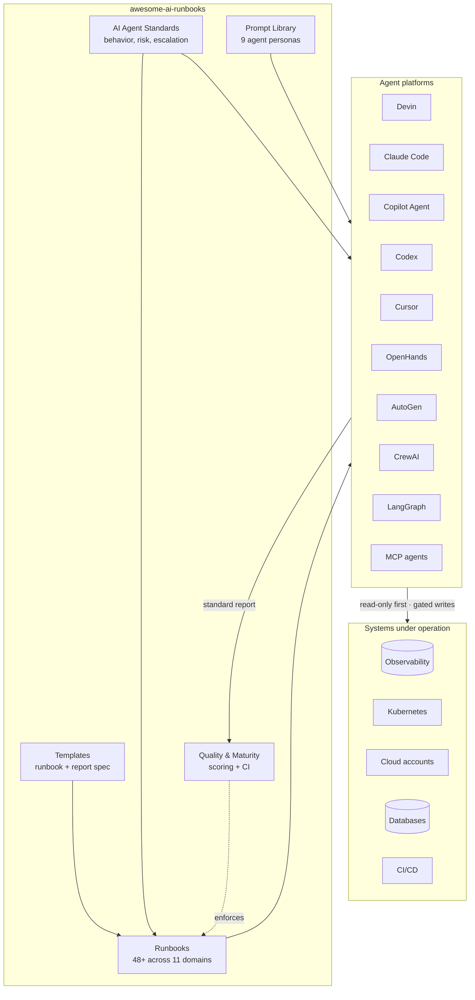
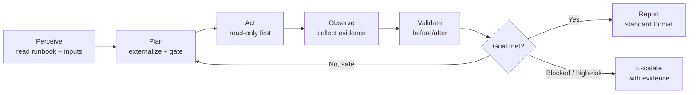
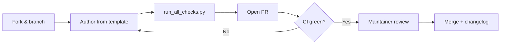

<div align="center">

# awesome-ai-runbooks

**The definitive open-source library of operational runbooks for autonomous AI agents.**

*Google SRE Playbooks + AWS Well-Architected + OpenAI Agent Operations + GitHub Engineering Standards — reimagined for the age of autonomous agents.*

[](./LICENSE)
[](./CONTRIBUTING.md)
[](./runbooks)
[](./quality/quality-dimensions.json)
[-brightgreen.svg)](./quality/repository-health.json)
[](./security/security-score.json)
[](./tests)
[](./docs/agent-frameworks.md)
[](./ENTERPRISE_READINESS_REPORT.md)
[](./CODE_OF_CONDUCT.md)

> Live badges (auto-generated by `tools/badges.py` as shields.io endpoints) live
> in [`.github/badges/`](./.github/badges) — see
> [`.github/badges/BADGES.md`](./.github/badges/BADGES.md) for copy-paste snippets.

</div>

---

## Table of contents

- [Project vision](#project-vision)
- [Why AI runbooks matter](#why-ai-runbooks-matter)
- [Architecture](#architecture)
- [Supported agent platforms](#supported-agent-platforms)
- [Repository structure](#repository-structure)
- [Popular runbooks](#popular-runbooks)
- [Quick start](#quick-start)
- [How a runbook works](#how-a-runbook-works)
- [Validation framework](#validation-framework)
- [Examples](#examples)
- [Contributing](#contributing)
- [Roadmap](#roadmap)
- [Enterprise adoption](#enterprise-adoption)
- [Future direction](#future-direction)
- [License](#license)

## Project vision

Autonomous agents — Devin, GitHub Copilot Agent, Claude Code, OpenAI Codex,
Cursor, OpenHands, AutoGen, CrewAI, LangGraph, and MCP-enabled enterprise agents
— can now execute real, multi-step engineering work. **Capability is no longer
the bottleneck; reliability, repeatability, and trust are.**

Human engineering organizations solved this with **runbooks, SOPs, and
playbooks**. `awesome-ai-runbooks` brings that same operational discipline to AI
agents — as a vendor-neutral, machine-checkable, evidence-first, cross-domain
standard designed for how agents actually **plan, act, validate, and report**.

> Read the full [Vision](./docs/planning/VISION.md), [Scope](./docs/planning/PROJECT_SCOPE.md),
> [Audience](./docs/planning/TARGET_AUDIENCE.md), and
> [Competitive Analysis](./docs/planning/COMPETITIVE_ANALYSIS.md).

## Why AI runbooks matter

| Without runbooks | With `awesome-ai-runbooks` |
|------------------|----------------------------|
| Behavior improvised from a one-line prompt | Standardized, reviewable procedures |
| Same task → wildly different quality | Consistent, senior-level execution |
| Agents jump to conclusions | Evidence-first, hypothesis-driven investigation |
| Risky, irreversible actions | Least-privilege, gated, reversible-by-design |
| No audit trail | Standard reports + audit logging patterns |
| Not portable across vendors | One contract across all major agents |
| Quality is a vibe | Quality is scored and enforced in CI |

Every runbook is a complete operational contract: objective, business context,
success criteria, planning, investigation workflow, decision tree, validation,
rollback, escalation, metrics, and a worked example.

## Architecture



## Supported agent platforms

Runbooks are **vendor-neutral**. Every runbook declares the platforms it is
written for in front matter (`supported_agents`).

| Platform | Category | Notes |
|----------|----------|-------|
| Devin | Autonomous SWE agent | Full runbook + persona support |
| GitHub Copilot Agent | IDE / repo agent | Full support |
| Claude Code | CLI coding agent | Full support |
| OpenAI Codex | Coding agent | Full support |
| Cursor Agents | IDE agent | Full support |
| OpenHands | Open-source agent | Full support |
| AutoGen | Multi-agent framework | Orchestrate runbooks across agents |
| CrewAI | Multi-agent framework | Role-based execution |
| LangGraph | Agent graph framework | Encode runbook loops as graphs |
| MCP-enabled agents | Any MCP client | Serve runbooks as resources/tools |
| Internal enterprise agents | Custom | Adopt via the Enterprise Guide |

## Repository structure

```text
awesome-ai-runbooks/
├── README.md                     # You are here
├── LICENSE                       # MIT
├── CODE_OF_CONDUCT.md
├── CONTRIBUTING.md               # How to author & submit runbooks
├── SECURITY.md                   # Defensive, least-privilege principles
├── CHANGELOG.md
├── ENTERPRISE_GUIDE.md           # Adoption, governance, HITL, audit
├── docs/
│   ├── AI_AGENT_STANDARDS.md     # Universal agent behavior contract
│   ├── QUALITY_ASSURANCE.md      # Scoring + maturity model
│   ├── FUTURE_RUNBOOKS.md        # Content roadmap
│   └── planning/                 # Vision, scope, audience, roadmap, analysis
├── templates/
│   ├── runbook-template.md       # The runbook specification
│   └── report-template.md        # The agent report specification
├── prompts/                      # 9 agent persona system prompts
├── runbooks/
│   ├── reliability/              # RCA, postmortem, readiness, DR/BCP
│   ├── observability/            # observability, logging, tracing reviews
│   ├── databases/                # postgres, mysql, redis, mongo, vector
│   ├── messaging/                # kafka lag, event-driven migration
│   ├── security/                 # IaC, containers, OAuth/JWT/API, AI security
│   ├── kubernetes/               # cluster / EKS / AKS / GKE audits
│   ├── cloud-cost/               # AWS / Azure / GCP cost optimization
│   ├── migrations/               # React, Node, Java, monolith→microservices
│   ├── architecture/             # GraphQL perf, platform engineering
│   ├── cicd/                     # pipeline debugging, deploy failure analysis
│   └── ai-ml/                    # MCP, RAG, LLM inference, prompt/agent eval
├── examples/                     # Worked example executions & reports
├── scripts/                      # Validation, scoring, link & coverage checks
├── assets/                       # Diagrams and images
└── .github/                      # CI workflows, issue/PR templates
```

## Popular runbooks

| Runbook | Domain | What the agent does |
|---------|--------|---------------------|
| [`root-cause-analysis`](./runbooks/reliability/root-cause-analysis.md) | Reliability | Evidence-first RCA of a live issue |
| [`incident-postmortem`](./runbooks/reliability/incident-postmortem.md) | Reliability | Blameless postmortem with action items |
| [`production-readiness-review`](./runbooks/reliability/production-readiness-review.md) | Reliability | GO/NO-GO readiness gate |
| [`investigate-kafka-lag`](./runbooks/messaging/investigate-kafka-lag.md) | Messaging | Diagnose and resolve consumer lag |
| [`postgresql-optimization`](./runbooks/databases/postgresql-optimization.md) | Databases | Query & index tuning with `EXPLAIN ANALYZE` |
| [`vector-database-review`](./runbooks/databases/vector-database-review.md) | Databases | Recall/latency tuning (HNSW/IVF) |
| [`api-security-audit`](./runbooks/security/api-security-audit.md) | Security | OWASP API Top 10 defensive audit |
| [`container-security-audit`](./runbooks/security/container-security-audit.md) | Security | Image, runtime & supply-chain review |
| [`eks-audit`](./runbooks/kubernetes/eks-audit.md) | Kubernetes | EKS best-practice & security audit |
| [`aws-cost-optimization`](./runbooks/cloud-cost/aws-cost-optimization.md) | FinOps | Rightsizing, commitments, waste cleanup |
| [`monolith-to-microservices`](./runbooks/migrations/monolith-to-microservices.md) | Migrations | Phased strangler-fig decomposition |
| [`rag-system-audit`](./runbooks/ai-ml/rag-system-audit.md) | AI/ML | Retrieval quality & groundedness audit |
| [`mcp-server-diagnostics`](./runbooks/ai-ml/mcp-server-diagnostics.md) | AI/ML | MCP server health & schema validation |

Browse the full library under [`runbooks/`](./runbooks).

## Quick start

### 1. Get the repository

```bash
git clone https://github.com/awesome-ai-runbooks/awesome-ai-runbooks.git
cd awesome-ai-runbooks
```

### 2. Point your agent at a runbook

1. Load the matching persona prompt from [`prompts/`](./prompts) as your agent's
   **system prompt**.
2. Provide the runbook file (paste it, or expose it via an MCP resource).
3. Provide the runbook's **Inputs Required** (e.g. `service_name`, `environment`).
4. Let the agent plan → investigate (read-only) → validate → report.

Example instruction to an agent:

```text
System: <contents of prompts/root-cause-analysis-agent.md>
User:   Execute runbook runbooks/reliability/root-cause-analysis.md
        Inputs: service_name=checkout-api, environment=prod,
        symptom="p99 latency > 2s since 14:00 UTC"
        Operate read-only; propose any mutating action for approval.
```

### 3. Validate contributions locally

```bash
python scripts/run_all_checks.py          # structure, spec, links, coverage, score
npx --yes markdownlint-cli2 "**/*.md"     # markdown lint
```

## How a runbook works

Every execution follows the universal agent loop defined in
[`docs/AI_AGENT_STANDARDS.md`](./docs/AI_AGENT_STANDARDS.md).



Actions are classified by risk tier (R0 read-only → R3 destructive). Anything
that mutates production or is irreversible is **gated behind human approval** and
must carry a **rollback**.

## Validation framework

Quality is enforced, not assumed. See
[`docs/QUALITY_ASSURANCE.md`](./docs/QUALITY_ASSURANCE.md).

| Check | Tool | Enforced in CI |
|-------|------|:--------------:|
| Structure & governance files present | `scripts/validate_structure.py` | ✅ |
| Runbook spec (sections, front matter, ≥1000 words, ≥2 diagrams) | `scripts/validate_runbooks.py` | ✅ |
| Relative links resolve | `scripts/check_links.py` | ✅ |
| Documentation coverage | `scripts/doc_coverage.py` | ✅ |
| Completeness score (/100) | `scripts/score_repository.py` | ✅ |
| Markdown lint | `markdownlint-cli2` | ✅ |
| External links (scheduled) | `lychee` | ✅ (weekly) |

Runbooks are scored on completeness, depth, diagrams, actionability, evidence,
safety, and clarity. The repository targets **Level 4 — Managed** on its own
maturity model.

## Platform & automation

Beyond the runbooks themselves, this repo ships a full **engineering platform**
(see [`tools/README.md`](./tools/README.md)). One shared library
([`tools/runbook_lib.py`](./tools/runbook_lib.py)) backs every tool, and
`python tools/run_platform.py` regenerates every report, index, and badge.

| Capability | Tool | Output |
|-----------|------|--------|
| Validation + completeness scoring | `tools/quality/runbook_validator.py` | `quality/quality-score.json` |
| 5-dimension quality engine | `tools/quality/runbook_quality_engine.py` | `quality/quality-dimensions.json` |
| Repository health (99/A) | `tools/health/repository_health.py` | `quality/repository-health.json` |
| Maturity model (L1–L5) | `tools/maturity_engine.py` | `quality/maturity.json` |
| Search + taxonomy | `tools/search/*` | `catalog/runbook-index.json`, `catalog/taxonomy.json` |
| Recommendations + knowledge graph | `tools/recommendation_engine.py` | `catalog/runbook-graph.json` |
| Content audit | `tools/content_audit.py` | `quality/content-audit.json` |
| Analytics | `metrics/repository_metrics.py` | `metrics/repository-metrics.json` |
| Security scanning + scoring | `tools/security/*` | `security/*.json` |
| Runbook generator + scaffolder | `tools/runbook_generator/*` | new runbooks |
| Release management | `tools/release/release_manager.py` | release notes |
| Badges | `tools/badges.py` | `.github/badges/*.json` |

Metadata is validated against a JSON Schema
([`schemas/runbook.schema.json`](./schemas/runbook.schema.json)), a documentation
portal is built with **MkDocs Material** ([`mkdocs.yml`](./mkdocs.yml)), and
**1016 tests** run under `pytest`. Ten GitHub Actions workflows enforce lint,
links, validation, scoring, security, docs, releases, and scheduled audits.

## Examples

Worked example executions and sample reports live in [`examples/`](./examples),
and every runbook includes an **Example Execution** section with a realistic
report excerpt built from the
[report template](./templates/report-template.md).

## Contributing

We welcome runbooks, improvements, prompts, and tooling. Start with
[CONTRIBUTING.md](./CONTRIBUTING.md):



New to the project? Look for issues labeled `good first issue` and check the
[runbook request form](./.github/ISSUE_TEMPLATE/runbook_request.yml).

## Roadmap

See [`docs/planning/ROADMAP.md`](./docs/planning/ROADMAP.md) for milestones and
[`docs/FUTURE_RUNBOOKS.md`](./docs/FUTURE_RUNBOOKS.md) for the content pipeline.

- ✅ **v1.0** — Foundation, standards, 48+ runbooks, prompts, QA, CI.
- 🚧 **v1.1** — Auto-generated catalog, JSON-Schema front matter, scaffolding.
- 🔜 **v1.2** — MCP reference server, per-platform adapters.
- 🔜 **v1.3** — Agent evaluation harness, golden trajectories, maturity badge.
- 🔜 **v2.0** — Enterprise overlays, approval-workflow references, compliance packs.

## Enterprise adoption

Adopting agents in a regulated or high-stakes environment? The
[Enterprise Guide](./ENTERPRISE_GUIDE.md) covers staged autonomy, private/overlay
runbooks, governance, security reviews, compliance mapping (SOC 2 / ISO 27001 /
NIST AI RMF / PCI), agent oversight, immutable audit logging, approval
workflows, and human-in-the-loop patterns — plus a reference architecture and an
adoption checklist.

## Future direction

The library is expanding across **AI Security, MCP Ecosystem, AIOps, Agent
Governance, Agent Safety, FinOps, Data Engineering, Platform Engineering, Cloud
Architecture, DevSecOps, Incident Response, SOC Automation, Threat Modeling,
Threat Hunting, and Compliance Automation.** See
[`docs/FUTURE_RUNBOOKS.md`](./docs/FUTURE_RUNBOOKS.md).

Our north star: be to AI agents what the SRE Book and the Well-Architected
Framework are to human engineers — an open, rigorous, cross-vendor operational
standard, purpose-built for autonomous execution.

## License

Released under the [MIT License](./LICENSE). Contributions are welcome under the
same license and our [Code of Conduct](./CODE_OF_CONDUCT.md).

---

<div align="center">
<sub>Built for platform, SRE, security, and AI engineering teams. Star the repo to follow along.</sub>
</div>
