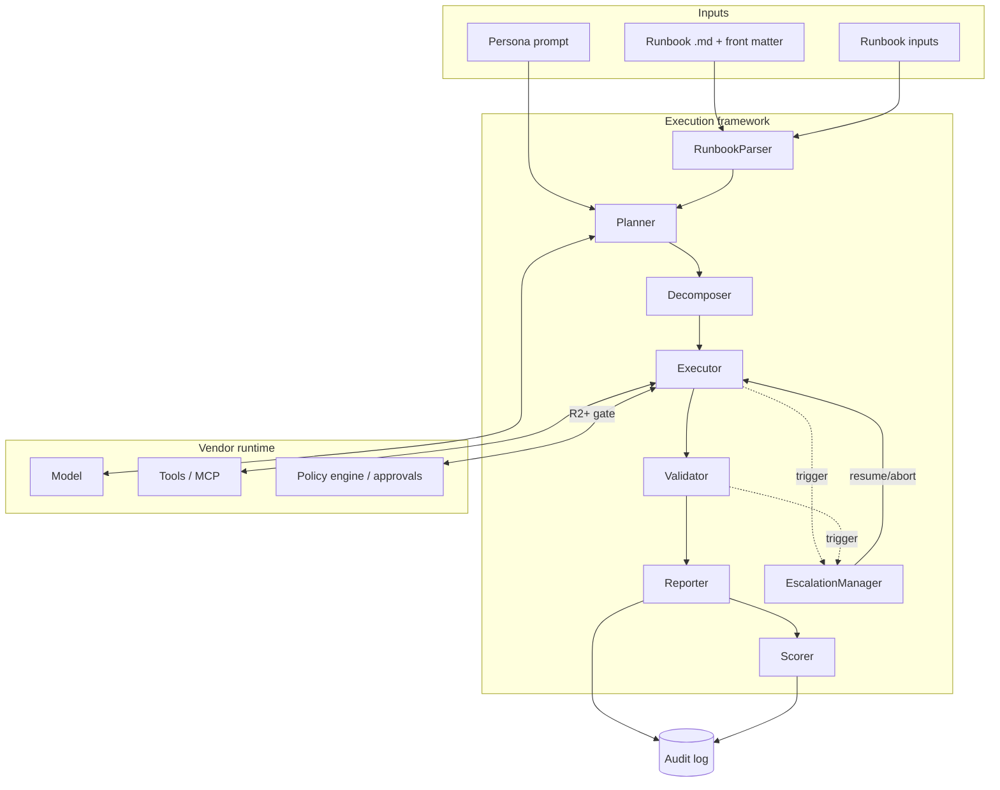
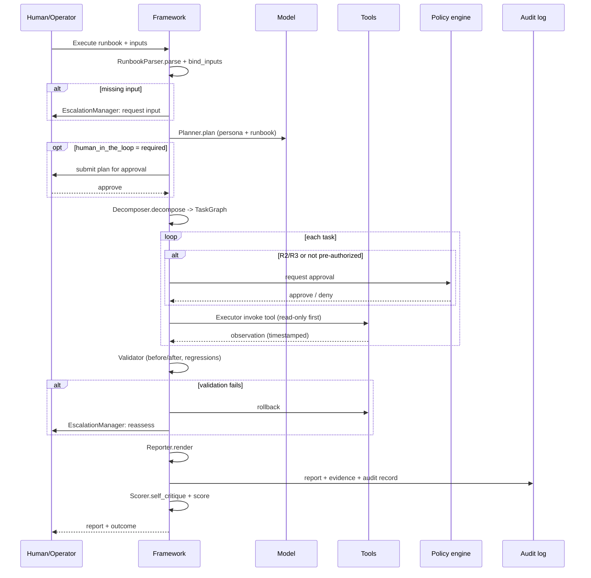

# AI Agent Execution Framework

This is a **design specification** for a vendor-neutral framework that turns a
runbook into a governed agent execution. It does not ship code; it defines the
components, their inputs and outputs, and how they realize the behavioral
contract in [`../docs/AI_AGENT_STANDARDS.md`](../docs/AI_AGENT_STANDARDS.md). Any
platform — Devin, Claude Code, Copilot Agent, Codex, Cursor, OpenHands, AutoGen,
CrewAI, LangGraph, or an internal agent — can implement it, because the framework
is a thin, portable orchestration layer over whatever LLM, tools, and runtime a
vendor provides.

## Design goals

- **Vendor-neutral.** No dependency on a specific model, SDK, or tool protocol.
- **Standards-faithful.** Each phase enforces a section of the AI Agent
  Standards (planning, risk, validation, escalation, reporting).
- **Evidence-first.** Every finding and action produces retrievable evidence for
  the [audit framework](../governance/audit-framework.md).
- **Safe by construction.** Risk classification and approval gates are enforced
  by the framework, not left to the model's discretion.
- **Deterministic process.** The *procedure* is consistent even when model
  wording varies.

## The execution lifecycle

A run flows through eight phases. The [lifecycle](./lifecycle.md) document covers
entry/exit criteria and failure handling in depth; here is the shape:

```text
parse → plan → decompose → execute → validate → report → score → escalate*
```

`escalate` is not strictly last — it can trigger from any phase when a gate,
missing input, or harm signal fires. On escalation the run pauses for a human
decision and then resumes or aborts.

## Component architecture



## Components

Each component has a narrow responsibility and a typed contract. The pseudocode
below is illustrative Python-ish interface sketches, not an implementation.

### RunbookParser

Parses the Markdown runbook and its YAML front matter into a structured object:
objective, success criteria, inputs, `required_access`, `risk_level`,
`human_in_the_loop`, ordered steps (each tagged read-only/mutating), decision
tree, validation steps, rollback, and escalation. It validates that inputs
satisfy the runbook's declared requirements before anything else runs.

```python
class RunbookParser:
    def parse(self, markdown: str) -> Runbook: ...
    def bind_inputs(self, rb: Runbook, inputs: dict) -> BoundRunbook:
        # raises MissingInputError -> EscalationManager
        ...
```

*Input:* runbook text + inputs. *Output:* `BoundRunbook`. *Maps to:* Standards
§1 (objective-anchored), §12 (constraints/access).

### Planner

Produces an externalized plan per Standards §2: restated objective, assumptions
and how to verify them, information needs, ordered steps tagged read-only vs
mutating, risk annotations with rollbacks, decision points, and a definition of
done. If `human_in_the_loop == required`, the plan is submitted for approval
before execution.

```python
class Planner:
    def plan(self, rb: BoundRunbook, persona: str) -> Plan: ...
    def needs_plan_approval(self, rb: BoundRunbook) -> bool: ...
```

*Input:* `BoundRunbook` + persona. *Output:* `Plan`. *Maps to:* Standards §2, §11
(decision framing).

### Decomposer

Breaks the plan into an executable task graph: atomic steps with dependencies,
risk tier per step (R0–R3), and the batching of independent read-only steps to
maximize information gain per unit of risk.

```python
class Decomposer:
    def decompose(self, plan: Plan) -> TaskGraph:
        # each Task carries: risk_tier, tool, rollback, gate?
        ...
```

*Input:* `Plan`. *Output:* `TaskGraph`. *Maps to:* Standards §8 (risk),
§2 (sequencing).

### Executor

Walks the task graph. For each task it classifies risk, and for R2/R3 (or any
task without pre-authorization) it calls the policy engine for approval before
invoking the tool. It captures every observation with timestamp and source, and
records each action (read/mutate, tool, target, approver, rollback, result).

```python
class Executor:
    def run(self, graph: TaskGraph, policy: PolicyEngine) -> RunState:
        for task in graph.ready():
            if task.risk_tier >= R2 and not task.pre_authorized:
                if not policy.approve(task):
                    raise GateBlocked(task)  # -> EscalationManager
            obs = self.tools.invoke(task)
            self.record(task, obs)
        ...
```

*Input:* `TaskGraph` + policy engine. *Output:* `RunState` with observations and
action records. *Maps to:* Standards §4 (investigation), §8 (risk gates).

### Validator

Confirms nothing is "done" until validated (Standards §5). For findings it
requires a corroborating observation from an independent signal source; for
changes it checks the expected effect against before/after measurement and scans
for regressions. On mismatch it triggers rollback and re-assessment.

```python
class Validator:
    def validate_finding(self, f: Finding) -> Verdict: ...
    def validate_change(self, before, after, expected) -> Verdict: ...
```

*Input:* findings/changes + baselines. *Output:* `Verdict` (validated / rollback
/ reassess). *Maps to:* Standards §5.

### Reporter

Emits a report using
[`../templates/report-template.md`](../templates/report-template.md): executive
summary first, observations separated from findings, quantified impact,
prioritized recommendations, disclosed gaps, and redacted secrets. Writes the
report and evidence URIs to the audit log.

```python
class Reporter:
    def render(self, run: RunState) -> Report: ...
    def emit_audit(self, run: RunState) -> AuditRecord: ...
```

*Maps to:* Standards §6, [audit framework](../governance/audit-framework.md).

### Scorer

Runs the self-critique/quality pass (Standards §7) and computes readiness and
completeness signals. It answers "what is the weakest part of this analysis?" and
either loops back for more evidence or marks the run submittable. Its output
feeds guardrail metrics and autonomy-stage promotion evidence.

```python
class Scorer:
    def self_critique(self, report: Report, run: RunState) -> Critique: ...
    def score(self, report: Report) -> QualityScore: ...
```

*Maps to:* Standards §7, [QA framework](../docs/QUALITY_ASSURANCE.md).

### EscalationManager

The cross-cutting safety valve (Standards §9). Any phase can raise an escalation
— missing input, false assumption with no branch, harm signal, above-tier action,
low confidence after timebox. It assembles context and evidence, states the
decision needed with options and a recommendation, routes by severity, and pauses
the run until a human responds.

```python
class EscalationManager:
    def raise_escalation(self, trigger: Trigger, ctx: RunState) -> Decision: ...
    def route(self, severity: Severity) -> Channel: ...
```

*Maps to:* Standards §9.

## Sequence of a run



## Mapping to the standards

| Phase / component | Standards section |
|-------------------|-------------------|
| RunbookParser | §1 objective-anchored, §12 constraints |
| Planner | §2 planning, §11 decision framing |
| Decomposer / Executor | §4 investigation, §8 risk tiers/gates |
| Validator | §5 validation |
| Reporter | §6 reporting |
| Scorer | §7 quality self-critique |
| EscalationManager | §9 escalation |
| Whole loop | §1 Perceive→Plan→Act→Observe→Validate→Reflect→Report/Escalate |

## Implementation notes

- **Portability.** Components depend on abstract `Model`, `Tools`, and
  `PolicyEngine` interfaces; vendors bind these to their SDK/MCP.
- **Governance hooks.** The framework only executes runbooks whose lifecycle
  status is `Approved` and at the catalog-declared autonomy stage; the kill
  switch and drift signals from
  [`../governance/agent-governance.md`](../governance/agent-governance.md) can
  halt the Executor.
- **Determinism.** Given the same runbook version, inputs, and system state, the
  *process* (phases, gates, evidence captured) is identical even if model prose
  differs — which is what makes runs reviewable and scorable.

This spec is the conceptual blueprint; the [lifecycle](./lifecycle.md) document
details how each phase begins, ends, and fails safely.
