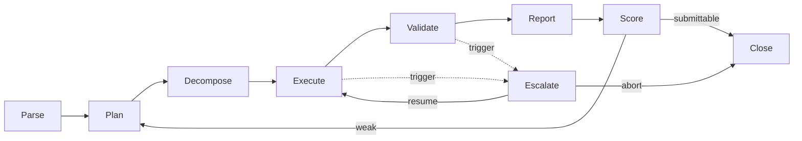

# Execution Lifecycle

This document details the execution lifecycle that the
[agent framework](./README.md) drives when an agent runs a runbook. Each phase
has explicit **entry criteria** (what must be true to start), **activities**,
**exit criteria** (what must be true to advance), and **failure handling** (what
happens when it goes wrong). The lifecycle realizes the universal agent loop in
[`../docs/AI_AGENT_STANDARDS.md`](../docs/AI_AGENT_STANDARDS.md#1-universal-agent-behavior-model):
Perceive → Plan → Act → Observe → Validate → Reflect → Report/Escalate.

## Phase overview

Escalate is cross-cutting: it can fire from Parse (missing input), Execute
(gate/harm), or Validate (unexpected effect), pausing the run for a human
decision.

## Parse

**Entry criteria:**

- A runbook with lifecycle status `Approved` and its inputs are provided.
- The agent identity is bound to this runbook in the approved catalog.

**Activities:**

- Parse Markdown + front matter into a structured `BoundRunbook`.
- Bind and validate inputs against declared requirements.
- Confirm `required_access` is available as scoped, short-lived credentials.

**Exit criteria:**

- All required inputs present and valid; objective and success criteria loaded.

**Failure handling:**

- Missing/invalid input, wrong runbook status, or unavailable access → raise an
  escalation requesting the input or access; do not proceed with assumptions.

## Plan

**Entry criteria:**

- A valid `BoundRunbook` and the bound persona prompt.

**Activities:**

- Produce the externalized plan (Standards §2): restated objective, assumptions +
  verification, information needs, ordered steps tagged read-only/mutating, risk
  annotations + rollbacks, decision points, definition of done.
- If `human_in_the_loop == required`, submit the plan for approval.

**Exit criteria:**

- A reviewable plan exists; plan approved where required.

**Failure handling:**

- Plan rejected → revise and resubmit. Cannot form a safe plan (e.g. objective
  unachievable within constraints) → escalate.

## Decompose

**Entry criteria:**

- An approved (or non-gated) plan.

**Activities:**

- Build the task graph: atomic tasks, dependencies, risk tier per task, rollback
  per mutating task, and gate flags.
- Batch independent read-only tasks; sequence read-only before mutating.

**Exit criteria:**

- A well-formed task graph where every mutating task has a rollback and a
  correct risk tier.

**Failure handling:**

- A mutating task without a viable rollback → mark R3 and require explicit
  approval, or escalate if no reversible alternative exists.

## Execute

**Entry criteria:**

- A valid task graph; policy engine and tools reachable; kill switch not tripped.

**Activities:**

- Walk ready tasks. Classify risk; for R2/R3 or non-pre-authorized tasks, request
  approval from the policy engine before invoking the tool.
- Perform read-only investigation first; capture every observation with timestamp
  and source; record each action (type, tool, target, approver, rollback,
  result).
- Respect timeboxes per investigation branch and action/runtime budgets.

**Exit criteria:**

- All required observations collected or a decision point reached; no unresolved
  above-tier action pending.

**Failure handling:**

- Approval denied or action above authorized tier → block the action and escalate
  with options.
- Tool error or transient failure → retry within budget, then escalate.
- Harm signal (breach, data loss, SEV1) → immediately escalate to security/IC.
- Kill switch trips → halt at the next safe gate, leave a documented state, emit
  audit record.

## Validate

**Entry criteria:**

- Findings and/or applied changes with captured baselines.

**Activities:**

- For findings: require ≥ 1 corroborating observation from an independent signal
  source; attach confidence.
- For changes: compare before/after against the pre-defined expected effect and
  scan for regressions and side effects.

**Exit criteria:**

- Each finding corroborated; each change confirmed to match expectation with no
  regression; rollback path still available.

**Failure handling:**

- Change does not match expectation or introduces a regression → execute the
  rollback, confirm restoration, and escalate for reassessment.
- Finding cannot be corroborated → downgrade confidence and disclose the gap
  rather than assert it.

## Report

**Entry criteria:**

- Validated findings and change outcomes.

**Activities:**

- Render the report from
  [`../templates/report-template.md`](../templates/report-template.md): executive
  summary, observations vs findings, quantified impact, prioritized
  recommendations, disclosed gaps, redacted secrets.
- Write report + evidence URIs and the run's audit record to the audit log.

**Exit criteria:**

- Report complete and consistent with observations; audit record emitted.

**Failure handling:**

- Missing evidence for a stated finding → return to Execute/Validate; never
  fabricate. Redaction incomplete → block emission until fixed.

## Score

**Entry criteria:**

- A rendered report and full `RunState`.

**Activities:**

- Run the self-critique pass (Standards §7): "what is the weakest part; what
  would a skeptical Staff Engineer challenge?"
- Compute quality/readiness signals; feed guardrail metrics.

**Exit criteria:**

- Report meets the quality bar → submittable. Otherwise loop back to Plan/Execute
  to close the weakest gaps.

**Failure handling:**

- Repeated failure to reach the bar within budget → escalate with the report and
  the identified gaps rather than submitting low-quality work.

## Escalate (cross-cutting)

**Entry criteria (triggers):**

- Missing input/access; false assumption with no branch; harm signal; action
  above authorized tier; low confidence after timebox; ambiguous next step that
  is R2/R3.

**Activities:**

- Assemble context and evidence; state the decision needed with options,
  trade-offs, and a recommendation; route by severity (IC/security, change owner,
  or SME).

**Exit criteria:**

- A human decision is received: **resume** (continue Execute with the decision
  applied) or **abort** (close safely).

**Failure handling:**

- No timely response → hold in a safe, documented state; do not act unilaterally
  on a gated decision.

## Close

Every run ends in one recorded outcome — `complete`, `escalated`, `aborted`, or
`failed` — with the system left in a known, documented state and a complete audit
record. The score and outcome become evidence for autonomy-stage promotion under
[`../governance/approval-process.md`](../governance/approval-process.md) and feed
the drift baselines in
[`../governance/agent-governance.md`](../governance/agent-governance.md).
