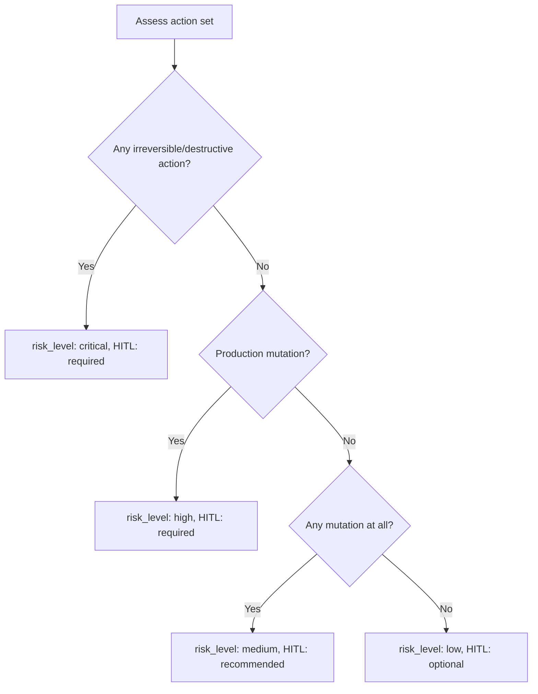
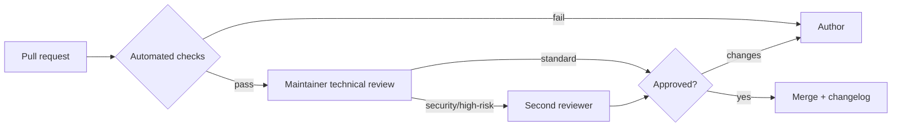

# Quality Assurance & Maturity Framework

This document defines how we measure and enforce quality across the repository:
runbook completeness scoring, agent-readiness scoring, risk scoring, the review
process, acceptance criteria, the validation checklist, and the repository
maturity model. The automated tooling in [`scripts/`](../scripts) implements the
mechanical parts of these rubrics; human review covers the rest.

## 1. Runbook Completeness Scoring

Each runbook is scored out of **100**. The automated scorer
(`scripts/score_repository.py`) computes the structural portion; reviewers assess
the qualitative portion.

| Dimension | Points | How it is measured |
|-----------|:------:|--------------------|
| Structural conformance | 25 | All required sections present, in order, with valid front matter |
| Depth | 20 | ≥ 1000 words of substantive content (auto) + reviewer depth check |
| Diagrams | 10 | ≥ 2 valid Mermaid diagrams (Investigation Workflow + Decision Tree) |
| Actionability | 10 | Concrete commands, checklists, and tables present |
| Evidence & validation | 10 | Real validation steps and expected outputs |
| Safety | 10 | Least privilege, rollback, escalation, risk tiers defined |
| Example execution | 5 | Realistic worked example with sample report |
| References | 5 | Credible, relevant references |
| Clarity & style | 5 | Markdownlint clean; readable; correct headings |

**Score bands:**

- **90–100 — Exemplary.** Reference-quality; eligible for `maturity: stable`.
- **75–89 — Solid.** Mergeable; may carry `maturity: reviewed`.
- **60–74 — Draft.** Needs work before merge.
- **< 60 — Rejected.** Returned to author.

## 2. Agent Readiness Scoring

Measures whether an agent can execute the runbook *reliably and safely* with
minimal ambiguity. Scored out of **50**.

| Criterion | Points | Question |
|-----------|:------:|----------|
| Unambiguous objective & success criteria | 10 | Can the agent tell exactly when it is done? |
| Executable steps | 10 | Are steps concrete, ordered, and tagged read-only vs mutating? |
| Decision coverage | 10 | Does the decision tree cover the realistic branches, including escalate? |
| Input/access clarity | 5 | Are required inputs and least-privilege access explicit? |
| Validation determinism | 5 | Can success/failure be verified objectively? |
| Escalation & rollback | 5 | Are gates and undo paths precise? |
| Cross-platform portability | 5 | Free of single-vendor assumptions? |

**Readiness bands:** ≥ 42 ready · 30–41 needs tightening · < 30 not agent-ready.

## 3. Risk Scoring

Risk classifies how much autonomy is safe. It combines **blast radius**,
**reversibility**, and **environment** into the runbook's `risk_level` and
`human_in_the_loop` fields (aligned with `AI_AGENT_STANDARDS.md` §8).

| risk_level | Typical content | human_in_the_loop |
|-----------|-----------------|-------------------|
| low | pure read-only analysis | optional |
| medium | reversible non-prod changes | recommended |
| high | reversible prod changes | required |
| critical | any irreversible/destructive step | required |

## 4. Review Process

- **Automated gate:** structure, front matter, markdown lint, links, and scoring
  must pass.
- **Technical review:** a maintainer verifies accuracy, depth, and safety.
- **Second review:** required for `security` category or `risk_level: high|critical`.
- **Merge:** on approval; `CHANGELOG.md` updated.

## 5. Acceptance Criteria

A runbook is accepted when **all** hold:

- [ ] Completeness score ≥ 75.
- [ ] Agent-readiness score ≥ 42.
- [ ] `risk_level` and `human_in_the_loop` are consistent with §3.
- [ ] Automated checks pass (structure, lint, links).
- [ ] At least one maintainer approval (two for security/high-risk).
- [ ] No placeholders, no `TODO`, no fabricated tools/APIs.
- [ ] Real rollback and escalation are documented.

## 6. Validation Checklist (author self-check)

Run before opening a PR:

- [ ] Copied from `templates/runbook-template.md`; all sections present in order.
- [ ] Front matter valid; `id` matches filename; category correct.
- [ ] ≥ 1000 words of real content.
- [ ] ≥ 2 Mermaid diagrams that render.
- [ ] Commands are correct and language-tagged.
- [ ] At least one table and one checklist.
- [ ] Example execution with a sample report excerpt.
- [ ] `python scripts/run_all_checks.py` passes locally.
- [ ] `npx markdownlint-cli2 "**/*.md"` is clean.

## 7. Repository Maturity Model

We hold *the repository itself* to a maturity model, reviewed each release.

| Level | Name | Criteria |
|:-----:|------|----------|
| 1 | Initial | Structure exists; some real runbooks; no automation. |
| 2 | Repeatable | Template + standards enforced; CI validates structure & lint. |
| 3 | Defined | Scoring rubric applied; ≥ 40 runbooks; full governance docs. |
| 4 | Managed | Link/coverage checks in CI; maturity badge; metrics tracked. |
| 5 | Optimizing | Agent-eval harness + golden trajectories; community-driven cadence. |

**Current target:** Level 4 (Managed) at v1.0, progressing to Level 5 per the
[roadmap](./planning/ROADMAP.md).

## 8. Metrics we track

| Metric | Definition | Target |
|--------|-----------|--------|
| Runbook count | Runbooks meeting acceptance criteria | Growing |
| Mean completeness score | Avg score across runbooks | ≥ 85 |
| CI pass rate on `main` | Green builds | 100% |
| Broken links | Dead internal/external links | 0 internal |
| Doc coverage | Runbooks with all sections filled | 100% |
| Time-to-review | Median PR review latency | ≤ 5 days |
