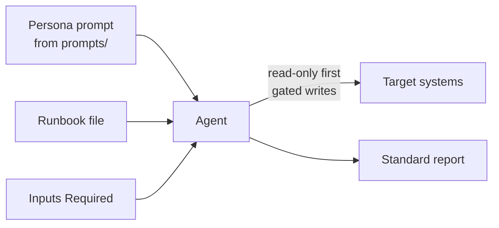
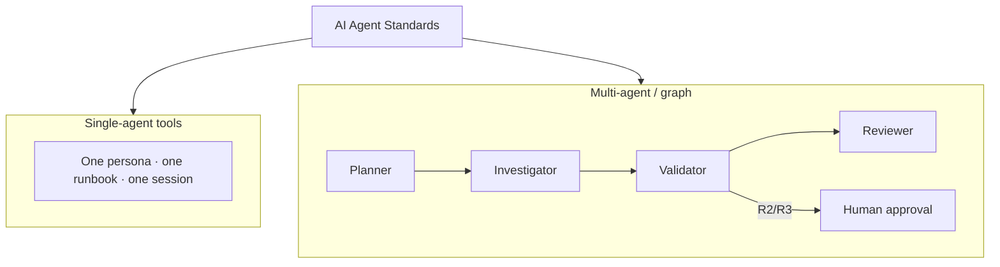

# Agent Frameworks

Runbooks in this library are **vendor-neutral**. Every runbook declares the
platforms it supports in its `supported_agents` front matter, and the same
procedure runs unchanged across ten agent platforms. This page explains the
platforms and the common pattern by which they consume runbooks. For concrete,
copy-paste setup steps, see the per-platform [Integrations](integrations/index.md)
guides.

## The universal consumption pattern

Regardless of platform, the integration shape is identical:

1. **Load a persona** from [`prompts/`](../prompts/README.md) as the agent's
   system prompt.
2. **Supply the runbook** — paste it, mount the file, or expose it as an MCP
   resource.
3. **Provide the runbook's Inputs Required** (for example `service_name`,
   `environment`).
4. **Let the agent run the loop** and emit a report using the
   [report template](../templates/report-template.md).

Only the *mechanics* of steps 1–3 differ per platform; the behavior in step 4 is
governed identically by the [AI Agent Standards](AI_AGENT_STANDARDS.md).

## Supported platforms

| Platform | Category | How it consumes runbooks | Guide |
|----------|----------|--------------------------|-------|
| GitHub Copilot Agent | IDE / repo agent | Repo-native custom instructions + task issue | [Guide](integrations/github-copilot.md) |
| Cursor | IDE agent | Project rules file + attached runbook context | [Guide](integrations/cursor.md) |
| Claude Code | CLI coding agent | `CLAUDE.md` persona + file references | [Guide](integrations/claude-code.md) |
| Devin | Autonomous SWE agent | Knowledge/persona + session prompt | [Guide](integrations/devin.md) |
| OpenHands | Open-source agent | Microagent / repo instructions + task | [Guide](integrations/openhands.md) |
| AutoGen | Multi-agent framework | Persona as `system_message`; runbook in task | [Guide](integrations/autogen.md) |
| CrewAI | Multi-agent framework | Persona maps to Agent role; runbook to Task | [Guide](integrations/crewai.md) |
| LangGraph | Agent graph framework | Loop encoded as graph nodes; runbook in state | [Guide](integrations/langgraph.md) |
| OpenAI Agents / Codex | Coding & agent SDK | Persona as `instructions`; runbook in input | [Guide](integrations/openai-agents.md) |
| MCP clients | Any MCP client | Runbooks served as resources; personas as prompts | [Guide](integrations/mcp-clients.md) |

Internal enterprise agents adopt the same pattern via the
[Enterprise Guide](../ENTERPRISE_GUIDE.md).

## Two families, one contract

Platforms fall into two broad families, but both honor the same contract.

- **Single-agent coding/ops tools** — GitHub Copilot Agent, Cursor, Claude Code,
  Devin, OpenHands, and OpenAI Codex — load one persona and execute a runbook
  end to end within a session. They map most directly to the runbook's linear
  workflow and are ideal for investigations, audits, and readiness reviews.
- **Multi-agent and graph frameworks** — AutoGen, CrewAI, and LangGraph — can
  decompose a runbook across specialized agents or encode its loop as an explicit
  graph. A planner agent can own the Planning framework, an investigator the
  Investigation framework, and a reviewer the Quality framework, while a
  human-approval node enforces the risk gates.

## Persona-to-runbook mapping

Personas are reusable across many runbooks. A few common pairings:

| Persona | Typical runbooks |
|---------|------------------|
| `root-cause-analysis-agent` | root-cause-analysis, incident-postmortem, investigate-kafka-lag |
| `security-review-agent` | api-security-audit, container-security-audit, terraform-security-review |
| `platform-audit-agent` | kubernetes/eks/aks/gke-audit, platform-engineering-review |
| `cost-optimization-agent` | aws/azure/gcp-cost-optimization |
| `production-readiness-agent` | production-readiness-review, release-readiness-review |

The full list lives in the [prompt library README](../prompts/README.md).

## What stays constant across platforms

- **Risk gating.** R2/R3 actions require human approval on every platform; the
  approval mechanism (ChatOps, PR review, a graph node) varies, the requirement
  does not.
- **Read-only first.** Investigation precedes mutation everywhere.
- **Standard output.** Every run ends in the same report format, so results are
  comparable no matter which agent produced them.
- **Least privilege.** Each runbook's `required_access` maps to scoped,
  short-lived credentials per platform.

Because the durable asset is the runbook and the contract, an organization can
swap or combine platforms without rewriting operational knowledge. Continue to
the [Integrations overview](integrations/index.md) to pick a platform and wire
it up.
