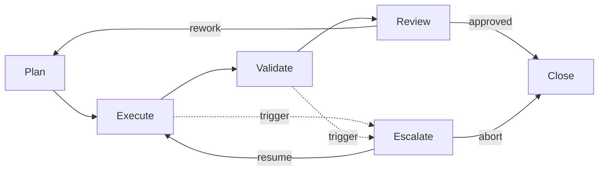

# Agent Execution Lifecycle

This document defines the operational stages a human organization tracks when an
autonomous agent executes a runbook: **Plan, Execute, Validate, Review, Escalate,
and Close**. It is the management-facing view of a run — who is responsible, what
artifacts each stage produces, and what gate must be cleared to advance. It
complements the behavioral contract in
[`AI_AGENT_STANDARDS.md`](./AI_AGENT_STANDARDS.md), the engine-facing phases in
[`../agent-framework/lifecycle.md`](../agent-framework/lifecycle.md), and the
governance controls under [`../governance/`](../governance/README.md).

## Stages at a glance

Escalate is not a sequential step — it is a gate that can fire from Execute or
Validate whenever a trigger is met, pausing the run for a human decision before
it can resume or close.

## Plan

The agent restates the runbook objective and success criteria, lists assumptions
and how it will verify them, and produces an ordered, risk-annotated plan with
rollbacks and decision points.

- **Responsibilities.** Agent authors the plan; the operator (and, for
  `human_in_the_loop: required` runbooks, an approver) reviews it before any
  action.
- **Artifacts.** Externalized plan; definition of done mapped to success
  criteria.
- **Gate.** For high-risk runbooks, no execution begins until the plan is
  approved. A plan that cannot safely meet the objective is escalated, not
  forced.

## Execute

The agent carries out the plan, read-only work first, requesting approval at
every R2/R3 (mutating) step through the policy engine.

- **Responsibilities.** Agent performs steps and records evidence; the operator
  approves gated actions; the policy engine enforces risk tiers.
- **Artifacts.** Timestamped observations with sources; an action log capturing
  type (read/mutate), tool, target, approver, and rollback used.
- **Gate.** Any action above the agent's authorized risk tier is blocked and
  routed to Escalate. Every mutating action must have its rollback ready before
  it runs.

## Validate

Nothing is "done" until validated. Findings need corroboration from an
independent signal source; changes are checked against a pre-defined expected
effect with before/after measurement and a regression scan.

- **Responsibilities.** Agent validates; the operator can request additional
  corroboration.
- **Artifacts.** Before/after measurements; corroborating evidence; confidence
  levels with residual uncertainty disclosed.
- **Gate.** If a change does not match its expected effect or introduces a
  regression, the agent executes the rollback, confirms restoration, and
  escalates for reassessment. Uncorroborated findings are downgraded, not
  asserted.

## Review

A human (or, for mature low-risk runbooks, a sampled/exception-based process)
reviews the report and the run before it is accepted. This is where the run meets
the [governance review process](../governance/review-process.md) in spirit — a
judgment check on correctness, safety, and completeness.

- **Responsibilities.** Reviewer assesses the report against success criteria and
  the quality bar; the runbook owner is accountable for the outcome.
- **Artifacts.** The report (from
  [`../templates/report-template.md`](../templates/report-template.md)); the
  self-critique/quality score; reviewer attestation.
- **Gate.** Approve → proceed to Close. Rework → return to Plan with specific
  feedback. Review depth scales with autonomy stage: full review at low stages,
  sampled/exception review at mature stages.

## Escalate

The cross-cutting safety valve. It fires on any trigger from
[`AI_AGENT_STANDARDS.md`](./AI_AGENT_STANDARDS.md#9-escalation-framework): a false
assumption with no branch, missing access/input, a harm signal (breach, data
loss, SEV1), an action above the authorized tier, or persistently low confidence.

- **Responsibilities.** Agent assembles the escalation payload; the routed human
  (incident commander/security on-call, change owner, or domain SME) decides.
- **Artifacts.** Escalation payload: current objective, work done, key evidence,
  the specific decision needed, options with trade-offs, and a recommendation.
- **Gate.** The run holds in a safe, documented state until a human responds with
  **resume** (apply the decision and continue Execute) or **abort** (close
  safely). The agent never acts unilaterally on a gated decision.

## Close

Every run ends in exactly one recorded outcome — `complete`, `escalated`,
`aborted`, or `failed` — with the system left in a known, documented state.

- **Responsibilities.** Agent emits the final record; the operator confirms
  closure; the runbook owner consumes the evidence.
- **Artifacts.** Final report; complete, immutable audit record per
  [`../governance/audit-framework.md`](../governance/audit-framework.md).
- **Gate.** Closure requires a complete audit trail. The outcome and quality
  score feed guardrail metrics and autonomy-stage promotion decisions in
  [`../governance/approval-process.md`](../governance/approval-process.md).

## Stage summary

| Stage | Primary owner | Key artifact | Advancement gate |
|-------|---------------|--------------|------------------|
| Plan | Agent + approver | Externalized plan | Plan approved (if required) |
| Execute | Agent + policy engine | Observations + action log | Gated actions approved; within tier |
| Validate | Agent | Before/after evidence | Effect confirmed; no regression |
| Review | Reviewer / owner | Report + quality score | Report meets bar |
| Escalate | Routed human | Escalation payload | Human decision received |
| Close | Operator / owner | Final report + audit record | Complete audit trail |

## Relationship to the framework phases

The management stages here map onto the finer-grained engine phases in
[`../agent-framework/lifecycle.md`](../agent-framework/lifecycle.md): **Plan**
covers Parse + Plan + Decompose; **Execute** and **Validate** map directly;
**Review** wraps the Report + Score phases; **Escalate** and **Close** are shared.
Tracking runs at this stage granularity gives operators a consistent, auditable
view across every agent platform and every runbook.
