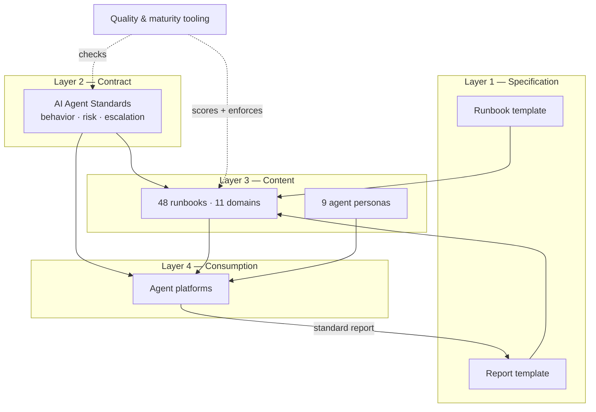
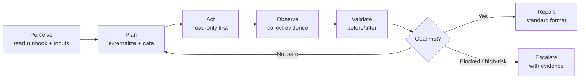

# Architecture

This page explains how the repository is put together and how its parts — the
template, the standards, the runbooks, the personas, and the quality tooling —
combine to produce reliable agent behavior. For the authoritative behavioral
contract, see [AI Agent Standards](AI_AGENT_STANDARDS.md); for the source layout,
see the [README](../README.md).

## The layered model

The project is best understood as four layers. Each higher layer depends on the
one below it, and the quality layer wraps everything.

### Layer 1 — Specification

The [`templates/`](../templates/runbook-template.md) directory defines the exact
shape of a runbook and of the report an agent must produce. The runbook template
fixes section order and required YAML front matter (`id`, `category`,
`risk_level`, `human_in_the_loop`, `supported_agents`, and more). The report
template fixes the deliverable format. Because both are specifications, they are
machine-checkable — validators can assert that every runbook conforms.

### Layer 2 — Contract

[AI Agent Standards](AI_AGENT_STANDARDS.md) is the universal behavioral contract.
It defines the Perceive → Plan → Act → Observe → Validate → Reflect → Report
loop, the risk tiers (R0 read-only through R3 destructive), the escalation
triggers, and the bias-reduction countermeasures. Every runbook references it,
and if a runbook ever conflicts with the standards on safety, **the standards
win**. This is what makes behavior portable: the contract is identical no matter
which agent executes the runbook.

### Layer 3 — Content

The [`runbooks/`](../runbooks) tree holds the 48 domain procedures, and
[`prompts/`](../prompts/README.md) holds the 9 personas. A persona is a system
prompt that gives the agent a role ("Principal SRE"), duties, and restrictions
aligned to the standards. Personas and runbooks are composable: the same
`root-cause-analysis-agent` persona can drive several incident-related runbooks.

### Layer 4 — Consumption

Agent platforms consume the content. They load a persona as the system prompt,
receive a runbook plus its inputs, and execute under the contract. The output is
always a standard report, which closes the loop back to Layer 1.

## The execution loop

Every runbook run follows the same closed loop defined in the standards. This is
the backbone of agent-native operations.

Read-only investigation always comes first. Any action that mutates production
or is irreversible is classified by risk tier and gated behind human approval,
and must carry a rollback.

## How the pieces reinforce each other

| Component | Depends on | Guarantees |
|-----------|------------|------------|
| Runbook | Template + Standards | Uniform structure, safe behavior |
| Persona | Standards | Consistent role and restrictions |
| Report | Report template | Comparable, auditable output |
| Validators | Template + Standards | Machine-checkable conformance |
| Scoring | Quality framework | A defensible quality bar |

The relationship is deliberately circular: specifications constrain content,
content is scored against the quality framework, and the standards keep both the
content and the agents honest at run time.

## The quality and tooling layer

The `scripts/` directory (which this portal does not modify) implements the
mechanical checks: structure validation, front-matter validation, completeness
scoring out of 100, internal link checking, and documentation coverage. These
run in CI on every pull request. Human review covers what tooling cannot —
technical accuracy, depth, and safety judgment. Security and high-risk runbooks
get a mandatory second review. The full rubric is in the
[Quality Framework](quality-framework.md) and
[Quality Assurance](QUALITY_ASSURANCE.md).

## Extending the architecture

Enterprises layer private content on top without forking divergence: keep the
public repository upstream (git subtree or submodule), add company-specific
runbooks in a private tree, and use overlays for local conventions. Policy — who
may run what, at which autonomy stage — lives in a catalog. That extension model,
plus the reference control-plane architecture, is described in the
[Enterprise Guide](../ENTERPRISE_GUIDE.md) and summarized on the
[Governance](governance.md) page.

## Next steps

Continue to the [Standards](standards.md) to see the twelve frameworks the
contract layer defines, or to the [Runbook Library](runbook-library.md) to
browse the content layer by domain.
