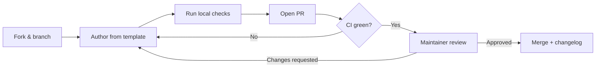

# Contributing

Contributions of every size are welcome — from fixing a typo to authoring a
brand-new runbook. This page is a portal-friendly introduction; the canonical,
always-current process lives in [CONTRIBUTING.md](../CONTRIBUTING.md), and the
scoring bar is defined in [Quality Assurance](QUALITY_ASSURANCE.md).

## Ways to contribute

- **Author a runbook** for an uncovered scenario (check the
  [Roadmap](future-roadmap.md) first).
- **Improve an existing runbook** — deepen analysis, add diagrams, fix commands.
- **Add or refine personas** in [`prompts/`](../prompts/README.md).
- **Improve tooling** in `scripts/` or CI in `.github/workflows/`.
- **Improve this documentation portal** under `docs/`.
- **Report issues** using the issue templates.

## Before you start

1. Check the [project roadmap](planning/ROADMAP.md), the
   [content pipeline](FUTURE_RUNBOOKS.md), and open issues to avoid duplicate
   work.
2. For a substantial addition, open an issue first to align on scope.
3. Read the [runbook template](../templates/runbook-template.md) and the
   [AI Agent Standards](AI_AGENT_STANDARDS.md).

## Authoring workflow



1. Pick the correct category folder under `runbooks/` (create a new one only if
   nothing fits, and justify it in your PR).
2. Copy the template:

   ```bash
   cp templates/runbook-template.md runbooks/<category>/<runbook-name>.md
   ```

3. Fill in **every** section and the YAML front matter — do not delete headings.
4. Keep the `id` in front matter identical to the filename (without `.md`).
5. Run the validators locally until they pass.

### Naming conventions

- Files: `kebab-case.md` (for example `redis-performance-diagnostics.md`).
- IDs: match the filename.
- Categories: lowercase, hyphenated (for example `cloud-cost`).

## The quality bar

Every runbook must:

- [ ] Contain all required sections from the template, in order.
- [ ] Include valid YAML front matter with all required keys.
- [ ] Be **≥ 1000 words** of real, specific content — no placeholders, no
      `TODO`, no filler.
- [ ] Include **at least two Mermaid diagrams** (Investigation Workflow and a
      Decision Tree).
- [ ] Provide concrete, runnable commands in language-tagged fenced blocks.
- [ ] Include action checklists, at least one table, and an example report
      excerpt.
- [ ] Follow least-privilege access with a real rollback and escalation process.
- [ ] Be vendor-neutral across the `supported_agents` it lists.

See the full scoring rubric in the [Quality Framework](quality-framework.md).

## Local validation

Requires Python 3.10+ and Node 18+.

```bash
# Python validators (structure, front matter, completeness scoring)
python scripts/validate_runbooks.py
python scripts/validate_structure.py
python scripts/score_repository.py
python scripts/check_links.py
python scripts/doc_coverage.py

# Markdown lint (Node)
npx --yes markdownlint-cli2 "**/*.md"
```

A convenience wrapper runs everything:

```bash
python scripts/run_all_checks.py
```

## Commit and PR conventions

- Use clear, imperative commit messages (Conventional Commits encouraged:
  `feat:`, `fix:`, `docs:`, `chore:`).
- Keep to one logical change per PR where possible.
- Fill out the PR template checklist and ensure CI is green before requesting
  review.

## Review process

1. Automated checks run on every PR (structure, lint, links, scoring).
2. At least one maintainer reviews for technical accuracy and depth.
3. Runbooks touching security or high-risk operations get a **second review**.
4. On merge, `CHANGELOG.md` is updated.

## Style essentials

- ATX-style headings (`#`, `##`); exactly one H1 per file.
- Blank lines around headings, lists, tables, and code fences.
- Language tags on all code fences (for example `bash`, `sql`, `yaml`,
  `mermaid`).
- Prefer tables for structured data and checklists for actions.
- American English spelling; never include real secrets or customer data.

By participating you agree to abide by our
[Code of Conduct](../CODE_OF_CONDUCT.md). Thank you for helping build the
definitive open library of AI agent runbooks.
