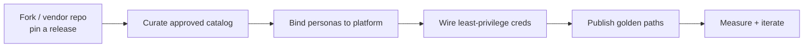
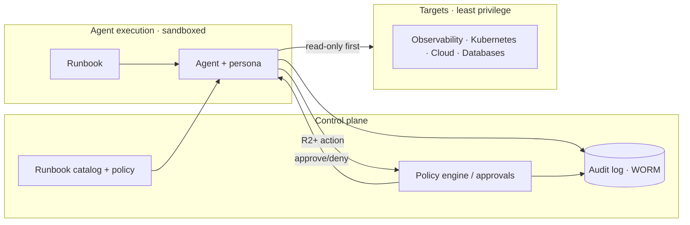

# Enterprise

This page summarizes how to adopt `awesome-ai-runbooks` safely and at scale
inside an enterprise. It is a map to the full
[Enterprise Guide](../ENTERPRISE_GUIDE.md), which is written for platform,
security, SRE, and engineering-leadership teams introducing autonomous agents
into regulated or high-stakes environments.

## The adoption model

Adopt in graduated stages of autonomy. Start agents on read-only, advisory work
and earn trust before allowing any production mutation. The full stage model —
from Stage 0 (read-only reports) to Stage 4 (managed, policy-enforced autonomy)
— is described on the [Governance](governance.md) page and in the guide.

## Internal adoption steps

1. **Fork or vendor** this repository into an internal `agent-runbooks` repo.
2. **Pin a release** (tag or commit) so agent behavior is reproducible and
   auditable; upgrade deliberately via pull request.
3. **Curate a catalog** of approved runbooks per team and domain; disable the
   rest.
4. **Bind personas** from [`prompts/`](../prompts/README.md) to your agent
   platform's system prompt.
5. **Wire least-privilege credentials** per runbook `required_access`.
6. **Publish golden paths**: "To do X, point your agent at runbook Y with inputs
   Z."
7. **Measure** adoption and outcomes, then iterate.

## Private and overlay runbooks

Keep public runbooks upstream and layer private ones on top without forking
divergence: track upstream as a subtree or submodule, add company-specific
runbooks in a private tree, and use overlays for local conventions (naming,
internal tools) so upstream updates merge cleanly. Author private runbooks from
the same [template](../templates/runbook-template.md) and run the same validators
in internal CI. Never place secrets, hostnames, or customer data in runbooks —
reference a secrets manager and use placeholders.

## Security, compliance, and oversight

- **Security reviews.** Every `security` runbook and any `high|critical`-risk
  runbook gets a second security review. Issue scoped, short-lived credentials
  per run; sandbox execution with egress controls; and red-team agent prompts
  for prompt injection before production.
- **Compliance mapping.** The guide maps agent operations to common frameworks.

| Framework | Where agents intersect | Controls provided |
|-----------|------------------------|-------------------|
| SOC 2 | Change management, access, monitoring | Approvals, audit logs, least privilege |
| ISO 27001 | A.9 access control, A.12 operations | Scoped creds, change control, logging |
| NIST AI RMF | Govern / Map / Measure / Manage | Standards, risk scoring, evaluation |
| PCI DSS | Change control, least privilege | Gated actions, audit trail, segregation |

- **Oversight and audit.** Log full run trajectories, track guardrail and quality
  metrics, detect drift after model or prompt changes, keep a tested kill switch,
  and emit tamper-evident audit records to WORM storage. Details are on the
  [Governance](governance.md) page.

## Reference architecture

The guiding principles are sandboxed execution, scoped short-lived credentials,
policy-enforced approvals, and a centralized immutable audit trail.

## Adoption checklist

- [ ] Repo forked/vendored and pinned to a release.
- [ ] Approved runbook catalog defined with autonomy stages.
- [ ] Personas bound to the agent platform.
- [ ] Least-privilege, short-lived credentials per runbook.
- [ ] Sandboxed execution with egress controls.
- [ ] Approval workflow wired for R2/R3 actions.
- [ ] Immutable audit logging in place.
- [ ] Guardrail and quality metrics dashboards live.
- [ ] Kill switch tested.
- [ ] Security review completed for security/high-risk runbooks.
- [ ] Compliance mappings documented.
- [ ] Governance/review board and cadence established.

## Next steps

Pair this page with [Governance](governance.md) for the day-to-day operating
model, and read the complete [Enterprise Guide](../ENTERPRISE_GUIDE.md) for the
detailed workflows, audit-record schema, and human-in-the-loop patterns.
