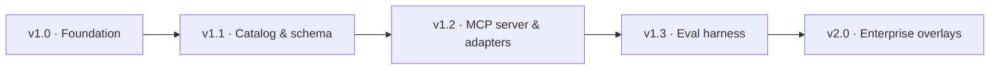
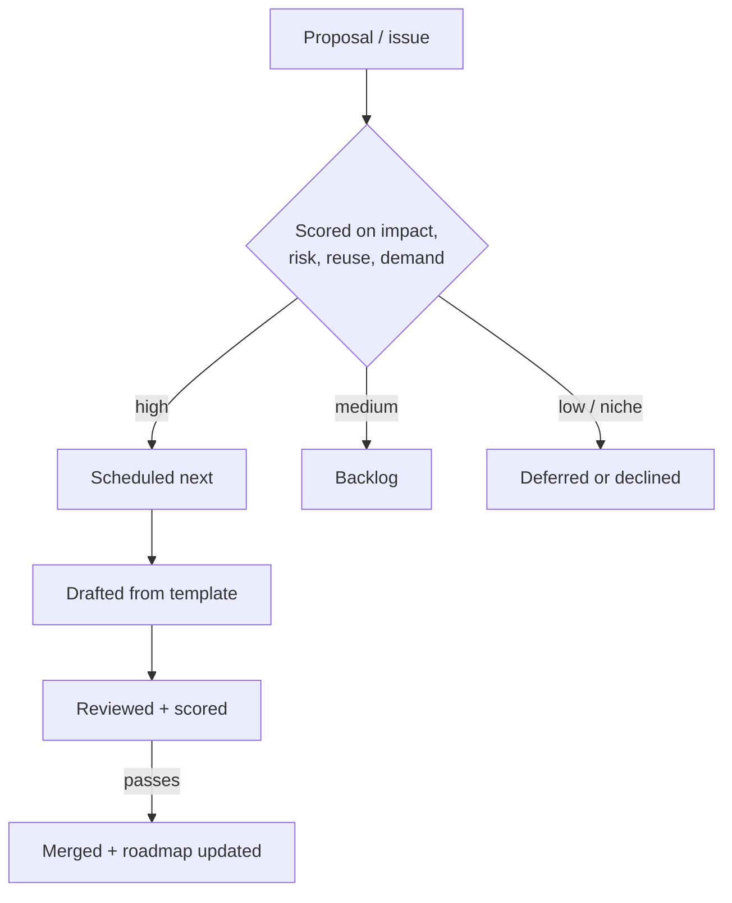

# Roadmap

The project advances along two tracks: the **project roadmap** (milestones and
capabilities) and the **content pipeline** (new runbooks). This page summarizes
both. The authoritative sources are
[`docs/planning/ROADMAP.md`](planning/ROADMAP.md) for milestones and
[Future Runbooks](FUTURE_RUNBOOKS.md) for the content pipeline.

## Project milestones

| Version | Theme | Highlights |
|---------|-------|-----------|
| v1.0 | Foundation | Standards, 48 runbooks, prompts, QA, CI |
| v1.1 | Catalog & schema | Auto-generated catalog, JSON-Schema front matter, scaffolding |
| v1.2 | Integrations | MCP reference server, per-platform adapters |
| v1.3 | Evaluation | Agent evaluation harness, golden trajectories, maturity badge |
| v2.0 | Enterprise | Enterprise overlays, approval-workflow references, compliance packs |

The v1.3 evaluation work is what carries the repository from Level 4 (Managed) to
Level 5 (Optimizing) on the maturity model described in the
[Quality Framework](quality-framework.md).

## Content pipeline

The runbook library grows across fifteen high-value themes. Status legend:
**planned**, **scoping**, **drafting**.

| Theme | Example planned runbooks | Extends |
|-------|--------------------------|---------|
| AI Security | prompt-injection defense, model supply-chain audit | `security` |
| MCP Ecosystem | MCP tool security review, registry hygiene | `ai-ml`, `security` |
| AIOps | anomaly triage, automated-remediation guardrails | `reliability` |
| Agent Governance | agent access review, action-approval policy audit | `security` |
| Agent Safety | agent red-team exercise, sandbox review | `security` |
| FinOps | commitment planning, unit-economics review | `cloud-cost` |
| Data Engineering | pipeline reliability, data-quality audit | new `data/` |
| Platform Engineering | golden-path audit, IDP reliability review | `architecture` |
| Cloud Architecture | multi-region resilience, well-architected review | `architecture` |
| DevSecOps | SLSA supply-chain review, secrets-management audit | `security` |
| Incident Response | SEV1 incident command, comms & status page | `reliability` |
| SOC Automation | alert-triage automation, detection tuning | new `soc/` |
| Threat Modeling | STRIDE facilitation, trust-boundary review | `security` |
| Threat Hunting | hypothesis-driven hunt, IOC sweep | `soc` |
| Compliance Automation | control-evidence collection, drift detection | `security` |

## How work is prioritized

New runbooks and features are prioritized by the same criteria: **impact, risk
reduction, reusability, and community demand.** High-impact, high-reuse
procedures that reduce operational risk are scheduled first, and security or
governance content that unblocks safe autonomy is weighted heavily.

## Influencing the roadmap

The roadmap is community-driven. To propose or reorder an item, open an issue
with the `roadmap` label as described in
[Contributing](contributing.md). Substantial additions should start with an issue
to align on scope before authoring. The content backlog in
[Future Runbooks](FUTURE_RUNBOOKS.md) is the canonical list of candidate
runbooks, and the [project roadmap](planning/ROADMAP.md) tracks the milestone
plan.

## Related reading

- [Quality Framework](quality-framework.md) — the maturity model the roadmap
  advances.
- [Runbook Library](runbook-library.md) — the current 48-runbook baseline the
  pipeline builds on.
- [Vision](planning/VISION.md) and
  [Competitive Analysis](planning/COMPETITIVE_ANALYSIS.md) — the long-term
  direction behind the milestones.
