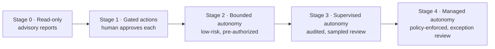
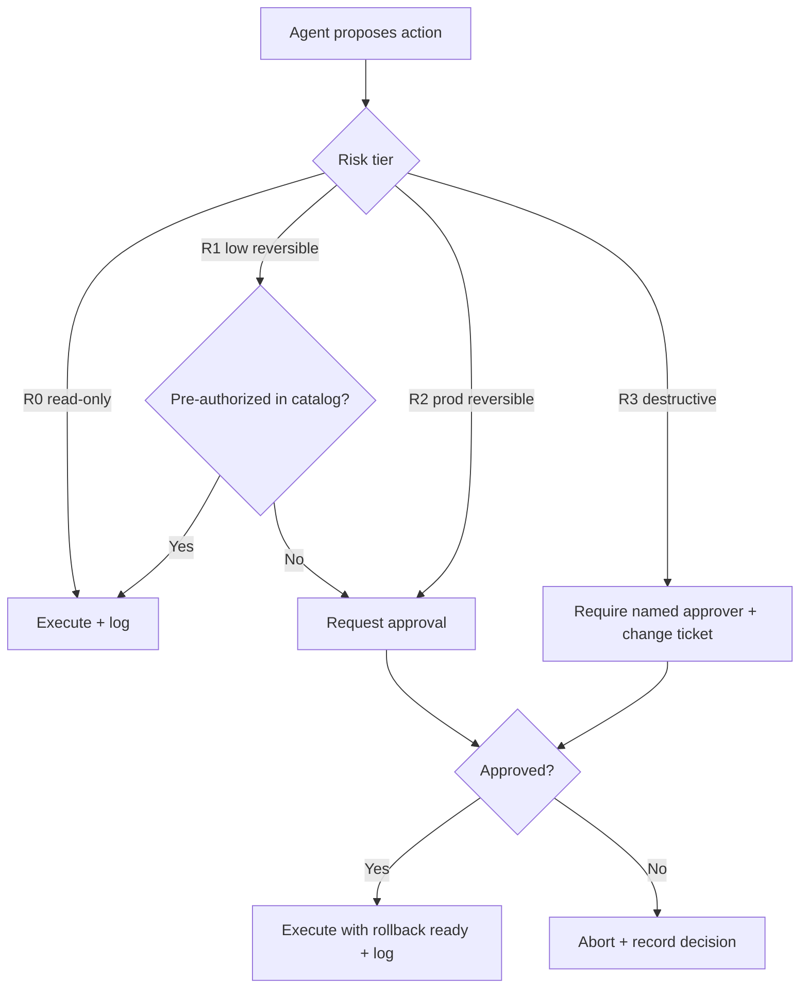

# Governance

Autonomous agents earn trust through governance, not promises. This page
summarizes how to govern agent operations built on this library — ownership,
approval authority, risk registers, and policy-as-code. The full treatment lives
in the [Enterprise Guide](../ENTERPRISE_GUIDE.md), and governance artifacts and
policy references are collected under the repository's
[`governance/`](../governance/) directory.

## Why governance comes first

A runbook makes agent behavior consistent; governance makes it *accountable*.
Without an owner, an approval authority, and an audit trail, even a well-written
runbook can drift, be misused, or run at an autonomy level the organization never
sanctioned. Governance answers three questions for every runbook: **who owns it,
who may promote it, and who approves its risky actions.**

## Graduated autonomy

Do not start agents on production-mutating work. Earn trust with read-only value
first, then advance a runbook stage by stage only after it meets its metrics over
an observation window.

| Stage | Agent may | Human role | Typical risk tier |
|:-----:|-----------|------------|-------------------|
| 0 | Investigate & report | Consume reports | R0 |
| 1 | Propose changes | Approve each action | R0–R1 |
| 2 | Execute pre-authorized low-risk actions | Review after | R1 |
| 3 | Execute within policy; escalate exceptions | Sample + exception review | R1–R2 |
| 4 | Operate within guardrails | Govern policy, review exceptions | R2 (gated R3) |

## Governance elements

| Element | Recommendation |
|---------|----------------|
| Ownership | Each runbook has an owner team via `owner` front matter |
| Approval authority | Define who can promote a runbook to each autonomy stage |
| Change control | Runbook changes go through PR + review, like code |
| Risk register | Track high/critical runbooks and their controls |
| Review cadence | Re-review runbooks on a schedule (`last_reviewed`) |
| Policy as code | Encode which agents may run which runbooks in a catalog |

A lightweight but explicit **Agent Operations Review Board** — platform,
security, and SRE together — approves new runbooks, autonomy promotions, and
post-incident changes.

## Approval workflows

Actions are gated by risk tier. The gate is enforced through existing tooling
(ChatOps approve/deny, PR review, or a change-management ticket); approvals must
be **specific to the action**, not a blanket grant, and must expire.

## Oversight and audit

Governance is only real if it is observable. Two practices make it so:

- **Agent oversight.** Log the full trajectory (plan, each tool call,
  inputs/outputs, final report), track guardrail metrics (blocked unsafe
  actions, escalations raised, approvals requested vs granted), watch for drift
  after model or prompt updates, and keep a tested kill switch that pauses all
  autonomous execution.
- **Immutable audit logging.** Every autonomous run emits a tamper-evident
  record in append-only (WORM) storage. Every mutating action records who
  approved it and the rollback used, and logs are queryable for incident review
  and compliance evidence.

## Human-in-the-loop patterns

| Pattern | When to use |
|---------|-------------|
| Plan approval | High-risk runbooks — approve the plan before any action |
| Action gate | Individual R2/R3 steps |
| Checkpoint review | Long migrations, at phase boundaries |
| Confidence gate | Ambiguous findings below a confidence threshold |
| Sampled review | Mature, low-risk runbooks |
| Four-eyes | Destructive/critical actions — two independent approvals |

Design gates to be fast and meaningful: the human should see the plan, the
evidence, and the rollback — not just a yes/no prompt.

## Where this connects

Governance sits alongside the [Quality Framework](quality-framework.md) (which
enforces content quality) and the [Enterprise](enterprise.md) page (which covers
staged adoption, private runbooks, and compliance). For the complete governance
model, reference architecture, and adoption checklist, read the
[Enterprise Guide](../ENTERPRISE_GUIDE.md).
