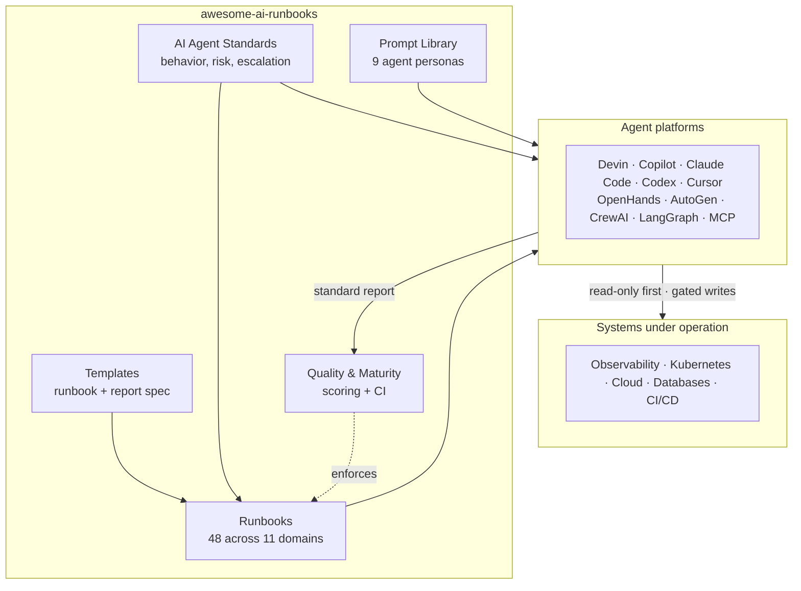

# awesome-ai-runbooks

**The definitive open-source library of operational runbooks for autonomous
AI agents.** Google SRE playbooks, AWS Well-Architected, and modern agent
operations — reimagined for the age of autonomous execution.

This portal is the guided, searchable companion to the repository. It explains
what the project is, how the pieces fit together, and how to point ten different
agent platforms at the same vendor-neutral runbooks and get consistent,
senior-level results.

## What it is

Autonomous agents — Devin, GitHub Copilot Agent, Claude Code, OpenAI Codex,
Cursor, OpenHands, AutoGen, CrewAI, LangGraph, and MCP-enabled agents — can now
carry out real, multi-step engineering work. Capability is no longer the
bottleneck; **reliability, repeatability, and trust are.**

Human engineering organizations solved that problem with runbooks, SOPs, and
playbooks. `awesome-ai-runbooks` brings the same operational discipline to AI
agents as a machine-checkable, evidence-first standard built around how agents
actually **plan, act, validate, and report**. The library ships **48 runbooks
across 11 domains**, **9 reusable agent personas**, a **universal behavioral
contract**, and a **quality framework enforced in CI**.

## Why it matters

| Without runbooks | With awesome-ai-runbooks |
|------------------|--------------------------|
| Behavior improvised from a one-line prompt | Standardized, reviewable procedures |
| Same task, wildly different quality | Consistent, senior-level execution |
| Agents jump to conclusions | Evidence-first, hypothesis-driven work |
| Risky, irreversible actions | Least-privilege, gated, reversible-by-design |
| No audit trail | Standard reports plus audit logging patterns |
| Locked to one vendor | One contract across every major agent |

## How it fits together



## Quick links

- [Overview](overview.md) — the what, why, and who in one page.
- [Architecture](architecture.md) — how runbooks, standards, and tooling
  combine.
- [Standards](standards.md) — the 12 frameworks every agent must follow.
- [Agent Frameworks](agent-frameworks.md) — how ten platforms consume runbooks.
- [Runbook Library](runbook-library.md) — all 11 categories and their coverage.
- [Quality Framework](quality-framework.md) — scoring and the maturity model.
- [Governance](governance.md) and [Enterprise](enterprise.md) — safe adoption
  at scale.
- [Integrations](integrations/index.md) — concrete setup guides per platform.
- [Roadmap](future-roadmap.md) and [Contributing](contributing.md) — where the
  project is heading and how to help.

## Get started in three steps

1. Load the matching persona from the repository's `prompts/` directory as your
   agent's system prompt.
2. Provide the runbook file and its **Inputs Required** (for example
   `service_name`, `environment`).
3. Let the agent plan, investigate read-only, validate, and produce a standard
   report.

```text
System: <contents of prompts/root-cause-analysis-agent.md>
User:   Execute runbook runbooks/reliability/root-cause-analysis.md
        Inputs: service_name=checkout-api, environment=prod,
        symptom="p99 latency > 2s since 14:00 UTC"
        Operate read-only; propose any mutating action for approval.
```

## Source material

This portal summarizes and links back to the canonical documents in the
repository: the [README](../README.md), the
[AI Agent Standards](AI_AGENT_STANDARDS.md), the
[Quality Assurance framework](QUALITY_ASSURANCE.md), the
[Enterprise Guide](../ENTERPRISE_GUIDE.md), and the planning set under
[`docs/planning/`](planning/VISION.md). When a portal page summarizes a topic,
the linked source document remains the authoritative reference.

Our north star: be to AI agents what the SRE Book and the Well-Architected
Framework are to human engineers — an open, rigorous, cross-vendor operational
standard, purpose-built for autonomous execution.
