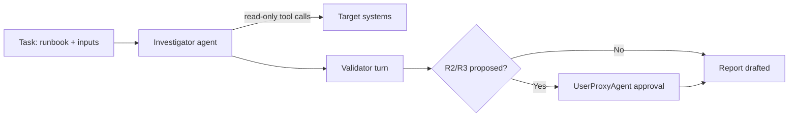

# AutoGen

AutoGen is a multi-agent framework where specialized agents converse to solve a
task. It is a strong fit for decomposing a runbook across roles — a planner, an
investigator, a validator, and a human-approval proxy — while every agent shares
the same [AI Agent Standards](../AI_AGENT_STANDARDS.md) as its behavioral floor.

## Prerequisites

- Python 3.10+ with `autogen-agentchat` (or `pyautogen`) installed.
- This library on disk so you can read persona and runbook files.
- Least-privilege credentials for the target system in environment variables,
  surfaced to tools rather than to prompts.

## Step 1 — Load the persona as a system message

Read the matching persona from [`prompts/`](../../prompts/README.md) and use it
as the agent's `system_message`.

```python
from pathlib import Path

def load(path: str) -> str:
    return Path(path).read_text(encoding="utf-8")

persona = load("prompts/root-cause-analysis-agent.md")
standards = load("docs/AI_AGENT_STANDARDS.md")
runbook = load("runbooks/reliability/root-cause-analysis.md")
```

## Step 2 — Define the agents

Map runbook phases to roles. A `UserProxyAgent` acts as the human-approval gate
for R2/R3 actions.

```python
from autogen import AssistantAgent, UserProxyAgent

llm_config = {"model": "gpt-4o", "temperature": 0}

investigator = AssistantAgent(
    name="investigator",
    system_message=persona + "\n\nBehavioral contract:\n" + standards,
    llm_config=llm_config,
)

approver = UserProxyAgent(
    name="human_approver",
    human_input_mode="ALWAYS",   # gate every mutating action
    code_execution_config={"work_dir": "runs", "use_docker": True},
)
```

## Step 3 — Kick off the task with the runbook and inputs

```python
task = f"""Execute the following runbook. Operate read-only first; request my
approval before any R2/R3 action and state a rollback.

Inputs Required:
  service_name: checkout-api
  environment: prod
  symptom: "p99 latency > 2s since 14:00 UTC"

--- RUNBOOK ---
{runbook}
"""

approver.initiate_chat(investigator, message=task)
```

## How the loop maps to AutoGen



## Register least-privilege tools

Expose only the read-only tools the runbook's `required_access` calls for, and
route any mutating tool through the approver.

```python
@investigator.register_for_llm(description="Read-only Prometheus query")
@approver.register_for_execution()
def prometheus_query(promql: str) -> str:
    ...  # call your metrics API with a scoped, read-only token
```

## Platform-specific tips

- **Keep `human_input_mode="ALWAYS"` for the approver.** It is the enforcement
  point for the risk gate; downgrade to `TERMINATE` only for provably read-only
  runbooks.
- **Set temperature to 0.** Deterministic reasoning makes trajectories easier to
  audit and reproduce.
- **Split roles by framework phase.** Assign the Planning, Investigation, and
  Quality frameworks to distinct agents to get self-critique for free.
- **Sandbox code execution.** Use `use_docker=True` so any command the agent
  runs is contained.
- **Persist the transcript.** Save the full chat and the final report; the
  transcript is your audit trajectory.

## Related

- [Agent Frameworks](../agent-frameworks.md) — multi-agent decomposition.
- [Standards](../standards.md) — the shared contract each agent enforces.
- [Prompt library](../../prompts/README.md) — persona selection.
