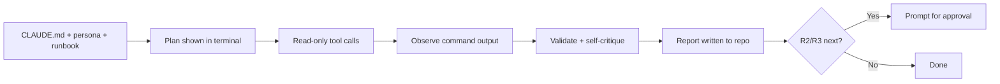

# Claude Code

Claude Code is a terminal-first coding agent that reads your project, runs
commands, and edits files. It loads a `CLAUDE.md` memory file automatically,
which makes it a clean fit for pinning the standards and persona while passing
the specific runbook as a file reference.

## Prerequisites

- Claude Code installed and authenticated (`claude` on your PATH).
- This library in the working directory (cloned, vendored, or a submodule).
- Least-privilege credentials for the target system exported in the shell
  environment, never written into `CLAUDE.md` or chat.

## Step 1 — Pin the contract in CLAUDE.md

Create or extend `CLAUDE.md` at the project root. Claude Code reads it at the
start of every session.

```markdown
# Project memory

## Runbook execution
When I ask you to execute a runbook, follow @docs/AI_AGENT_STANDARDS.md:
- Investigate read-only first.
- Classify each action R0–R3; pause for my approval before any R2/R3 (prod
  mutation or irreversible) action, and state a rollback.
- Produce a report using @templates/report-template.md.
```

The `@path` syntax imports those files into Claude Code's context automatically.

## Step 2 — Load the persona and runbook

Reference the persona and runbook with `@` file mentions so their full contents
are in context. Pick the persona that matches the runbook from
[`prompts/`](../../prompts/README.md).

## Step 3 — Invoke

From the project directory:

```bash
claude "Adopt the persona in @prompts/platform-audit-agent.md and execute
the runbook @runbooks/kubernetes/eks-audit.md.
Inputs Required: cluster_name=prod-use1, environment=prod, region=us-east-1.
Operate read-only (kubectl get/describe, aws eks describe-*). Propose any
mutating action for approval with a rollback. Write the report to
reports/eks-audit-prod-use1.md following @templates/report-template.md."
```

You can also run it non-interactively in a pipeline with the print flag:

```bash
claude -p "Execute @runbooks/observability/logging-review.md with
service_name=orders-api environment=staging. Read-only only." \
  > reports/logging-review.md
```

## How the loop maps to Claude Code



## Platform-specific tips

- **Use permission modes deliberately.** Keep Claude Code in its default
  approval mode so mutating bash commands require confirmation; reserve any
  auto-accept mode for read-only investigations.
- **Allow-list only the tools the runbook needs.** Configure permitted commands
  (for example `kubectl get`, `aws eks describe-*`) to match the runbook's
  `required_access` and deny the rest.
- **Let `@`-imports carry the runbook.** Because imported files are re-readable,
  Claude can revisit the decision tree and validation steps mid-run without you
  re-pasting them.
- **Capture the report as an artifact.** Redirect `-p` output or ask for a file
  write so every run leaves a versioned deliverable.
- **Keep secrets in the environment.** Export credentials before launching
  `claude`; never place them in `CLAUDE.md`, which is committed to the repo.

## Related

- [Standards](../standards.md) — the behavior `CLAUDE.md` enforces.
- [Prompt library](../../prompts/README.md) — persona selection.
- [Runbook Library](../runbook-library.md) — pick a runbook by domain.
