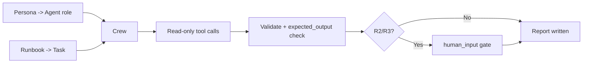

# CrewAI

CrewAI orchestrates role-based agents ("a crew") that each own a goal and a
backstory and collaborate on tasks. The mapping to this library is natural: a
persona from [`prompts/`](../../prompts/README.md) becomes an Agent's role and
backstory, and a runbook becomes a Task description, all governed by the
[AI Agent Standards](../AI_AGENT_STANDARDS.md).

## Prerequisites

- Python 3.10+ with `crewai` installed.
- This library on disk so you can read persona and runbook files.
- Least-privilege credentials for the target system in environment variables,
  exposed only through tools.

## Step 1 — Turn a persona into an Agent

```python
from pathlib import Path
from crewai import Agent, Task, Crew, Process

def load(p: str) -> str:
    return Path(p).read_text(encoding="utf-8")

persona = load("prompts/cost-optimization-agent.md")
standards = load("docs/AI_AGENT_STANDARDS.md")

finops = Agent(
    role="Cloud Cost Optimization Engineer",
    goal="Execute the runbook read-only and produce a prioritized report.",
    backstory=persona + "\n\nBehavioral contract:\n" + standards,
    allow_delegation=False,
    verbose=True,
)
```

## Step 2 — Turn a runbook into a Task

```python
runbook = load("runbooks/cloud-cost/aws-cost-optimization.md")

audit = Task(
    description=(
        "Execute the following runbook. Operate read-only. Propose any mutating "
        "action for human approval with a rollback.\n\n"
        "Inputs Required:\n"
        "  account_id: 1234-5678-9012\n"
        "  environment: prod\n"
        "  region: us-east-1\n\n"
        f"--- RUNBOOK ---\n{runbook}"
    ),
    expected_output=(
        "A report following templates/report-template.md: executive summary, "
        "observations, evidence-linked findings, prioritized recommendations."
    ),
    agent=finops,
    human_input=True,   # gate R2/R3 actions and review the result
)
```

## Step 3 — Run the crew

```python
crew = Crew(agents=[finops], tasks=[audit], process=Process.sequential)
result = crew.kickoff()
Path("reports/aws-cost-optimization.md").write_text(str(result), encoding="utf-8")
```

## How the loop maps to CrewAI



## Compose a multi-role crew

For larger runbooks, split the phases into cooperating agents — for example an
investigator and a reviewer — and keep delegation off unless the runbook calls
for it:

```python
reviewer = Agent(
    role="Staff Engineer reviewer",
    goal="Run the self-critique pass from the Quality framework before sign-off.",
    backstory="You challenge weak evidence and unsafe steps.",
)
```

## Platform-specific tips

- **Set `human_input=True` on mutating tasks.** It is the R2/R3 gate; leave it on
  unless the runbook is provably read-only.
- **Give tools least privilege.** Attach only the read-only tools the runbook's
  `required_access` requires; wrap any write tool so it cannot run without
  approval.
- **Use `expected_output` to enforce the report shape.** Point it at the
  [report template](../../templates/report-template.md) so findings are
  comparable across runs.
- **Prefer sequential process for runbooks.** A runbook is an ordered procedure;
  sequential execution preserves the plan → investigate → validate order.
- **Persist `kickoff()` output.** Write the result to `reports/` as your audit
  artifact.

## Related

- [Agent Frameworks](../agent-frameworks.md) — role-based decomposition.
- [Standards](../standards.md) — the contract in each backstory.
- [Prompt library](../../prompts/README.md) — persona selection.
