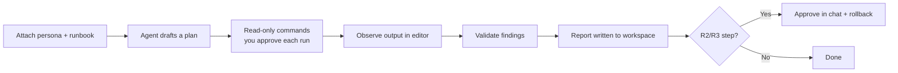

# Cursor

Cursor's Agent mode runs inside the editor: it reads your workspace, plans
multi-step edits, and runs terminal commands with your approval. To execute a
runbook, you make the persona and standards **project rules** so they apply
automatically, then attach the specific runbook as context for the task.

## Prerequisites

- Cursor with Agent mode available.
- This library present in the workspace (cloned, vendored, or a submodule) so
  runbook and persona files can be attached with `@Files`.
- Least-privilege credentials for the target system available to your shell
  (environment variables or a profile), never pasted into chat.

## Step 1 — Add project rules

Create a rule under `.cursor/rules/` so the standards are always in context.
Cursor applies matching rules to every Agent request in the project.

```markdown
---
description: AI runbook execution standards
alwaysApply: true
---

Follow docs/AI_AGENT_STANDARDS.md when executing any runbook. Investigate
read-only first. Classify each action R0–R3; never run an R2/R3 command
(anything mutating prod or irreversible) without my explicit approval in chat.
Deliver a report using templates/report-template.md.
```

## Step 2 — Load the persona

Attach the matching persona from [`prompts/`](../../prompts/README.md) as context
using the `@Files` picker — for example
[`prompts/root-cause-analysis-agent.md`](../../prompts/root-cause-analysis-agent.md)
for an incident investigation. You can also paste its contents into the first
message of the Agent conversation.

## Step 3 — Attach the runbook and state inputs

In Agent mode, reference the runbook file and provide the inputs.

```text
@prompts/root-cause-analysis-agent.md  (persona)
@runbooks/reliability/root-cause-analysis.md  (runbook)

Execute this runbook.
Inputs Required:
  - service_name: checkout-api
  - environment: prod
  - symptom: "p99 latency > 2s since 14:00 UTC"
Operate read-only. Propose any mutating action for my approval with a rollback.
```

## How the loop maps to Cursor



Cursor's per-command approval prompt is a natural enforcement point for the
runbook's risk gates: read-only (R0) commands can run freely, while any mutating
command surfaces for your explicit approval.

## Example: write the report to the workspace

Ask the agent to save its deliverable so it is versioned with your code:

```text
Save the final report to reports/checkout-api-rca-2026-08-13.md using the
structure in templates/report-template.md.
```

## Platform-specific tips

- **Prefer `alwaysApply` for the standards, attached files for the runbook.**
  The standards rarely change, so keep them as an always-on rule; the runbook
  differs per task, so attach it explicitly.
- **Enable command approval, not full auto-run.** Keep Agent command execution
  gated so mutating steps require a click — this maps directly to the R2/R3 gate.
- **Use `@Files` over pasting for long runbooks.** Attaching the file keeps the
  full runbook in context without truncation and lets the agent re-read sections.
- **Scope the terminal.** Run Cursor from a shell that only has the credentials
  the runbook's `required_access` calls for; do not expose broad admin tokens.
- **Keep one runbook per conversation.** Start a fresh Agent chat for each
  runbook so context stays focused and the plan stays reviewable.

## Related

- [Standards](../standards.md) — risk tiers and the approval gate.
- [Agent Frameworks](../agent-frameworks.md) — how Cursor fits the shared
  pattern.
- [Prompt library](../../prompts/README.md) — persona selection.
