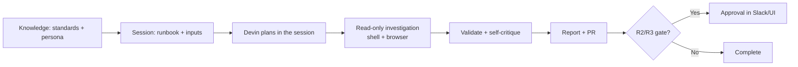

# Devin

Devin is an autonomous software engineer that runs long, multi-step sessions in
its own cloud workspace with a browser, shell, and editor. It supports a
persistent **Knowledge** store for durable instructions, which is the ideal
place to pin the standards and personas so every session starts compliant.

## Prerequisites

- A Devin workspace with access to this library (connected repo, or the runbook
  and persona files pasted into the session).
- Least-privilege, short-lived credentials for the target system provided through
  Devin's secrets management, never in plain prompts.
- A defined approval channel (Slack or the session UI) for R2/R3 gates.

## Step 1 — Add the standards to Knowledge

Create a Knowledge entry that Devin applies across sessions:

```text
Title: Runbook execution standards
Trigger: when executing any awesome-ai-runbooks runbook

Follow docs/AI_AGENT_STANDARDS.md. Investigate read-only first. Classify every
action R0–R3. Never take an R2/R3 action (prod mutation or irreversible) without
explicit human approval and a stated rollback. Deliver a report using
templates/report-template.md.
```

## Step 2 — Load the persona

Add each persona from [`prompts/`](../../prompts/README.md) as its own Knowledge
entry, or paste the relevant persona at the start of a session. For a readiness
review, use
[`prompts/production-readiness-agent.md`](../../prompts/production-readiness-agent.md).

## Step 3 — Start the session

Give Devin the persona, the runbook, and the inputs in the session prompt.

```text
Adopt the persona in prompts/production-readiness-agent.md.
Execute runbook runbooks/reliability/production-readiness-review.md.
Inputs Required:
  - service_name: notifications-api
  - environment: prod
  - release_ref: v2.4.0
Operate read-only. For any R2/R3 action, post a plan with rollback to the
approval channel and wait. Save the report to reports/notifications-readiness.md
using templates/report-template.md, then open a PR with just the report.
```

## How the loop maps to Devin



Devin's session log becomes the trajectory record the
[Enterprise Guide](../../ENTERPRISE_GUIDE.md) expects for audit — plan, tool
calls, and final report in one place.

## Example: gated action request

When the runbook reaches a mutating step, Devin should surface a request like:

```text
Proposed R2 action: restart deployment notifications-api (rolling).
Reason: readiness check flags a stuck pod. Rollback: kubectl rollout undo
deploy/notifications-api. Approve? (yes/no)
```

## Platform-specific tips

- **Use Knowledge for durable content, sessions for the task.** Standards and
  personas belong in Knowledge; the runbook path and inputs belong in the session
  prompt so behavior is reproducible.
- **Pin a runbook version.** Reference a specific tag or commit of the vendored
  library so a given session's behavior is auditable and repeatable.
- **Wire approvals to a real channel.** Connect Slack or use the session UI so
  R2/R3 gates reach a human quickly without stalling the run.
- **Scope secrets per runbook.** Grant only the credentials the runbook's
  `required_access` requires; rotate short-lived tokens after the session.
- **Have Devin open a PR with the report.** Keeping the deliverable in version
  control gives you the standard, comparable output the report template defines.

## Related

- [Enterprise Guide](../../ENTERPRISE_GUIDE.md) — audit logging and approval
  workflows.
- [Standards](../standards.md) — the risk gates Devin enforces.
- [Prompt library](../../prompts/README.md) — persona selection.
