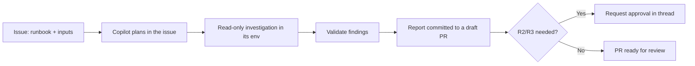

# GitHub Copilot Agent

GitHub Copilot's coding agent works inside a repository: you assign it an issue,
it plans, edits files, runs commands in its environment, and opens a pull
request. To make it execute a runbook from this library, you pin the persona and
standards as **repository custom instructions** and hand it the runbook plus
inputs in the task itself.

## Prerequisites

- A repository with GitHub Copilot coding agent enabled for your organization.
- This library available to the agent — either vendored into the repo under
  `agent-runbooks/`, or added as a git submodule so the runbook and persona
  files are on disk.
- Least-privilege credentials for the target system exposed to the agent's
  environment as repository or environment secrets (never hard-coded).

## Step 1 — Pin the standards as custom instructions

Create `.github/copilot-instructions.md`. Copilot loads this automatically for
every task, so it is the right place for the durable behavioral contract.

```markdown
# Copilot agent instructions

When asked to execute a runbook, follow docs/AI_AGENT_STANDARDS.md exactly:
operate read-only first, classify every action by risk tier (R0–R3), and never
perform an R2/R3 action without explicit approval in the issue thread.
Produce a report using templates/report-template.md.
```

## Step 2 — Provide the persona and runbook

For a given task, paste the persona contents at the top of the issue (or
reference the file path if it is vendored in the repo). Personas live in
[`prompts/`](../../prompts/README.md); pick the one that matches the runbook —
for example [`prompts/security-review-agent.md`](../../prompts/security-review-agent.md)
for a security audit.

## Step 3 — Assign the task

Open an issue, assign it to Copilot, and state the runbook, its inputs, and the
safety boundary explicitly.

```text
Title: Execute api-security-audit on the payments service

Body:
System persona: see prompts/security-review-agent.md (loaded).
Execute runbook runbooks/security/api-security-audit.md.
Inputs Required:
  - service_name: payments-api
  - environment: staging
  - base_url: https://staging.internal/payments
Operate strictly read-only. Do not modify code or config.
Post findings as a report following templates/report-template.md, then open a
draft PR containing only the report under reports/.
```

## Example invocation via the CLI

You can also drive the agent with the GitHub CLI once the task exists:

```bash
gh issue create \
  --title "Execute api-security-audit on payments-api" \
  --body-file ./task-api-security-audit.md \
  --assignee "@copilot"
```

## How the loop maps to Copilot



Copilot externalizes its plan in the issue timeline, which satisfies the
Planning framework's requirement that plans be reviewable before action.

## Platform-specific tips

- **Keep writes in the PR, not in production.** Copilot's natural output is a
  pull request. Have it write the runbook's **report** into the repo (for
  example under `reports/`) rather than mutating live systems; production changes
  should remain a separate, human-approved step.
- **Use environment secrets, not literals.** Configure target-system credentials
  as Copilot environment secrets scoped to the minimum needed for the runbook's
  `required_access`.
- **Constrain the firewall allow-list.** If the runbook queries an external
  observability or cloud API, add only those hosts to the agent's network
  allow-list so egress stays least-privilege.
- **One runbook per issue.** Copilot performs best with a single, well-scoped
  task; do not batch multiple runbooks into one issue.
- **Review the plan first.** Because the plan appears in the timeline, a
  reviewer should confirm the read-only vs mutating step tags before approving
  any follow-up action.

## Related

- [Agent Frameworks](../agent-frameworks.md) — the cross-platform pattern.
- [Standards](../standards.md) — the risk tiers Copilot must respect.
- [Prompt library](../../prompts/README.md) — pick the right persona.
