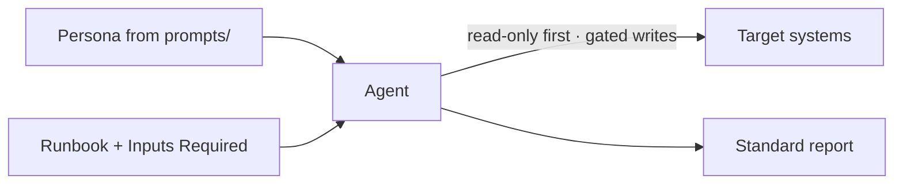

# Integrations

These guides show, concretely, how to make ten agent platforms execute the
runbooks in this repository. They all follow the same shape — load a persona,
supply a runbook, provide inputs — and differ only in platform mechanics. For the
conceptual model, see [Agent Frameworks](../agent-frameworks.md); for the
behavioral contract every platform honors, see the
[AI Agent Standards](../AI_AGENT_STANDARDS.md).

## The shared pattern

1. Load a persona from [`prompts/`](../../prompts/README.md) as the system
   prompt.
2. Supply the runbook file — paste it, mount it, or serve it as an MCP resource.
3. Provide the runbook's **Inputs Required** (for example `service_name`,
   `environment`).
4. Let the agent plan, investigate read-only, gate R2/R3 actions, validate, and
   report using the [report template](../../templates/report-template.md).

## Choose your platform

| Platform | Best for | Integration surface | Guide |
|----------|----------|----------------------|-------|
| GitHub Copilot Agent | Repo-scoped tasks and PRs | `.github/copilot-instructions.md` + issue | [github-copilot.md](github-copilot.md) |
| Cursor | In-IDE investigation and edits | `.cursor/rules` + attached context | [cursor.md](cursor.md) |
| Claude Code | Terminal-first workflows | `CLAUDE.md` + file references | [claude-code.md](claude-code.md) |
| Devin | End-to-end autonomous sessions | Knowledge + session prompt | [devin.md](devin.md) |
| OpenHands | Open-source, self-hosted agents | Microagents + repo instructions | [openhands.md](openhands.md) |
| AutoGen | Multi-agent orchestration | `system_message` per agent | [autogen.md](autogen.md) |
| CrewAI | Role-based crews | Agent role + Task description | [crewai.md](crewai.md) |
| LangGraph | Explicit, resumable graphs | Graph nodes + typed state | [langgraph.md](langgraph.md) |
| OpenAI Agents / Codex | SDK-built agents | `instructions` + input | [openai-agents.md](openai-agents.md) |
| MCP clients | Any MCP-capable host | Resources + prompts + tools | [mcp-clients.md](mcp-clients.md) |

## Principles that hold everywhere

- **Least privilege.** Map each runbook's `required_access` to scoped,
  short-lived credentials.
- **Read-only first.** Investigation always precedes mutation.
- **Gated writes.** R2/R3 actions require human approval regardless of platform.
- **Standard output.** Every run ends in the same report format, so results are
  comparable across platforms.

Pick a platform above to see step-by-step setup, an example invocation, and
platform-specific tips.
