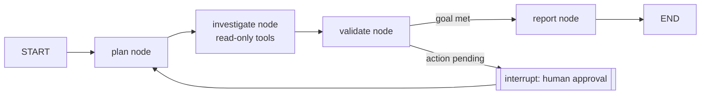

# LangGraph

LangGraph models an agent as an explicit state graph, which is an unusually good
match for this library: the runbook's Perceive → Plan → Act → Observe → Validate
→ Reflect → Report loop maps directly onto graph nodes and edges, and LangGraph's
interrupt mechanism gives you a first-class human-approval gate for R2/R3
actions. Behavior is governed by the [AI Agent Standards](../AI_AGENT_STANDARDS.md).

## Prerequisites

- Python 3.10+ with `langgraph` and a LangChain chat model installed.
- This library on disk so nodes can read persona and runbook files.
- Least-privilege credentials for the target system in environment variables,
  bound to read-only tools.

## Step 1 — Define typed state

```python
from typing import Annotated, TypedDict
from langgraph.graph.message import add_messages

class RunbookState(TypedDict):
    messages: Annotated[list, add_messages]
    runbook: str
    inputs: dict
    findings: list
    pending_action: dict | None   # set when an R2/R3 step is proposed
```

## Step 2 — Seed the persona and runbook

```python
from pathlib import Path

def load(p: str) -> str:
    return Path(p).read_text(encoding="utf-8")

persona = load("prompts/observability-agent.md")
standards = load("docs/AI_AGENT_STANDARDS.md")
system = persona + "\n\nBehavioral contract:\n" + standards
runbook = load("runbooks/observability/observability-review.md")
```

## Step 3 — Build the loop as a graph

```python
from langgraph.graph import StateGraph, START, END
from langgraph.checkpoint.memory import MemorySaver

def plan(state): ...        # externalize the plan from the runbook
def investigate(state): ... # read-only tool calls; append to findings
def validate(state): ...    # before/after checks
def report(state): ...      # render templates/report-template.md

def route(state):
    return "approve" if state.get("pending_action") else "report"

g = StateGraph(RunbookState)
g.add_node("plan", plan)
g.add_node("investigate", investigate)
g.add_node("validate", validate)
g.add_node("report", report)
g.add_edge(START, "plan")
g.add_edge("plan", "investigate")
g.add_edge("investigate", "validate")
g.add_conditional_edges("validate", route, {"approve": "plan", "report": "report"})
g.add_edge("report", END)

# interrupt_before pauses the graph so a human can approve an R2/R3 action
app = g.compile(checkpointer=MemorySaver(), interrupt_before=["plan"])
```

## Step 4 — Run with an approval gate

```python
config = {"configurable": {"thread_id": "obs-review-1"}}
app.invoke(
    {"runbook": runbook,
     "inputs": {"service_name": "orders-api", "environment": "prod"},
     "messages": [("system", system)]},
    config,
)
# Inspect state at the interrupt; if a mutating action is pending, approve then:
# app.invoke(None, config)  # resumes after human review
```

## How the loop maps to LangGraph



## Platform-specific tips

- **Use `interrupt_before` for the risk gate.** Pausing the graph before a
  mutating node is the cleanest R2/R3 approval mechanism and it is resumable.
- **Add a checkpointer.** `MemorySaver` (or a durable store) lets long runbooks —
  migrations especially — resume across checkpoint reviews.
- **Bind read-only tools only.** Attach tools that satisfy the runbook's
  `required_access`; keep any mutating tool behind the interrupt.
- **Store findings in state, not just messages.** A typed `findings` list makes
  the Validation and Reporting frameworks easy to enforce deterministically.
- **One thread per run.** Use a unique `thread_id` so each runbook execution has
  an isolated, auditable trajectory.

## Related

- [Standards](../standards.md) — the loop the graph encodes.
- [Agent Frameworks](../agent-frameworks.md) — graph-based consumption.
- [Prompt library](../../prompts/README.md) — persona selection.
