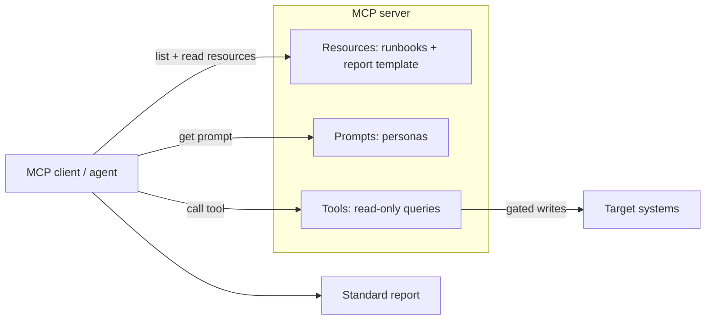

# MCP Clients

The Model Context Protocol (MCP) standardizes how agents obtain context and
tools from servers. It is the most portable way to distribute this library:
serve runbooks as **resources**, personas as **prompts**, and target-system
access as **tools**, and any MCP-capable client — Claude Desktop, Cursor, an IDE
plugin, or a custom agent — can execute a runbook. Behavior is governed by the
[AI Agent Standards](../AI_AGENT_STANDARDS.md).

## Prerequisites

- An MCP host/client (for example Claude Desktop, Cursor, or a custom SDK app).
- A small MCP server that exposes this library from disk (example below).
- Least-privilege credentials for the target system held by the server or a
  dedicated tools server — never embedded in resource text.

## The MCP mapping



| Library element | MCP primitive |
|-----------------|---------------|
| Runbook files | Resources (`runbook://<category>/<id>`) |
| Report template | Resource |
| Personas (`prompts/`) | Prompts |
| Target-system access | Tools (read-only by default) |

## Step 1 — Serve the library

A minimal Python server (using the `mcp` SDK) exposes runbooks and personas:

```python
from pathlib import Path
from mcp.server.fastmcp import FastMCP

mcp = FastMCP("awesome-ai-runbooks")
ROOT = Path(".")

@mcp.resource("runbook://{category}/{name}")
def runbook(category: str, name: str) -> str:
    return (ROOT / "runbooks" / category / f"{name}.md").read_text(encoding="utf-8")

@mcp.prompt()
def persona(name: str) -> str:
    """Return a persona system prompt, e.g. name='root-cause-analysis-agent'."""
    return (ROOT / "prompts" / f"{name}.md").read_text(encoding="utf-8")

if __name__ == "__main__":
    mcp.run()   # stdio transport by default
```

## Step 2 — Register the server with a client

For a stdio-based host, add it to the client's MCP config:

```json
{
  "mcpServers": {
    "ai-runbooks": {
      "command": "python",
      "args": ["-m", "ai_runbooks_server"]
    }
  }
}
```

## Step 3 — Execute a runbook

In the client, select the persona prompt and attach the runbook resource, then
provide inputs:

```text
Use prompt: persona(name="platform-audit-agent")
Attach resource: runbook://kubernetes/eks-audit
Execute this runbook. Inputs Required: cluster_name=prod-use1, environment=prod,
region=us-east-1. Operate read-only; propose R2/R3 actions for approval.
```

## Platform-specific tips

- **Expose runbooks as read-only resources.** Resources carry context, not
  side effects; keep all mutation behind explicitly gated tools.
- **Split read and write tools across servers.** Put read-only queries in one
  server and any mutating tool in a separate, approval-gated server so the risk
  boundary is structural.
- **Validate tool inputs server-side.** Treat every tool argument as untrusted
  and enforce the runbook's `required_access` scope in the server, not the
  prompt.
- **Pin a library version.** Serve runbooks from a specific tag or commit so
  clients get reproducible, auditable behavior.
- **Log every tool call.** Emit the trajectory (resource reads, prompt use, tool
  calls) to satisfy the audit expectations in the
  [Enterprise Guide](../../ENTERPRISE_GUIDE.md).
- **Guard against prompt injection.** Because resources contain instructions, a
  malicious runbook could misdirect an agent — review runbook content like
  privileged code before serving it.

## Related

- [Standards](../standards.md) — the contract every MCP client honors.
- [Agent Frameworks](../agent-frameworks.md) — MCP as a portable surface.
- [Prompt library](../../prompts/README.md) — the personas served as prompts.
