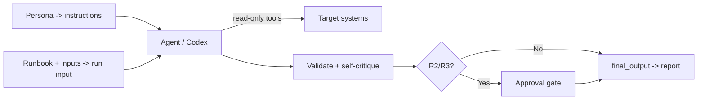

# OpenAI Agents / Codex

The OpenAI Agents SDK builds agents around `instructions`, `tools`, and typed
handoffs, and OpenAI Codex is the coding agent that runs in the terminal, IDE,
and cloud. Both consume this library the same way: the persona becomes the
agent's instructions, the runbook and inputs become the run input, and the
[AI Agent Standards](../AI_AGENT_STANDARDS.md) supply the behavioral floor.

## Prerequisites

- Python 3.10+ with `openai-agents` installed (for the SDK path), or Codex CLI
  installed (for the terminal path).
- This library on disk so you can read persona and runbook files.
- Least-privilege credentials for the target system in environment variables,
  exposed through function tools rather than prompts.

## Path A — OpenAI Agents SDK

### Step 1 — Persona as instructions

```python
from pathlib import Path
from agents import Agent, Runner, function_tool

def load(p: str) -> str:
    return Path(p).read_text(encoding="utf-8")

persona = load("prompts/security-review-agent.md")
standards = load("docs/AI_AGENT_STANDARDS.md")

agent = Agent(
    name="security-reviewer",
    instructions=persona + "\n\nBehavioral contract:\n" + standards,
)
```

### Step 2 — Register least-privilege tools

```python
@function_tool
def http_get(url: str) -> str:
    """Read-only HTTP GET against an allow-listed host."""
    ...  # implement with a scoped client
```

### Step 3 — Run with the runbook and inputs

```python
runbook = load("runbooks/security/api-security-audit.md")

task = f"""Execute this runbook read-only. Propose any R2/R3 action for approval
with a rollback.

Inputs Required:
  service_name: payments-api
  environment: staging
  base_url: https://staging.internal/payments

--- RUNBOOK ---
{runbook}
"""

result = Runner.run_sync(agent, task)
Path("reports/api-security-audit.md").write_text(result.final_output, encoding="utf-8")
```

## Path B — Codex CLI

Pin the standards in an `AGENTS.md` at the repo root (Codex reads it
automatically), then invoke with the persona and runbook:

```bash
codex "Adopt prompts/security-review-agent.md and execute
runbooks/security/api-security-audit.md with service_name=payments-api,
environment=staging. Operate read-only; propose mutations for approval. Write the
report to reports/api-security-audit.md using templates/report-template.md."
```

## How the loop maps



## Platform-specific tips

- **Keep the standards in `instructions`/`AGENTS.md`, the runbook in the input.**
  The contract is durable; the runbook varies per task.
- **Gate mutations with human approval.** In the SDK, route mutating tools
  through a confirmation step or a handoff to an approval agent; in Codex, keep
  its approval mode on so commands require confirmation.
- **Constrain tools to `required_access`.** Register only the read-only functions
  the runbook needs and allow-list outbound hosts.
- **Enable tracing.** The SDK's tracing (and Codex logs) give you the trajectory
  record for audit.
- **Write the report to a file.** Persist `final_output` (or redirect Codex
  output) so each run leaves a comparable, versioned deliverable.

## Related

- [Standards](../standards.md) — the contract in the instructions.
- [Agent Frameworks](../agent-frameworks.md) — the shared pattern.
- [Prompt library](../../prompts/README.md) — persona selection.
