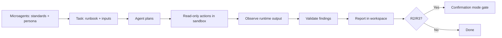

# OpenHands

OpenHands (formerly OpenDevin) is an open-source agent platform that runs in a
sandboxed runtime with a shell, editor, and browser. It supports repository-level
instructions and **microagents** — triggered instruction files — which make it
straightforward to pin the standards and load a persona when a runbook keyword
appears.

## Prerequisites

- A running OpenHands instance (Docker or the app) with a sandboxed runtime.
- This library mounted into the workspace the runtime can read.
- Least-privilege credentials for the target system provided as runtime
  environment variables, never in prompts.

## Step 1 — Add repo instructions

Create `.openhands/microagents/repo.md` (a repository microagent that always
loads for the project):

```markdown
# Repository agent instructions

When executing an awesome-ai-runbooks runbook, follow
docs/AI_AGENT_STANDARDS.md: read-only first; classify each action R0–R3; require
explicit human approval before any R2/R3 (prod mutation or irreversible) action,
with a rollback. Produce a report using templates/report-template.md.
```

## Step 2 — Add a persona microagent (optional)

Create a keyword-triggered microagent so the right persona loads on demand, for
example `.openhands/microagents/rca.md`:

```markdown
---
triggers:
  - rca
  - root cause
---

Adopt the persona in prompts/root-cause-analysis-agent.md for this task.
```

Personas live in [`prompts/`](../../prompts/README.md). You can instead paste the
persona at the start of a conversation.

## Step 3 — Give it the task

In the OpenHands chat, reference the runbook and provide inputs:

```text
Trigger: rca
Execute runbook runbooks/reliability/root-cause-analysis.md.
Inputs Required:
  - service_name: search-api
  - environment: prod
  - symptom: "5xx rate 3% since 09:20 UTC"
Operate read-only. Propose any mutating action for approval with a rollback.
Write the report to reports/search-api-rca.md per templates/report-template.md.
```

## How the loop maps to OpenHands



## Platform-specific tips

- **Use confirmation mode for mutations.** Enable OpenHands confirmation mode so
  the agent pauses before running commands — this enforces the R2/R3 gate at the
  runtime level.
- **Constrain the sandbox.** Restrict the runtime's network egress to only the
  endpoints the runbook's `required_access` needs; the sandbox is your blast-
  radius boundary.
- **Prefer microagents over long prompts.** Keyword-triggered microagents keep
  the standards and personas out of the way until a runbook needs them, which
  keeps context lean.
- **Mount the library read-only.** The agent should be able to read runbooks and
  the report template but not modify the library itself.
- **Persist the report.** Have the agent write its deliverable into the mounted
  workspace so it survives the sandbox teardown.

## Related

- [Standards](../standards.md) — the contract the repo microagent pins.
- [Agent Frameworks](../agent-frameworks.md) — the shared consumption pattern.
- [Prompt library](../../prompts/README.md) — persona selection.
