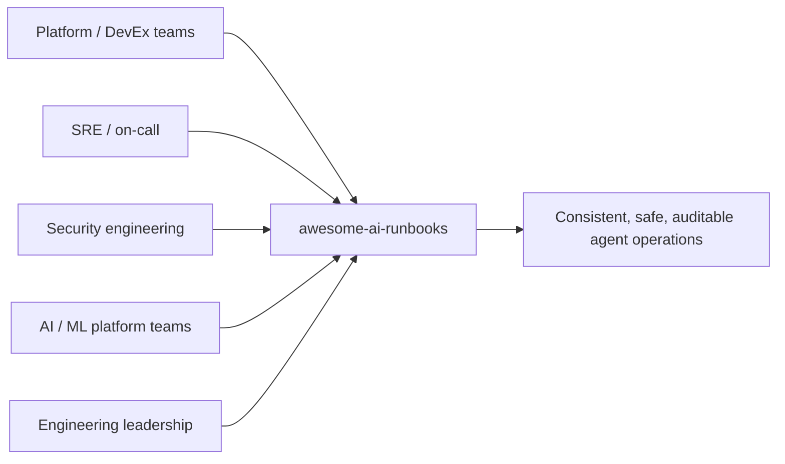

# Overview

`awesome-ai-runbooks` is an open-source library of operational runbooks
purpose-built for autonomous AI agents. This page explains **what** the project
is, **why** it exists, and **who** it serves. For the founding intent, read the
[Vision](planning/VISION.md), the [Project Scope](planning/PROJECT_SCOPE.md),
and the [Target Audience](planning/TARGET_AUDIENCE.md) documents.

## What it is

A runbook here is a complete, machine-checkable operational contract for a
single scenario — diagnosing a latency regression, auditing an EKS cluster,
optimizing PostgreSQL, hardening an API, or planning a monolith decomposition.
Each runbook is authored from a shared [template](../templates/runbook-template.md)
and contains, in a fixed order: objective, business context, success criteria,
planning instructions, an investigation workflow, a decision tree, validation
steps, a rollback strategy, an escalation process, metrics, and a worked
example with a sample report.

The library currently provides:

- **48 runbooks** across **11 domains** (reliability, observability, databases,
  messaging, security, kubernetes, cloud-cost, migrations, architecture, cicd,
  and ai-ml).
- **9 agent personas** in [`prompts/`](../prompts/README.md) that configure an
  agent's role, duties, and restrictions.
- A **universal behavioral contract** in
  [AI Agent Standards](AI_AGENT_STANDARDS.md) that every runbook references.
- A **quality and maturity framework** in
  [Quality Assurance](QUALITY_ASSURANCE.md) enforced by CI.

## Why it exists

Modern agents can execute real multi-step engineering work, but a one-line
prompt produces improvised, non-repeatable behavior. Two runs of "investigate
this incident" can differ wildly in rigor, safety, and output. The same problem
existed for human on-call engineers before runbooks and SOPs standardized how
work gets done. This project applies that discipline to agents.

The core value proposition is consistency with safety:

| Concern | How the library addresses it |
|---------|------------------------------|
| Inconsistent quality | Standardized procedures and a scored quality bar |
| Guesswork | Evidence-first, hypothesis-driven investigation |
| Unsafe actions | Risk tiers (R0–R3), least privilege, gated mutations |
| No accountability | Standard reports plus audit-logging patterns |
| Vendor lock-in | One vendor-neutral contract across all major agents |

Because runbooks are vendor-neutral, an organization can switch agent platforms
or run several in parallel without rewriting its operational knowledge. The
runbook is the durable asset; the agent is interchangeable.

## Who it serves

- **Platform and developer-experience teams** curate approved runbooks and paved
  paths so every team's agents behave the same way.
- **SRE and on-call engineers** get evidence-first incident, RCA, and readiness
  procedures that agents can run under supervision.
- **Security engineers** get defensive, least-privilege audit runbooks and a
  review process that gives high-risk content a second set of eyes.
- **AI/ML platform teams** get runbooks for RAG systems, LLM inference, and MCP
  servers — the systems that increasingly run the agents themselves.
- **Engineering leadership** gets a governance and adoption model that turns
  "agents did something" into an auditable, policy-enforced capability.

See the full breakdown in [Target Audience](planning/TARGET_AUDIENCE.md).

## How it compares

Unlike a prompt collection or a single-vendor cookbook, this library couples
each procedure to a behavioral standard and an enforced quality bar. It is
cross-domain (not only incident response, not only security) and cross-vendor
(not tied to any one agent). The full positioning is in the
[Competitive Analysis](planning/COMPETITIVE_ANALYSIS.md).

## What "good" looks like

Every deliverable an agent produces is judged against six dimensions borrowed
from the standards: correctness, completeness, clarity, reproducibility, safety,
and actionability. A runbook, in turn, is scored out of 100 on structure, depth,
diagrams, actionability, evidence, safety, examples, references, and clarity.
The repository holds itself to a five-level maturity model and targets
**Level 4 — Managed**. Details live in the
[Quality Framework](quality-framework.md).

## Where to go next

- New to the concepts? Continue to the [Architecture](architecture.md) page.
- Care most about behavior guarantees? Read the [Standards](standards.md).
- Ready to wire up a platform? Jump to [Integrations](integrations/index.md).
- Adopting inside a company? Start with [Enterprise](enterprise.md) and
  [Governance](governance.md).

The canonical, always-current entry point remains the repository
[README](../README.md); this portal reorganizes that material for browsing and
search.
