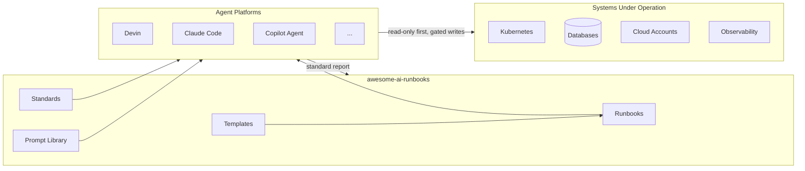

# Project Scope — awesome-ai-runbooks

This document defines what is in scope, what is out of scope, and the boundaries
of the project so contributors and adopters share a precise mental model.

## In scope

### 1. Runbooks (the core artifact)

Standardized operational playbooks for AI agents across these domains:

| Domain | Examples |
|--------|----------|
| Reliability & SRE | root cause analysis, incident postmortem, production readiness, DR/BCP |
| Observability | observability review, logging review, tracing review |
| Databases | PostgreSQL/MySQL optimization, Redis, MongoDB, vector databases |
| Messaging & events | Kafka lag, event-driven migration |
| Security (defensive) | Terraform/IaC, container/Docker, OAuth/JWT/API, AI system security |
| Kubernetes & cloud | cluster audits (EKS/AKS/GKE), cost optimization (AWS/Azure/GCP) |
| Migrations | React 18→19, Node/Java upgrades, monolith→microservices, REST→GraphQL |
| CI/CD | pipeline debugging, deployment failure analysis, release readiness |
| Architecture | GraphQL performance, platform engineering review |
| AI/ML systems | MCP diagnostics, RAG audit, LLM inference, prompt quality, agent eval |

### 2. Standards and frameworks

- A single **runbook specification** (`templates/runbook-template.md`).
- A **report specification** (`templates/report-template.md`).
- **AI agent execution standards** (`docs/AI_AGENT_STANDARDS.md`).
- A **quality assurance and scoring framework** (`docs/QUALITY_ASSURANCE.md`).
- An **enterprise adoption guide** (`ENTERPRISE_GUIDE.md`).

### 3. Prompt library

Ready-to-use agent persona prompts (`prompts/`) that pair with runbooks.

### 4. Automation

Validation and scoring tooling (`scripts/`) plus CI workflows
(`.github/workflows/`) enforcing structure, markdown quality, and link health.

## Out of scope

- **Agent runtimes / frameworks.** We do not ship an orchestration engine.
- **Model training or fine-tuning.** We describe operations, not model builds.
- **Offensive security tooling.** Security runbooks are strictly defensive
  (detection, hardening, remediation).
- **Proprietary vendor lock-in.** No runbook depends on a single closed vendor.
- **Secrets or live infrastructure.** The repo contains no credentials and
  never executes against real systems from CI.

## Boundaries and interfaces

The repository is the **source of procedure**. Agents are the **execution
engine**. Target systems are operated only through least-privilege access with
human-in-the-loop gates for high-risk actions.

## Deliverable inventory

| Category | Artifact | Location |
|----------|----------|----------|
| Planning | Vision, scope, audience, roadmap, competitive analysis | `docs/planning/` |
| Standards | Agent standards, QA framework | `docs/` |
| Templates | Runbook & report templates | `templates/` |
| Runbooks | 48+ domain runbooks | `runbooks/` |
| Prompts | 9 agent persona prompts | `prompts/` |
| Automation | Validators, scorers, CI | `scripts/`, `.github/` |
| Governance | LICENSE, CoC, CONTRIBUTING, SECURITY | repo root |
| Enterprise | Adoption & governance guide | `ENTERPRISE_GUIDE.md` |

## Acceptance criteria for the project

- Every runbook conforms to the specification and passes structural validation.
- Every runbook is ≥ 1000 words with at least two diagrams and real content.
- CI validates markdown, links, and structure on every PR.
- Documentation is complete with no placeholders or TODOs.
- The repository scores at least "Level 4 — Managed" on its own maturity model
  (see `docs/QUALITY_ASSURANCE.md`).

## Scope change process

Scope changes are proposed via issue using the `scope-change` label, discussed,
and recorded in [`ROADMAP.md`](./ROADMAP.md) and `CHANGELOG.md` upon acceptance.
