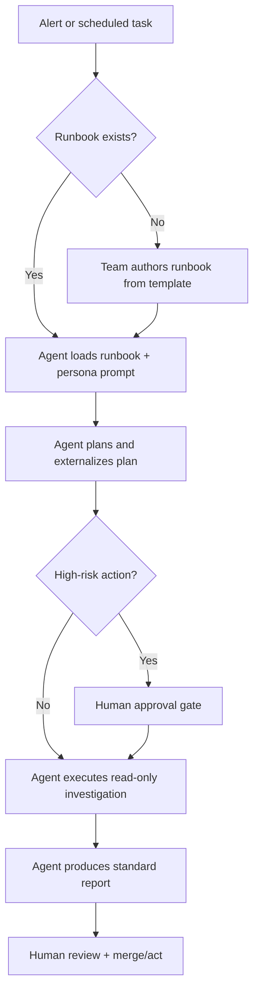

# Target Audience & Personas — awesome-ai-runbooks

This project serves engineering organizations adopting autonomous AI agents. The
personas below drive every design decision, from runbook structure to escalation
gates.

## Primary personas

### 1. Priya — Platform / Developer Experience Lead

- **Context:** Owns the internal developer platform and is piloting AI agents as
  a self-service capability ("golden paths for agents").
- **Goals:** Standardize how agents perform recurring engineering tasks; reduce
  cognitive load; make agent output reviewable.
- **Pains:** Every team prompts agents differently; no consistency, no audit
  trail, no reuse.
- **How this repo helps:** Drop-in standardized runbooks + prompt library that
  plug into the platform's agent catalog.
- **Success metric:** % of agent tasks executed via approved runbooks.

### 2. Sam — Site Reliability Engineer (SRE)

- **Context:** On-call for tier-1 services; wants agents to accelerate triage
  without increasing risk.
- **Goals:** Faster MTTD/MTTR, consistent investigations, trustworthy
  postmortems.
- **Pains:** Agents jump to conclusions, skip evidence, and take risky actions.
- **How this repo helps:** Evidence-driven investigation workflows, decision
  trees, rollback strategies, and escalation gates.
- **Success metric:** MTTR reduction; zero agent-caused incidents.

### 3. Dana — Security Engineer / AppSec

- **Context:** Responsible for securing cloud, containers, APIs, and now AI
  systems.
- **Goals:** Continuous, repeatable defensive reviews mapped to OWASP, CIS,
  NIST.
- **Pains:** Manual reviews don't scale; AI/LLM introduces new attack surface.
- **How this repo helps:** Defensive security runbooks with standards mapping
  and least-privilege access models.
- **Success metric:** Coverage of assets under continuous automated review.

### 4. Marcus — AI Platform / ML Engineer

- **Context:** Runs RAG, LLM inference, MCP servers, and agent evaluation.
- **Goals:** Diagnose and optimize AI systems with the same rigor as classic
  infra.
- **Pains:** Few operational standards exist for AI-native systems.
- **How this repo helps:** AI/ML runbooks (RAG audit, inference optimization,
  MCP diagnostics, agent evaluation).
- **Success metric:** Groundedness/latency/cost targets met and monitored.

## Secondary personas

### 5. Lena — Engineering Manager / Director

- **Goals:** Predictable delivery, governance, risk reduction, measurable ROI.
- **How this repo helps:** Maturity model, metrics, and enterprise governance
  guide give leadership confidence to scale agent adoption.

### 6. Raj — Software Architect

- **Goals:** Safe, well-reasoned migrations and architecture reviews.
- **How this repo helps:** Migration and architecture runbooks encode proven
  patterns (strangler fig, expand-contract, bounded contexts).

### 7. Nina — DevSecOps / Compliance

- **Goals:** Auditability, approval workflows, evidence retention.
- **How this repo helps:** Standard reports, human-in-the-loop gates, and audit
  logging patterns in the enterprise guide.

### 8. Tom — OSS Contributor

- **Goals:** Contribute high-quality runbooks and get them reviewed fast.
- **How this repo helps:** Clear spec, templates, scoring, and CI feedback.

## Usage scenarios

### Representative scenarios

1. **Incident triage:** PagerDuty alert triggers the `root-cause-analysis`
   runbook; the agent investigates read-only, produces a report, and escalates
   with evidence.
2. **Scheduled audit:** Weekly `eks-audit` and `aws-cost-optimization` runs feed
   a platform dashboard.
3. **Migration:** Architect assigns `monolith-to-microservices` to an agent for
   analysis and a phased plan before any code changes.
4. **AI system health:** `rag-system-audit` runs after each retrieval pipeline
   change to guard groundedness and latency.

## Persona-to-runbook mapping

| Persona | Most-used runbooks |
|---------|--------------------|
| SRE | root-cause-analysis, incident-postmortem, sre-service-audit, observability-review |
| Security | api-security-audit, container-security-audit, terraform-security-review, ai-system-security-review |
| Platform | production-readiness-review, platform-engineering-review, ci-cd-pipeline-debugging |
| AI/ML | rag-system-audit, llm-inference-optimization, mcp-server-diagnostics, agent-evaluation-framework |
| Architect | monolith-to-microservices, rest-to-graphql-migration, graphql-performance-review |
| FinOps | aws/azure/gcp-cost-optimization |
