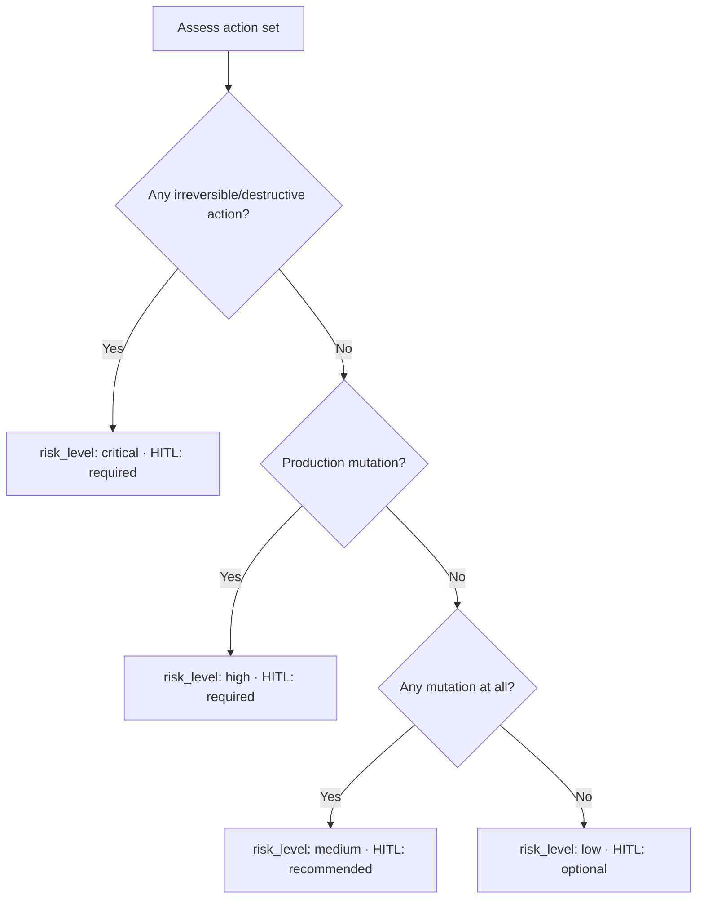
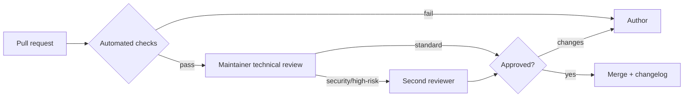

# Quality Framework

Quality in this repository is **enforced, not assumed**. This page summarizes how
runbooks are scored, how risk is classified, and how the repository holds itself
to a maturity model. The authoritative rubric is
[Quality Assurance](QUALITY_ASSURANCE.md); the mechanical checks are implemented
by the `scripts/` tooling and run in CI on every pull request.

## Two scores per runbook

Every runbook is measured on two axes: how **complete** it is and how **ready**
an agent is to execute it safely.

### Completeness score (out of 100)

The automated scorer computes the structural portion; reviewers assess the
qualitative portion.

| Dimension | Points | How it is measured |
|-----------|:------:|--------------------|
| Structural conformance | 25 | All required sections present, in order, valid front matter |
| Depth | 20 | ≥ 1000 words of substantive content plus reviewer depth check |
| Diagrams | 10 | ≥ 2 valid Mermaid diagrams |
| Actionability | 10 | Concrete commands, checklists, tables |
| Evidence & validation | 10 | Real validation steps and expected outputs |
| Safety | 10 | Least privilege, rollback, escalation, risk tiers |
| Example execution | 5 | Realistic worked example with sample report |
| References | 5 | Credible, relevant references |
| Clarity & style | 5 | Markdownlint clean; readable; correct headings |

Score bands: **90–100 exemplary**, **75–89 solid** (mergeable), **60–74 draft**,
**below 60 rejected**.

### Agent-readiness score (out of 50)

This measures whether an agent can execute the runbook reliably and safely with
minimal ambiguity — unambiguous objectives, executable steps tagged read-only vs
mutating, decision coverage that includes escalation, explicit inputs and access,
deterministic validation, precise gates and rollbacks, and cross-platform
portability. Readiness bands: **≥ 42 ready**, **30–41 needs tightening**,
**below 30 not agent-ready**.

## Risk scoring

Risk determines how much autonomy is safe. It combines blast radius,
reversibility, and environment into the `risk_level` and `human_in_the_loop`
front-matter fields, aligned with [Standards §8](AI_AGENT_STANDARDS.md#8-risk-framework).

## The review process

The automated gate — structure, front matter, markdown lint, links, and scoring
— must pass first. A maintainer then verifies accuracy, depth, and safety. Any
runbook in the `security` category or marked `risk_level: high|critical` requires
a **second review**. On approval, the change lands and `CHANGELOG.md` is updated.

## Acceptance criteria

A runbook is accepted only when all of the following hold:

- Completeness score ≥ 75.
- Agent-readiness score ≥ 42.
- `risk_level` and `human_in_the_loop` are consistent with the risk model.
- Automated checks pass (structure, lint, links).
- At least one maintainer approval (two for security/high-risk).
- No placeholders, no `TODO`, no fabricated tools or APIs.
- Real rollback and escalation are documented.

## Repository maturity model

The repository holds *itself* to a five-level maturity model, reviewed each
release.

| Level | Name | Criteria |
|:-----:|------|----------|
| 1 | Initial | Structure exists; some real runbooks; no automation |
| 2 | Repeatable | Template + standards enforced; CI validates structure & lint |
| 3 | Defined | Scoring rubric applied; ≥ 40 runbooks; full governance docs |
| 4 | Managed | Link/coverage checks in CI; maturity badge; metrics tracked |
| 5 | Optimizing | Agent-eval harness + golden trajectories; community cadence |

**Current target: Level 4 — Managed**, progressing toward Level 5 per the
[Roadmap](future-roadmap.md).

## Metrics tracked

| Metric | Definition | Target |
|--------|-----------|--------|
| Runbook count | Runbooks meeting acceptance criteria | Growing |
| Mean completeness score | Average score across runbooks | ≥ 85 |
| CI pass rate on `main` | Green builds | 100% |
| Broken links | Dead internal/external links | 0 internal |
| Doc coverage | Runbooks with all sections filled | 100% |
| Time-to-review | Median PR review latency | ≤ 5 days |

## Author self-check

Before opening a pull request, authors run the local validators
(`python scripts/run_all_checks.py` and `markdownlint-cli2`) and confirm the
runbook was built from the template with all sections present, ≥ 1000 words, ≥ 2
rendering Mermaid diagrams, language-tagged commands, at least one table and
checklist, and a worked example. The full checklist is in
[Quality Assurance](QUALITY_ASSURANCE.md); contribution mechanics are on the
[Contributing](contributing.md) page.
