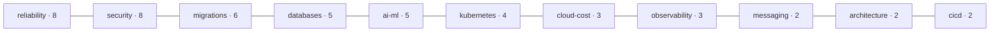

# Runbook Library

The library ships **48 runbooks across 11 categories**. Every runbook is a
complete operational contract authored from the shared
[runbook template](../templates/runbook-template.md) and governed by the
[AI Agent Standards](AI_AGENT_STANDARDS.md). This page describes each category
and what its runbooks cover. Browse the source under
[`runbooks/`](../runbooks).

## Categories at a glance

| Category | Count | Focus |
|----------|:-----:|-------|
| reliability | 8 | Incident response, RCA, readiness, DR/BCP |
| security | 8 | Defensive audits across API, containers, IaC, AI |
| migrations | 6 | Framework, language, and architecture upgrades |
| databases | 5 | Performance and health of relational, cache, NoSQL, vector |
| ai-ml | 5 | RAG, LLM inference, MCP, prompt/agent evaluation |
| kubernetes | 4 | Cluster and managed-Kubernetes audits |
| cloud-cost | 3 | FinOps rightsizing and commitment optimization |
| observability | 3 | Metrics, logging, and tracing reviews |
| messaging | 2 | Event streaming and event-driven migration |
| architecture | 2 | Performance and platform-engineering reviews |
| cicd | 2 | Pipeline debugging and deployment-failure analysis |
| **Total** | **48** | **11 domains** |

## Distribution

## What each category covers

### reliability (8)

The largest category. Evidence-first incident and service-health procedures:
[root-cause-analysis](../runbooks/reliability/root-cause-analysis.md),
[incident-postmortem](../runbooks/reliability/incident-postmortem.md),
[production-readiness-review](../runbooks/reliability/production-readiness-review.md),
[release-readiness-review](../runbooks/reliability/release-readiness-review.md),
[service-reliability-review](../runbooks/reliability/service-reliability-review.md),
[sre-service-audit](../runbooks/reliability/sre-service-audit.md),
[disaster-recovery-assessment](../runbooks/reliability/disaster-recovery-assessment.md),
and [business-continuity-review](../runbooks/reliability/business-continuity-review.md).
These pair with the `root-cause-analysis-agent` and `production-readiness-agent`
personas.

### security (8)

Defensive, least-privilege audits — never offensive tooling. Coverage spans API
security (OWASP API Top 10), container and image supply-chain review,
infrastructure-as-code (Terraform) review, OAuth/JWT and authentication review,
and AI-system security including model risk. All `security` runbooks require a
mandatory second review before merge, per the
[Quality Framework](quality-framework.md).

### migrations (6)

Phased, reversible upgrade and modernization playbooks: framework upgrades (for
example React 18→19), Node and Java version migrations, REST-to-GraphQL
migration, event-driven migration, and the strangler-fig
[monolith-to-microservices](../runbooks/migrations/monolith-to-microservices.md)
decomposition. Migrations emphasize checkpoint reviews at phase boundaries.

### databases (5)

Performance and health diagnostics across engine types: PostgreSQL and MySQL
query and index tuning with `EXPLAIN ANALYZE`, Redis performance, MongoDB review,
and [vector-database-review](../runbooks/databases/vector-database-review.md) for
recall and latency tuning (HNSW/IVF).

### ai-ml (5)

The systems that increasingly run the agents themselves:
[rag-system-audit](../runbooks/ai-ml/rag-system-audit.md) for retrieval quality
and groundedness, LLM inference performance and cost, prompt and agent
evaluation, and [mcp-server-diagnostics](../runbooks/ai-ml/mcp-server-diagnostics.md)
for MCP server health and schema validation.

### kubernetes (4)

Best-practice and security audits for a self-managed cluster and the three major
managed offerings — [eks-audit](../runbooks/kubernetes/eks-audit.md), AKS, and
GKE. These pair with the `platform-audit-agent` persona.

### cloud-cost (3)

FinOps rightsizing, commitment planning, and waste cleanup for
[AWS](../runbooks/cloud-cost/aws-cost-optimization.md), Azure, and GCP, driven by
the `cost-optimization-agent` persona.

### observability (3)

Reviews of the three pillars: an overall observability review, a logging review,
and a tracing review, driven by the `observability-agent` persona.

### messaging (2)

Event-streaming operations, including
[investigate-kafka-lag](../runbooks/messaging/investigate-kafka-lag.md) for
consumer-lag diagnosis and an event-driven migration procedure.

### architecture (2)

System-design reviews: a GraphQL performance review and a platform-engineering
review, driven by the `architecture-review-agent` persona.

### cicd (2)

Delivery-pipeline procedures: pipeline debugging and deployment-failure analysis,
which pair with the `root-cause-analysis-agent` persona.

## How to run any runbook

1. Choose the runbook and read its **Inputs Required** and `required_access`.
2. Load the matching persona from [`prompts/`](../prompts/README.md).
3. Provide the runbook and inputs to your platform (see
   [Integrations](integrations/index.md)).
4. Let the agent investigate read-only, gate any R2/R3 action, validate, and
   report.

## What's coming

The content pipeline extends these categories and adds new ones (data
engineering, SOC automation, threat modeling, and more). See
[Roadmap](future-roadmap.md) and [Future Runbooks](FUTURE_RUNBOOKS.md) for the
planned expansion.
