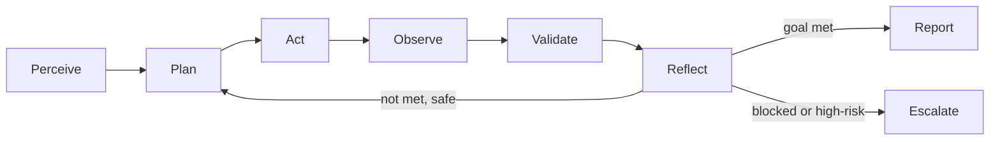

# Standards

The [AI Agent Standards](AI_AGENT_STANDARDS.md) document is the universal
behavioral contract for any autonomous agent executing a runbook in this
repository. It is vendor-neutral — it applies equally to Devin, GitHub Copilot
Agent, Claude Code, OpenAI Codex, Cursor, OpenHands, AutoGen, CrewAI, LangGraph,
MCP-enabled agents, and internal enterprise agents. Every runbook references it,
and **if a runbook and the standards ever conflict on safety, the standards
win.**

This page summarizes the **twelve frameworks** that make up the contract. Read
the [full standards document](AI_AGENT_STANDARDS.md) for the complete text,
tables, and diagrams.

## The behavioral loop

All twelve frameworks orbit a single closed loop. An agent perceives the runbook
and inputs, plans, acts (read-only first), observes, validates, reflects, and
either reports or escalates.

## The twelve frameworks

| # | Framework | What it governs |
|:-:|-----------|-----------------|
| 1 | Universal Agent Behavior Model | The Perceive→Plan→Act→Observe→Validate→Reflect→Report loop and non-negotiable guardrails |
| 2 | Planning | Externalized, reviewable plans with steps tagged read-only vs mutating |
| 3 | Reasoning | Hypothesis-driven analysis, falsification, calibrated confidence |
| 4 | Investigation | Systematic, timeboxed, evidence-logged signal gathering |
| 5 | Validation | Nothing is "done" until verified with before/after evidence |
| 6 | Reporting | Standard report format; observation separated from interpretation |
| 7 | Quality | Six-dimension self-assessment before submitting |
| 8 | Risk | Classifying every action into risk tiers R0–R3 |
| 9 | Escalation | Defined triggers and a structured escalation payload |
| 10 | Bias Reduction | Countermeasures for characteristic agent failure modes |
| 11 | Decision-Making | Framing one-way vs two-way doors and scoring options |
| 12 | Autonomous Execution | How much an agent may do on its own per `human_in_the_loop` |

### 1–2. Behavior model and planning

The behavior model sets the core tenets: objective-anchored work, evidence
before assertion, least privilege and read-only first, reversibility,
transparency, and bounded autonomy. Planning happens **before** action and is
externalized for review — a valid plan restates the objective, lists assumptions
and how to verify them, orders steps tagged `[read-only]` or `[mutating]`,
annotates risks and rollbacks, and defines "done."

### 3–5. Reasoning, investigation, validation

Reasoning is hypothesis-driven: enumerate candidates, rank by prior and
evidence, and design the test that would **disprove** the leading hypothesis
rather than merely confirm it. Investigation is systematic and timeboxed, drawing
on recent changes, golden signals, logs, traces, dependencies, and resource
state, with every observation timestamped and sourced. Validation requires a
corroborating observation for each finding and a before/after measurement for
each change, plus a regression check.

### 6–7. Reporting and quality

Every execution produces a report using the
[report template](../templates/report-template.md): executive summary first,
facts separated from judgments, impact quantified in business terms, and
prioritized, assignable recommendations. Before submitting, the agent runs a
self-critique pass against six quality dimensions — correctness, completeness,
clarity, reproducibility, safety, and actionability.

### 8–9. Risk and escalation

Risk classification is the safety keystone:

| Risk tier | Examples | Requirement |
|-----------|----------|-------------|
| R0 read-only | queries, `get`, `describe`, dashboards | Allowed autonomously |
| R1 low-impact reversible | scale a dev replica, create a ticket | Allowed within constraints; log it |
| R2 production reversible | config change with rollback, restart a pod | Human approval unless pre-authorized; rollback ready |
| R3 destructive/irreversible | drop table, delete data, force-push | Explicit action-specific approval always |

Risk is a function of blast radius × reversibility × environment; when uncertain
about a tier, treat it as the higher one. Escalation is triggered — not guessed —
when an assumption proves false with no branch, access is missing, active harm is
detected, an action exceeds the authorized tier, confidence stays low, or the
next step is R2/R3 amid ambiguity.

### 10–12. Bias reduction, decisions, autonomy

The standards name characteristic failure modes — confirmation bias, anchoring,
recency bias, automation bias, sycophancy, overconfidence, hallucination, and
premature closure — and pair each with a countermeasure. Decision-making frames
reversibility (one-way vs two-way doors) and scores options including "do
nothing" and "escalate." Autonomy is declared per runbook through
`human_in_the_loop`, which takes one of three values.

| Level | Meaning | Agent may |
|-------|---------|-----------|
| `optional` | Low-risk, well-understood | Execute end-to-end, report after |
| `recommended` | Default for investigations | Execute read-only; propose R2+ for approval |
| `required` | High-risk / production-mutating | Plan and investigate; pause for approval before any mutation |

## Conformance

A runbook conforms when its persona, planning instructions, risk annotations,
validation steps, escalation process, and rollback strategy are consistent with
these frameworks. The [Quality Framework](quality-framework.md) scores that
conformance, and CI enforces the mechanical parts. Continue to
[Agent Frameworks](agent-frameworks.md) to see how each platform applies the
contract in practice.
