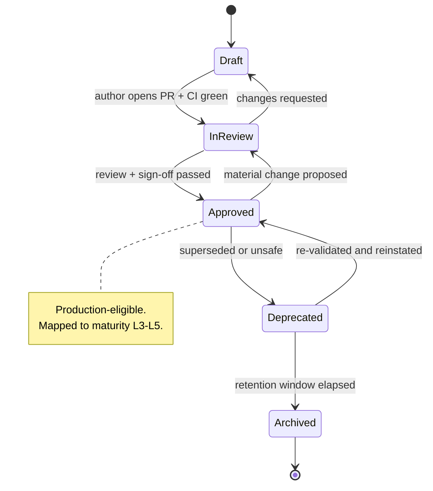
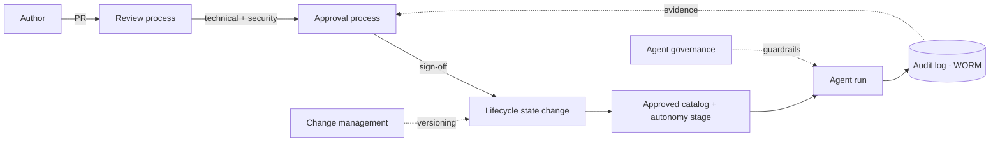

# Governance Framework

This directory defines how runbooks and the autonomous agents that execute them
are governed across their entire life. Governance exists to make agent
operations **accountable, auditable, and safe** without reintroducing the toil
that agents are meant to remove. It complements the behavioral contract in
[`../docs/AI_AGENT_STANDARDS.md`](../docs/AI_AGENT_STANDARDS.md), the scoring
rubric in [`../docs/QUALITY_ASSURANCE.md`](../docs/QUALITY_ASSURANCE.md), and the
enterprise adoption model in [`../ENTERPRISE_GUIDE.md`](../ENTERPRISE_GUIDE.md).

## Why governance

A runbook is executable policy: it tells an autonomous agent what to do against
real systems. That makes every runbook a privileged artifact and every agent run
a change event. Governance answers four questions for each:

- **Who is accountable?** Every runbook has an owner and every run has an actor.
- **How does it get approved?** A defined review and sign-off path per risk.
- **What is its status?** A single, unambiguous lifecycle state.
- **How is it evidenced?** An immutable audit trail for compliance and review.

## Documents in this framework

| Document | Purpose |
|----------|---------|
| [approval-process.md](./approval-process.md) | Who approves runbooks, criteria, and autonomy-stage promotion |
| [review-process.md](./review-process.md) | Technical and security review, reviewer duties, SLAs, checklists |
| [runbook-lifecycle.md](./runbook-lifecycle.md) | Lifecycle states, entry/exit criteria, maturity mapping |
| [audit-framework.md](./audit-framework.md) | Audit log schema, retention, immutability, compliance mapping |
| [change-management.md](./change-management.md) | RFC/PR flow, semver, change classes, rollback, CODEOWNERS |
| [agent-governance.md](./agent-governance.md) | Governing autonomous agents: access, kill switch, drift |

## Roles

Governance assigns clear roles so no decision is anonymous.

| Role | Responsibility |
|------|----------------|
| **Runbook owner** | Accountable for a runbook's accuracy, safety, and reviews |
| **Author** | Proposes new or changed runbooks via PR |
| **Technical reviewer** | Verifies correctness, depth, and agent-readiness |
| **Security reviewer** | Second review for `security/` and `risk_level: high\|critical` |
| **Approver / board** | The Agent Operations Review Board that signs off promotions |
| **Operator** | The human accountable for a specific agent run in production |

The **Agent Operations Review Board** (platform + security + SRE) is the standing
authority for approvals, autonomy-stage promotions, and post-incident changes.

## Runbook lifecycle state machine

Every runbook occupies exactly one state at a time. Transitions are explicit,
reviewed, and recorded in the audit trail. The full entry/exit criteria live in
[runbook-lifecycle.md](./runbook-lifecycle.md).

## Governance principles

- **Change control equals code control.** Runbook changes flow through PR,
  review, and CODEOWNERS gating — never edited in place in production.
- **Least privilege by default.** Runbooks request the minimum access; agents
  receive scoped, short-lived credentials per run.
- **Evidence-first.** No promotion, approval, or incident conclusion without a
  retrievable audit record.
- **Bounded autonomy.** Agents operate freely within a runbook's declared risk
  tier and pause at defined gates; the board owns the guardrails.
- **Reversibility.** Both runbook document changes and agent actions must have a
  documented, verifiable rollback.
- **Traceability.** Every state transition, approval, and run maps to a named
  human or service actor.

## How the pieces fit together

The lifecycle is the spine: authors submit changes (change management), those
changes are reviewed (review process) and signed off (approval process), which
moves a runbook between lifecycle states. Approved runbooks enter the catalog at
an autonomy stage, agents execute them under agent governance, and every run
produces evidence in the audit framework. This closes the loop — audit evidence
feeds the next review and promotion decision.

## Adopting this framework

1. Assign runbook owners and stand up the review board.
2. Adopt the lifecycle states and require them in front matter / catalog.
3. Wire CODEOWNERS so reviews are enforced mechanically (change management).
4. Turn on immutable audit logging before any production autonomy.
5. Gate autonomy-stage promotions on the approval criteria and metrics.

Governance should be **lightweight but explicit**: enough process to be safe and
auditable, encoded as automation wherever possible so it scales with the library.
