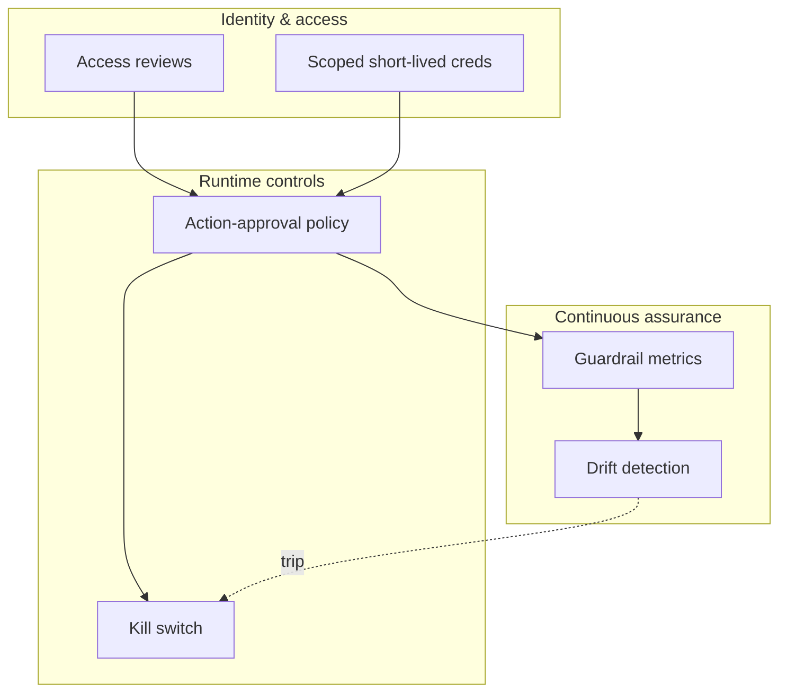
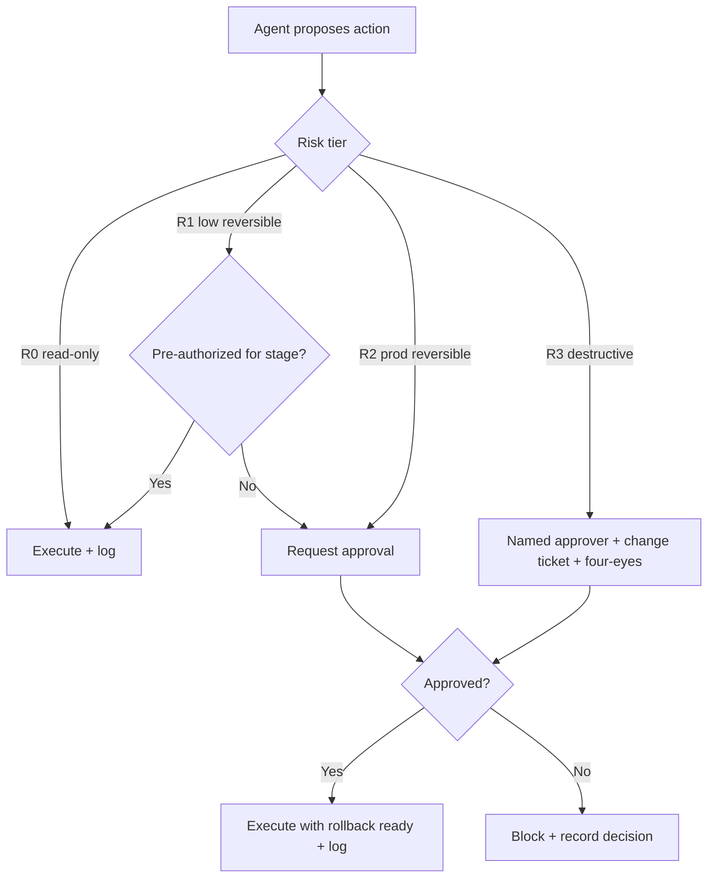

# Agent Governance

Governing the runbooks is necessary but not sufficient — the **agents** that
execute them must be governed too. An autonomous agent is a non-human identity
with credentials, the ability to act on production systems, and behavior that can
drift as its underlying model or prompts change. This document defines the
controls that keep agent execution accountable and safe: access reviews, an
action-approval policy, a kill switch, guardrail metrics, and drift detection. It
operationalizes the oversight guidance in
[`../ENTERPRISE_GUIDE.md`](../ENTERPRISE_GUIDE.md#7-agent-oversight) and the risk
and autonomy frameworks in
[`../docs/AI_AGENT_STANDARDS.md`](../docs/AI_AGENT_STANDARDS.md#8-risk-framework).

## Control overview

## Agents as governed identities

Each agent runs under a distinct **non-human identity** (service account) — never
a shared or human credential. The identity is bound to a specific set of
runbooks and environments via the approved catalog. Credentials are **scoped and
short-lived**: issued per run against the runbook's declared `required_access`,
expiring at run end. There is no standing "agent admin" role.

## Access reviews

Because agent identities accumulate entitlements over time, review them on a
schedule and on trigger.

| Review | Cadence | Checks |
|--------|---------|--------|
| Entitlement recertification | Quarterly | Each agent identity still needs each grant; revoke unused |
| Catalog binding review | Quarterly | Agent is bound only to runbooks appropriate to its stage |
| Credential hygiene | Continuous | Short-lived, scoped, rotated; no static long-lived secrets |
| Trigger-based review | On incident / model change / role change | Re-verify least privilege before resuming autonomy |

Access reviews are recorded in the audit trail (see
[audit-framework.md](./audit-framework.md)) and are a prerequisite for
autonomy-stage promotion in the [approval process](./approval-process.md).

## Action-approval policy

Every action an agent proposes is classified by risk tier (R0–R3) and gated
accordingly. This policy is enforced by the control plane, not left to the
agent's discretion.

Policy rules:

- Approvals are **action-specific** and **time-bounded** — never a blanket grant.
- R3 (destructive/irreversible) actions always require a named approver, a change
  ticket, and independent four-eyes sign-off.
- An action exceeding the agent's authorized tier for the current autonomy stage
  is **blocked**, not merely flagged, and counts as a guardrail event.
- Every mutating action records who approved it and the rollback used.

## Kill switch

A single, well-tested control pauses autonomous execution when something goes
wrong. Design it for speed and blast-radius control.

- **Scopes:** global (all agents), per-agent, per-runbook, and per-environment.
  Prefer the narrowest scope that contains the problem.
- **Effect:** in-flight R2/R3 actions are halted at the next gate; new runs are
  refused; read-only diagnostics may remain enabled for triage.
- **Triggers:** manual (operator/board/security on-call) and automatic (a
  guardrail metric or drift alert crossing threshold).
- **Safe state:** on trip, agents must leave systems in a known, documented state
  and emit a final audit record — never abandon a half-applied change.
- **Recovery:** resuming autonomy requires a recorded decision and, if a runbook
  was implicated, its return to `In-Review`.

Test the kill switch regularly; an untested kill switch is not a control.

## Guardrail metrics

Monitor **behavior**, not just outcomes. These metrics gate autonomy-stage
promotion and feed the kill switch.

| Metric | Definition | Target / alert |
|--------|------------|----------------|
| Unsafe-action attempts blocked | Actions above authorized tier that the policy blocked | Trend to 0; any spike alerts |
| Approval request rate | R2/R3 actions requiring human approval per run | Stable per runbook |
| Approval grant ratio | Granted vs requested | Sudden drops signal misalignment |
| Escalation rate | Runs raising an escalation | Within expected band per runbook |
| Finding accuracy | Verified-correct findings vs total | ≥ agreed threshold |
| Rework / false-positive rate | Reports requiring rework | Trending down |
| Rollback success rate | Rollbacks that restored prior state | 100% expected |

Metrics are published to dashboards and reviewed by the board. Green metrics over
a defined window are a precondition for promoting a runbook's autonomy stage.

## Drift detection

Model updates, prompt changes, or dependency shifts can silently change agent
behavior. Detect it before it causes harm.

- **Behavioral baseline.** For each runbook, capture the expected distribution of
  actions, tool calls, escalation rate, and runtime from clean runs.
- **Change hooks.** Any change to the agent model, persona prompt, tool set, or
  runbook version is a checkpoint that resets and re-validates the baseline.
- **Detection signals.** Alert when the action distribution, escalation rate, or
  finding accuracy deviates materially from baseline after such a change.
- **Golden trajectories.** Maintain a set of representative runs with known-good
  behavior; re-run them after any change and compare.
- **Response.** A drift alert can automatically demote a runbook's autonomy stage
  or trip the kill switch, pending human review.

## Governance loop

Access reviews establish least privilege; the action-approval policy enforces it
at runtime; guardrail metrics and drift detection observe the results; and the
kill switch contains failures. Evidence from every layer flows to the audit trail
and back into promotion and review decisions — the same closed loop that governs
the runbooks now governs the agents that run them.
