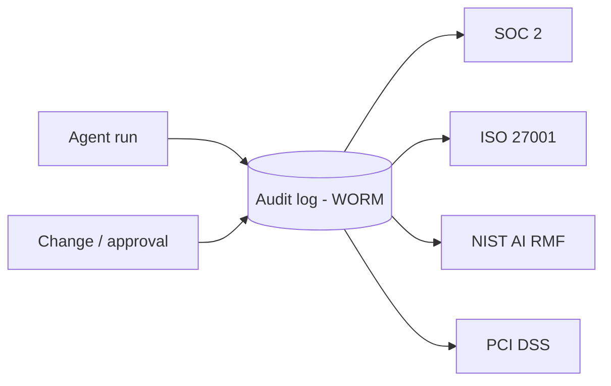

# Audit Framework

Every autonomous agent run and every governed change is an event that must be
**recorded, immutable, and retrievable**. The audit framework defines the log
schema for agent runs, how evidence is retained and protected from tampering,
and how the resulting trail maps to common compliance frameworks. It extends the
audit logging guidance in
[`../ENTERPRISE_GUIDE.md`](../ENTERPRISE_GUIDE.md#8-audit-logging).

## What we audit

| Event class | Examples | Primary consumer |
|-------------|----------|------------------|
| **Agent runs** | plan, each tool call, approvals, escalations, outcome | Incident review, promotion evidence |
| **Lifecycle transitions** | Draft→In-Review→Approved→Deprecated→Archived | Governance, compliance |
| **Approvals** | content sign-off, autonomy-stage promotion | Change control, audit |
| **Guardrail events** | blocked unsafe action, drift alert, kill-switch use | Security, agent governance |

## Audit record schema (agent run)

Each run emits one root record with an ordered list of actions. Fields marked
required must always be present; omit unknowns with an explicit `null` rather
than dropping the key.

| Field | Type | Required | Description |
|-------|------|:--------:|-------------|
| `run_id` | string | yes | Globally unique, sortable run identifier |
| `runbook_id` | string | yes | Matches the runbook filename/`id` |
| `runbook_version` | string | yes | Semver of the executed runbook |
| `runbook_status` | enum | yes | Lifecycle status at execution time |
| `autonomy_stage` | int | yes | 0–4 stage from the catalog |
| `agent` | string | yes | Platform (e.g. `devin`, `claude-code`) |
| `actor` | string | yes | Service or user identity running the agent |
| `environment` | enum | yes | `dev` / `staging` / `prod` |
| `inputs` | object | yes | Runbook inputs (secrets redacted) |
| `risk_tier_max` | enum | yes | Highest risk tier reached (R0–R3) |
| `plan_approved_by` | string | no | Approver for plan-gated runs |
| `actions[]` | array | yes | Ordered tool invocations (below) |
| `escalations[]` | array | yes | Escalation events with reason and route |
| `evidence_uris[]` | array | yes | Pointers to preserved queries/outputs |
| `report_uri` | string | yes | Location of the final report |
| `outcome` | enum | yes | `complete` / `escalated` / `aborted` / `failed` |
| `integrity` | object | yes | Hash chain + signature (see immutability) |

Each element of `actions[]`:

| Field | Type | Description |
|-------|------|-------------|
| `ts` | string (RFC 3339) | Timestamp |
| `type` | enum | `read` / `mutate` |
| `tool` | string | Tool/function invoked |
| `target` | string | System/resource acted on |
| `risk_tier` | enum | R0–R3 for this action |
| `approved_by` | string | Required for mutating actions |
| `rollback` | string | Rollback used/available for mutating actions |
| `result` | enum | `ok` / `blocked` / `error` |

## Example audit record

```json
{
  "run_id": "2026-08-13T14:02:11Z-checkout-rca-7f3a",
  "runbook_id": "root-cause-analysis",
  "runbook_version": "1.2.0",
  "runbook_status": "approved",
  "autonomy_stage": 3,
  "agent": "devin",
  "actor": "svc-agent-sre",
  "environment": "prod",
  "inputs": {
    "service_name": "checkout-api",
    "symptom": "p99 latency > 2s since 14:00 UTC",
    "credentials": "<REDACTED>"
  },
  "risk_tier_max": "R2",
  "plan_approved_by": "oncall-lead@corp",
  "actions": [
    {
      "ts": "2026-08-13T14:03:02Z",
      "type": "read",
      "tool": "prometheus_query",
      "target": "checkout-api",
      "risk_tier": "R0",
      "approved_by": null,
      "rollback": null,
      "result": "ok"
    },
    {
      "ts": "2026-08-13T14:07:44Z",
      "type": "mutate",
      "tool": "kubectl_rollout_restart",
      "target": "deploy/checkout-api",
      "risk_tier": "R2",
      "approved_by": "oncall-lead@corp",
      "rollback": "kubectl rollout undo deploy/checkout-api",
      "result": "ok"
    }
  ],
  "escalations": [],
  "evidence_uris": ["s3://agent-audit/checkout-rca-7f3a/evidence/"],
  "report_uri": "s3://agent-audit/checkout-rca-7f3a/report.md",
  "outcome": "complete",
  "integrity": {
    "prev_hash": "sha256:0f3c…",
    "record_hash": "sha256:9a71…",
    "signature": "kms:alias/agent-audit:MEUCIQ…"
  }
}
```

## Evidence retention

- **Preserve raw evidence** referenced by findings: queries, command output,
  dashboards, and the final report. Store under a per-run prefix.
- **Redact secrets and regulated data** before persistence; never log
  credentials, tokens, private keys, or raw customer PII.
- **Retention windows** follow data classification: default 400 days for run
  records; longer where a compliance regime requires it (e.g. PCI-relevant
  changes). Lifecycle and approval records are retained for the life of the
  repository.
- **Residency** is respected — evidence is stored in the region required by the
  data it references; runbooks must not move regulated data across boundaries.

## Immutability

- **Append-only / WORM storage.** Records are written once to
  write-once-read-many or object-lock storage; no in-place edits or deletes
  within the retention window.
- **Hash chaining.** Each record stores the previous record's hash and its own
  hash, forming a tamper-evident chain; a broken link is detectable.
- **Signing.** Records are signed (e.g. KMS) so authenticity is verifiable.
- **Separation of duties.** Agents and operators can write but cannot alter or
  delete audit records; only a restricted audit role administers retention.
- **Access logging.** Reads of the audit store are themselves logged.

## Compliance mapping



| Framework | Control area | Evidence this trail provides |
|-----------|--------------|------------------------------|
| **SOC 2** | Change management, logical access, monitoring | Approvals, actor identity, mutating-action gating, run outcomes |
| **ISO 27001** | A.8 asset/logging, A.9 access, A.12 operations | Scoped-credential use, event logging, change control |
| **NIST AI RMF** | Govern / Map / Measure / Manage | Lifecycle + guardrail events, drift alerts, escalation records |
| **PCI DSS** | Req. 10 logging, change control, least privilege | Immutable time-stamped actions, segregation of duties, retention |

## Using the audit trail

The trail is the evidence base for autonomy-stage promotions (clean-run counts,
blocked-action counts), for incident and postmortem review, and for external
audits. Queries should be able to answer, for any window: which runbooks ran,
who or what ran them, what they changed, who approved it, and how it was rolled
back. If the trail cannot answer those questions, the gap is a governance defect
to be fixed before autonomy is expanded.
