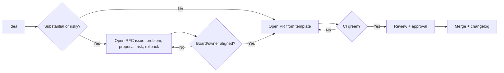

# Change Management

Runbooks are executable policy, so changing one is a change to what agents do
against real systems. Change management applies **code-grade control** to runbook
and framework changes: a proposal path (RFC/PR), semantic versioning, explicit
change classes, a rollback procedure for documentation changes, and mechanical
gating via CODEOWNERS. It works hand-in-hand with the
[review](./review-process.md), [approval](./approval-process.md), and
[lifecycle](./runbook-lifecycle.md) processes and mirrors the contribution flow
in [`../CONTRIBUTING.md`](../CONTRIBUTING.md).

## Proposal path: RFC and PR

Small, well-understood changes go straight to a **pull request**. Substantial or
risky changes start with a lightweight **RFC** so scope is agreed before effort
is spent.



Open an RFC when a change: introduces a new runbook category, alters the
template or standards, changes an autonomy stage, or affects any
`risk_level: high|critical` runbook. The RFC states the problem, the proposal,
the risk class, and the rollback.

## Versioning (semver)

Each runbook carries a `version` in front matter following
[Semantic Versioning](https://semver.org/): `MAJOR.MINOR.PATCH`.

| Bump | When | Example |
|------|------|---------|
| **MAJOR** | Behavior changes an agent would execute differently; steps added/removed/reordered; risk tier or access changes | New mutating step; `required_access` widened |
| **MINOR** | Backward-compatible additions | New optional check, extra evidence, added reference |
| **PATCH** | Editorial fixes with no behavioral effect | Typos, formatting, link fixes, clarifications |

Rules:

- A MAJOR bump returns an Approved runbook to `In-Review` and **resets its
  autonomy stage** to one appropriate for the change's risk.
- The `version` and the change are recorded in
  [`../CHANGELOG.md`](../CHANGELOG.md).
- Framework documents (templates, standards) are versioned as a set and released
  under repository tags; agents should pin a release for reproducibility.

## Change classes

Every change is labeled with a class that determines its required path.

| Class | Definition | Path | Reviewers |
|-------|------------|------|-----------|
| **A — Editorial** | No behavioral effect (PATCH) | PR | 1 maintainer |
| **B — Functional** | Changes steps/logic but not risk tier (MINOR/MAJOR) | PR | 1 maintainer (+ SME) |
| **C — Sensitive** | Touches `security/`, risk tier, access, or autonomy | RFC → PR | technical + security (four-eyes) |
| **D — Emergency** | Hotfix for an unsafe runbook in production | Fast-track PR | 1 board member, ratified later |

Class C and D changes always require the second (security) review defined in the
[review process](./review-process.md).

## CODEOWNERS gating

Reviews are enforced mechanically, not by convention. A `CODEOWNERS` file routes
required reviewers by path so the correct approvals are non-optional:

```text
# Illustrative CODEOWNERS routing
/runbooks/security/**        @security-reviewers @runbook-owners
/runbooks/**                 @runbook-owners
/docs/AI_AGENT_STANDARDS.md  @review-board
/templates/**                @review-board
/governance/**               @review-board
```

Branch protection requires: green CI, the CODEOWNERS-mandated approvals, up-to-date
branch, and no self-approval. A merge cannot proceed until these are satisfied,
which makes the [approval process](./approval-process.md) enforceable rather than
advisory.

## Rollback of documentation changes

Because runbooks are versioned documents in git, rollback is deterministic — but
it must be **governed**, not ad hoc.

**When to roll back:**

- A merged change is found to induce unsafe agent behavior.
- A runbook change correlates with a failed or harmful agent run.
- CI on `main` regresses due to a merged change.

**Procedure:**

1. **Contain.** If agents may be executing the affected runbook, pause it via
   the catalog and, if needed, the kill switch (see
   [agent-governance.md](./agent-governance.md)).
2. **Revert.** Open a revert PR restoring the last-known-good version; label it
   Class D if urgent. Reverting is preferred over force-pushing so history stays
   intact and auditable.
3. **Version.** Bump `version` for the revert (a revert is itself a change) and
   note it in the changelog.
4. **Re-status.** Return the runbook to `In-Review` if the revert needs
   validation, or straight to `Approved` if restoring a prior signed-off version.
5. **Record.** Write an audit record (see
   [audit-framework.md](./audit-framework.md)) capturing the reason, the reverted
   SHAs, and the approver.
6. **Follow up.** File an issue for the proper fix so the revert is not the end
   state.

Never rewrite published history to "undo" a change; roll forward with a revert so
the audit trail remains complete.

## Change record

Each merged change leaves: a PR with review approvals, a changelog entry, a
semver bump, and (for Class C/D) an audit record. Together these answer who
changed what, why, who approved it, and how to undo it — the minimum bar for a
change to a system that autonomous agents act upon.
