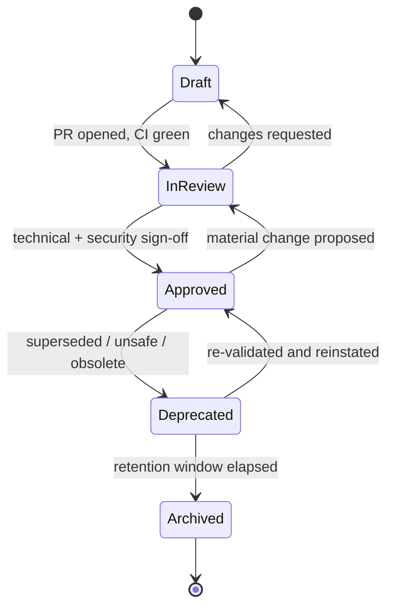

# Runbook Lifecycle

Every runbook has exactly one **status** at any moment, and every status change
is a reviewed, recorded event. A single, unambiguous lifecycle makes it possible
to answer "can an agent run this today, and how autonomously?" with certainty.
This document defines the statuses, their entry and exit criteria, and how they
map to the repository maturity levels in
[`../docs/QUALITY_ASSURANCE.md`](../docs/QUALITY_ASSURANCE.md#7-repository-maturity-model).

## The statuses

| Status | Meaning | Agent may execute? |
|--------|---------|--------------------|
| **Draft** | Being authored or revised; not yet reviewed | No |
| **In-Review (Validated)** | Under technical/security review; CI green | Only in a sandbox, for validation |
| **Approved (Production)** | Signed off; production-eligible at its autonomy stage | Yes, per catalog stage |
| **Deprecated** | Superseded or found unsafe; discouraged | No (except explicit migration) |
| **Archived** | Retired; retained for audit history only | No |

The status is declared in front matter (e.g. `status: approved`) and mirrored in
the approved catalog so agents and the control plane agree on a single source of
truth.

## State machine

## Draft

The working state for new runbooks and in-progress revisions.

**Entry criteria:**

- A runbook file created from
  [`../templates/runbook-template.md`](../templates/runbook-template.md), or an
  existing Approved runbook returned after a change request.

**Exit criteria (to In-Review):**

- All required sections present and front matter valid.
- Author self-check in
  [`../docs/QUALITY_ASSURANCE.md`](../docs/QUALITY_ASSURANCE.md#6-validation-checklist-author-self-check)
  complete.
- A PR is opened and automated checks are green.

Agents must not execute Draft runbooks against any real system.

## In-Review (Validated)

The runbook is complete and mechanically valid; humans are assessing judgment,
safety, and agent-readiness. "Validated" denotes that automated validation has
passed — not that content is approved.

**Entry criteria:**

- CI green (structure, front matter, lint, links, scoring).
- Completeness ≥ 75 and agent-readiness ≥ 42 (per the scorer).

**Exit criteria (to Approved):**

- Technical review passed; security review passed where required (see
  [review-process.md](./review-process.md)).
- Sign-off recorded per [approval-process.md](./approval-process.md).

**Exit criteria (back to Draft):**

- A reviewer requests changes.

During this state a runbook may be executed **only in a sandbox** for validation
runs that produce evidence for the review.

## Approved (Production)

The runbook is production-eligible. Its autonomy stage (0–4) is governed
separately and lives in the catalog, not in the lifecycle status.

**Entry criteria:**

- Content approval granted and merged; `status: approved` set.
- Entered the catalog at **Stage 0** (read-only advisory) by default.

**Exit criteria (to In-Review):**

- A material change is proposed (any change class B or C in
  [change-management.md](./change-management.md)); the runbook re-enters review.

**Exit criteria (to Deprecated):**

- Superseded by a newer runbook, made obsolete by platform changes, or found to
  induce unsafe behavior.

Approved runbooks are re-reviewed on cadence (every 180 days or on dependency
change). A failed re-review moves the runbook to Deprecated or back to In-Review.

## Deprecated

The runbook should no longer be used for new work but is kept discoverable for
migration and historical reference.

**Entry criteria:**

- A board decision or emergency deprecation (see approval process) with a stated
  reason and, where relevant, a pointer to the replacement runbook.

**Exit criteria (to Approved):**

- The underlying issue is resolved and the runbook is re-validated through
  In-Review, or the deprecation was precautionary and is lifted.

**Exit criteria (to Archived):**

- The retention/migration window elapses (default 90 days) with no reinstatement.

Agents must not autonomously execute Deprecated runbooks; explicit,
human-directed migration runs are the only exception.

## Archived

The terminal state. The runbook is removed from the active catalog but retained
in version control and the audit trail for compliance history.

**Entry criteria:**

- Deprecated beyond its retention window, or permanently retired.

**Exit criteria:**

- None. To revive, author a new runbook (new `id` or major version) from the
  archived one; it starts again at Draft.

## Mapping to maturity levels

The lifecycle status describes a runbook's readiness; the **maturity level**
describes how proven it is. They are related but distinct — a runbook can be
Approved yet still low-maturity until it accrues clean runs.

| Maturity | Name | Typical lifecycle status | Signal |
|:--------:|------|--------------------------|--------|
| L1 | Initial | Draft | Exists; not reviewed |
| L2 | Repeatable | In-Review (Validated) | Template + CI enforced; validated in sandbox |
| L3 | Defined | Approved (Stage 0–1) | Scored, signed off, advisory/gated use |
| L4 | Managed | Approved (Stage 2–3) | Metrics tracked; bounded/supervised autonomy |
| L5 | Optimizing | Approved (Stage 4) | Eval harness + golden trajectories; managed autonomy |

Promotion up the maturity levels tracks autonomy-stage promotion in the
[approval process](./approval-process.md): each level requires an observation
window of clean runs, green guardrail metrics, and a recorded board decision.

## Recording transitions

Each transition writes an audit record (see
[audit-framework.md](./audit-framework.md)) capturing the runbook `id` and
version, from-state, to-state, the actor/approver, the reason, and a timestamp.
This history is the evidence base for re-reviews, promotions, and incident
investigations.
