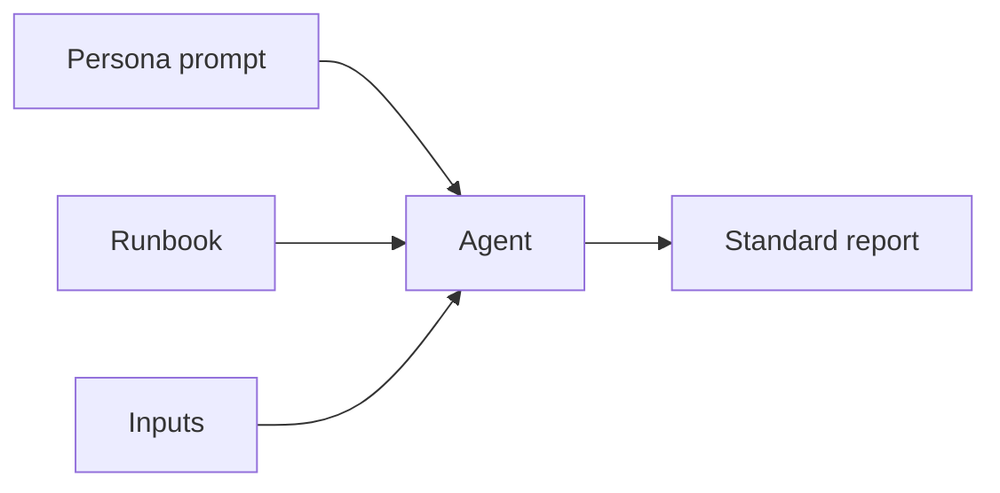

# Agent Prompt Library

Ready-to-use **system/persona prompts** that pair with the runbooks in this
repository. Each prompt configures an agent with a role, duties, restrictions,
expected behavior, and output format that align with
[`docs/AI_AGENT_STANDARDS.md`](../docs/AI_AGENT_STANDARDS.md) and the
[report template](../templates/report-template.md).

## How to use

1. Load the relevant persona prompt as the agent's **system prompt** (or the
   first instruction message).
2. Provide the target **runbook** (paste it, or expose it via an MCP resource).
3. Provide the runbook's **Inputs Required** (service name, environment, etc.).
4. Let the agent plan, investigate, validate, and report per the standards.

## Prompts

| Prompt | Pairs with (examples) |
|--------|-----------------------|
| [`root-cause-analysis-agent.md`](./root-cause-analysis-agent.md) | root-cause-analysis, incident-postmortem, investigate-kafka-lag |
| [`security-review-agent.md`](./security-review-agent.md) | api-security-audit, container-security-audit, terraform-security-review |
| [`architecture-review-agent.md`](./architecture-review-agent.md) | graphql-performance-review, monolith-to-microservices |
| [`cost-optimization-agent.md`](./cost-optimization-agent.md) | aws/azure/gcp-cost-optimization |
| [`platform-audit-agent.md`](./platform-audit-agent.md) | kubernetes/eks/aks/gke-audit, platform-engineering-review |
| [`migration-agent.md`](./migration-agent.md) | react-18-to-19-upgrade, rest-to-graphql-migration |
| [`observability-agent.md`](./observability-agent.md) | observability-review, logging-review, tracing-review |
| [`production-readiness-agent.md`](./production-readiness-agent.md) | production-readiness-review, release-readiness-review |
| [`runbook-generator-agent.md`](./runbook-generator-agent.md) | authoring new runbooks from the template |

## Conventions

- Prompts are vendor-neutral; adapt only the tool-invocation syntax to your
  platform.
- Prompts never instruct the agent to bypass safety gates or exceed its
  authorized risk tier.
- Prompts assume least-privilege, read-only-first execution.
