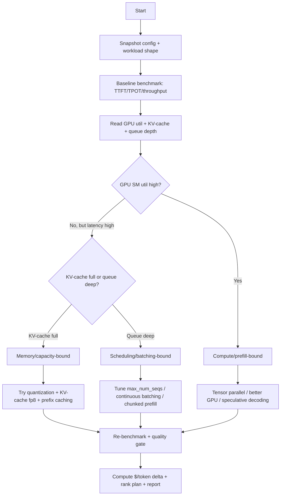
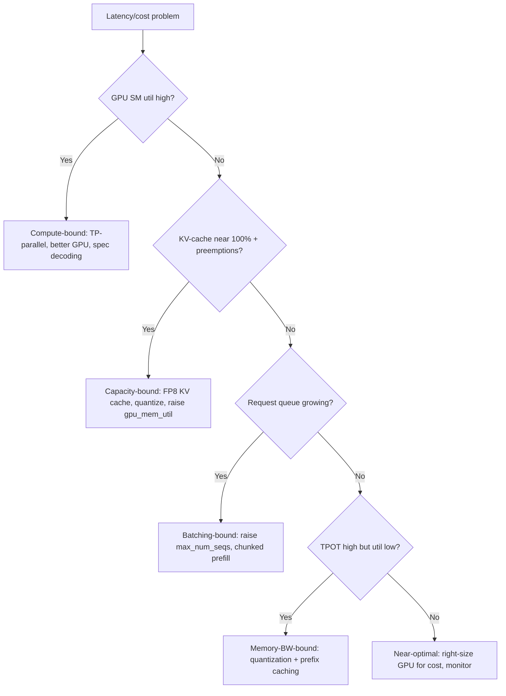

# LLM Inference Optimization

> A performance and cost audit of a self-hosted LLM serving stack — latency,
> throughput, batching, KV cache, quantization, and $/token — that finds the
> real bottleneck (memory-bound vs compute-bound vs scheduling) and delivers a
> measured tuning plan.

## Objective

Diagnose where an LLM inference deployment is losing latency, throughput, or
money, and deliver a benchmarked optimization plan. "Done" means TTFT
(time-to-first-token), TPOT (time-per-output-token), and end-to-end latency are
measured under realistic load; throughput (tokens/s and requests/s) and GPU
utilization/KV-cache pressure are characterized; the binding constraint is
identified; and each recommended change (batching, quantization, cache config,
parallelism) has a measured before/after and a cost-per-1M-token delta.

## Business Context

Inference is the dominant recurring cost of any LLM product and the primary
driver of perceived quality — users judge an assistant by how fast the first
token appears and how smoothly it streams. Under-optimized serving wastes GPUs
(the scarcest, most expensive resource in the org) and inflates $/token by
2–10x, while poor latency tuning drives users away even when the model is good.
Conversely, correct batching, quantization, and KV-cache management can multiply
throughput per GPU several-fold, deferring costly capacity purchases and
improving SLOs at the same time. This runbook converts GPU spend into the most
tokens-per-dollar achievable without regressing quality or latency SLOs.

## Problem Statement

Teams frequently run vLLM/TGI with defaults, then complain about cost or
latency without knowing which regime they're in. LLM decoding is
**memory-bandwidth-bound** (KV cache + weights dominate), so the usual CPU-era
intuitions mislead. Symptoms: low GPU compute utilization but high latency
(scheduling/batching problem); OOM or preemption under load (KV-cache too small
/ `max_num_seqs` too high); great single-request latency but terrible aggregate
throughput (no continuous batching); or a huge bill because FP16 is used where
an 8-bit quant would serve identically.

This runbook audits one serving deployment. **Out of scope:** model training/
fine-tuning, changing the model's task quality, and multi-region autoscaling
architecture (recommended as follow-up).

## Success Criteria

- [ ] TTFT, TPOT, and E2E latency (p50/p95/p99) are measured under realistic
      concurrency with a load generator.
- [ ] Throughput (output tokens/s, requests/s) and GPU SM utilization, memory,
      and KV-cache usage are characterized across load levels.
- [ ] The binding constraint is identified (memory-bandwidth, KV-cache capacity,
      batch scheduling, or compute) with evidence.
- [ ] At least one optimization (batching, quantization, cache, parallelism) is
      benchmarked with a before/after and quality check.
- [ ] Cost per 1M input+output tokens is computed for current and proposed
      configs.
- [ ] A ranked tuning plan with expected $/token and latency impact is delivered.

## Trigger Conditions

- Alert: inference latency SLO breach or GPU cost spike.
- Schedule: quarterly cost/perf review of GPU fleets.
- Manual: onboarding a new model or GPU type; capacity planning.
- Event: OOM/preemption incidents under peak load.

## Inputs Required

| Input | Description | Example | Required |
|-------|-------------|---------|----------|
| `deployment` | Serving deployment id | `llama3-8b-vllm` | Yes |
| `engine` | Serving engine | `vllm` / `tgi` | Yes |
| `model` | Model + dtype | `Llama-3.1-8B fp16` | Yes |
| `gpu` | GPU type + count | `1x A100-80GB` | Yes |
| `endpoint` | OpenAI-compatible URL | `http://vllm:8000/v1` | Yes |
| `workload` | Prompt/output length mix | `1500 in / 300 out` | Yes |
| `latency_slo` | TTFT/E2E targets | `TTFT<400ms p95` | Yes |

## Required Access

| Scope | Purpose | Read/Write | Sensitivity |
|-------|---------|-----------|-------------|
| Inference endpoint | Benchmark requests | Invoke | Medium |
| GPU metrics (DCGM) | SM util, mem, throughput | Read | Low |
| Engine metrics | vLLM/TGI Prometheus metrics | Read | Low |
| Serving config | Inspect launch flags | Read | Low |
| Cost/billing | GPU hourly rate | Read | Medium |

## Assumptions

- A load-test environment or a safe production shadow is available so benchmarks
  don't harm live traffic.
- GPU metrics (DCGM exporter) and engine metrics are scraped by Prometheus.
- The model's output quality bar is fixed; optimizations must not regress it
  beyond an agreed tolerance.
- The team can tolerate short benchmark load windows.

## Risks

| Risk | Likelihood | Impact | Mitigation |
|------|-----------|--------|------------|
| Benchmark load impacts prod | Medium | High | Use isolated replica/shadow; cap concurrency |
| Quantization silently degrades quality | Medium | High | Run a quality eval (perplexity + task set) post-quant |
| Tuning `gpu_memory_utilization` too high -> OOM | Medium | Medium | Increase gradually; watch preemption metric |
| Optimizing the wrong regime | Medium | Medium | Confirm memory- vs compute-bound before tuning |

## Constraints

- No changes to production serving config during the runbook; benchmark on a
  replica and deliver recommendations.
- Do not exceed the agreed benchmark load window or concurrency cap.
- Quality regression from quantization must stay within the agreed tolerance.
- Respect data policy: use synthetic or approved prompts for benchmarking.

## Agent Persona

Adopt the persona of a **Principal ML Systems / Inference Engineer** who thinks
in roofline models and GPU memory bandwidth. You know decoding is
memory-bound and prefill is compute-bound, and you never tune without first
identifying the regime. Tone: rigorous, benchmark-driven, cost-obsessed. You
distrust single-request latency numbers and insist on throughput-under-load and
$/token. Follow
[`docs/AI_AGENT_STANDARDS.md`](../../docs/AI_AGENT_STANDARDS.md) for evidence and
change-safety.

## Planning Instructions

1. Record the current launch flags, model dtype, GPU type, and the realistic
   workload shape (input/output token distribution, concurrency).
2. Define the benchmark matrix: concurrency levels × input/output lengths, and
   the metrics to capture (TTFT, TPOT, throughput, GPU util, KV-cache usage).
3. Plan a quality gate for any quantization change (perplexity + a small task
   eval set) so speed isn't bought with accuracy.
4. Externalize the plan and load caps; when `human_in_the_loop` is `required`,
   get approval before generating load.

## Execution Instructions

Inspect the current serving config (vLLM example):

```bash
# vLLM launch flags being audited
python -m vllm.entrypoints.openai.api_server \
  --model meta-llama/Llama-3.1-8B-Instruct \
  --dtype float16 \
  --max-model-len 8192 \
  --gpu-memory-utilization 0.90 \
  --max-num-seqs 256 \
  --enable-prefix-caching \
  --tensor-parallel-size 1
```

Scrape engine + GPU metrics (vLLM exposes Prometheus metrics):

```promql
# KV-cache utilization — the key capacity signal for decoding
vllm:gpu_cache_usage_perc

# Requests waiting vs running -> scheduler/batching pressure
vllm:num_requests_waiting / (vllm:num_requests_running + 1)

# Throughput
rate(vllm:generation_tokens_total[1m])

# GPU SM utilization (DCGM) — low util + high latency = not compute-bound
DCGM_FI_DEV_GPU_UTIL
```

Run a load benchmark and capture latency percentiles:

```bash
# vLLM's benchmark_serving with a realistic length mix + concurrency sweep
python benchmarks/benchmark_serving.py \
  --backend vllm --model meta-llama/Llama-3.1-8B-Instruct \
  --dataset-name random --random-input-len 1500 --random-output-len 300 \
  --request-rate 20 --num-prompts 1000 \
  --metric-percentiles 50,95,99
# Reports: TTFT, TPOT, E2E latency percentiles, output tokens/s
```

Benchmark a quantized variant (AWQ/GPTQ/FP8) for $/token:

```bash
# FP8 (or AWQ) can ~2x throughput on memory-bound decode with minimal quality loss
python -m vllm.entrypoints.openai.api_server \
  --model meta-llama/Llama-3.1-8B-Instruct \
  --quantization fp8 --kv-cache-dtype fp8 \
  --gpu-memory-utilization 0.90 --max-num-seqs 512
```

Quality gate after quantization (must pass before recommending):

```bash
# lm-eval-harness sanity check vs fp16 baseline on a small task set
lm_eval --model local-completions --tasks gsm8k,mmlu_flan_n_shot \
  --model_args base_url=http://vllm-fp8:8000/v1 --limit 200
```

Compute cost per 1M tokens:

```text
$/1M_tokens = (gpu_hourly_rate / 3600) / output_tokens_per_sec * 1e6
Example: A100 @ $2.50/hr, 3,200 tok/s  ->  (2.50/3600)/3200 * 1e6 = $0.217 / 1M output tok
```

## Investigation Workflow



## Analysis Framework

Identify the regime first, then tune. Key signals and thresholds:

| Signal | Reading | Interpretation |
|--------|---------|----------------|
| GPU SM util | < 40% with high latency | Not compute-bound; scheduling/batching issue |
| KV-cache usage | ~100% + preemptions | Capacity-bound: quantize, shrink `max_model_len`, raise cache |
| Requests waiting | Growing queue | Batching/`max_num_seqs` too low or prefill blocking decode |
| TTFT high, TPOT low | Slow first token | Prefill/compute-bound; chunked prefill helps |
| TPOT high | Slow streaming | Decode memory-bandwidth-bound; quantization helps |

Reasoning rules:

- Decode is **memory-bandwidth-bound**: the biggest wins come from reducing
  bytes moved — quantization (FP8/AWQ), FP8 KV cache, and larger effective
  batches via continuous batching.
- **Continuous (in-flight) batching** is the single biggest throughput lever;
  confirm it's on (vLLM default; TGI `--max-batch-total-tokens`).
- Prefix caching + chunked prefill help when prompts share long system prefixes
  or when prefill stalls decode.
- Raising `gpu_memory_utilization` gives more KV-cache headroom (higher
  concurrency) — but too high risks OOM; watch the preemption metric.
- Never accept a speed win without a **quality gate**; report the accuracy delta
  alongside the throughput delta.
- Always convert wins to $/1M tokens; latency and throughput improvements only
  matter if they change the SLO or the bill.

## Decision Tree



## Validation Steps

- [ ] Re-run the baseline and proposed config under identical load and confirm
      the throughput/latency delta is reproducible (not noise).
- [ ] Confirm the quality gate (perplexity + task eval) is within tolerance for
      any quantization change.
- [ ] Verify no OOM/preemption events occurred at the proposed
      `gpu_memory_utilization` and `max_num_seqs`.
- [ ] Confirm the $/1M-token calculation uses the actual billed GPU rate.
- [ ] Confirm latency SLOs (TTFT/E2E p95) still pass under peak concurrency.

## Expected Outputs

- Inference optimization report with baseline vs proposed benchmark tables.
- A regime diagnosis (compute / capacity / batching / memory-bandwidth bound).
- A quality-gate result table for any quantization change.
- A $/1M-token comparison and projected monthly savings.
- A ranked tuning plan with expected latency + cost impact.

## Deliverables

A single report following
[`templates/report-template.md`](../../templates/report-template.md), including
benchmark tables, the regime diagnosis, quality-gate results, and the ranked
tuning plan. Follow
[`docs/AI_AGENT_STANDARDS.md`](../../docs/AI_AGENT_STANDARDS.md) for evidence and
redaction.

## Escalation Process

- **P1 (page):** A live latency SLO breach causing user-facing degradation, or
  recurring OOM/preemption dropping requests. Notify the serving owner +
  on-call within 1 hour.
- **P2 (ticket):** Cost inefficiency (config leaving >30% throughput on the
  table). File tickets tagged `inference` with the benchmarked plan.
- **P3 (backlog):** Marginal tuning opportunities.
- If a quality regression from quantization exceeds tolerance, escalate to the
  model owner before recommending the change.

## Rollback Strategy

Benchmarks run on an isolated replica, so production is untouched and no rollback
is needed for the audit. If any recommended change is later applied and
regresses latency or quality, revert by restoring the previous launch flags /
model artifact (keep the prior container image and config pinned), then confirm
KV-cache usage, latency percentiles, and the quality gate return to baseline. Do
not roll a config change to 100% of traffic without a canary.

## Post-Execution Review

- Which regime were we actually in? Teams often "add GPUs" when they were
  batching-bound. Record it.
- Did quantization buy throughput without measurable quality loss on the task set?
- What is the new $/1M tokens, and how much monthly GPU spend does the plan save?
- Should a throughput + quality benchmark become a CI gate for model/engine
  upgrades?

## Metrics

| Metric | Definition | Target |
|--------|-----------|--------|
| TTFT p95 | Time to first token | < SLO |
| TPOT | Time per output token | < SLO |
| Output throughput | Tokens/s per GPU | maximized |
| GPU utilization | SM util under load | > 70% at peak |
| KV-cache preemptions | Preempted requests/min | ~0 |
| $/1M tokens | Serving cost per 1M tokens | minimized |

## Example Execution

**Inputs:** `deployment=llama3-8b-vllm`, `engine=vllm`, `model=Llama-3.1-8B
fp16`, `gpu=1x A100-80GB`, `workload=1500 in / 300 out`, `latency_slo=TTFT<400ms
p95`.

**Agent reasoning (abridged):** Baseline at concurrency 20: TTFT p95 = 380ms
(OK), output throughput = 1,850 tok/s, but GPU SM util was only 46% while
`vllm:num_requests_waiting` grew — a scheduling signal, and KV-cache sat at 61%.
`max_num_seqs` was 256 but effective batch was small because long prompts filled
the cache. Enabling FP8 weights + FP8 KV cache freed cache, allowing
`max_num_seqs=512`; throughput rose to 3,400 tok/s (+84%), SM util to 73%, TTFT
p95 held at 410ms. The lm-eval gate (gsm8k, mmlu, n=200) showed a 0.4-point drop
— within tolerance. $/1M output tokens fell from $0.375 to $0.204.

**Sample report excerpt:**

```text
Inference Optimization — llama3-8b-vllm (1x A100-80GB)
  Regime: batching + KV-cache capacity bound (SM util 46%, queue growing)

  Config            Throughput   TTFT p95   SM util   $/1M out
  fp16 (baseline)   1,850 tok/s  380 ms     46%       $0.375
  fp8 + fp8 KV +    3,400 tok/s  410 ms     73%       $0.204
   max_num_seqs=512

  Quality gate (n=200): gsm8k -0.4pt, mmlu -0.2pt  (within tolerance)

Top recommendations (ranked):
  R1 Enable fp8 weights + fp8 KV cache; raise max_num_seqs 256 -> 512.
  R2 Enable chunked prefill to keep decode fed under long prompts.
  R3 Keep prefix caching on (shared system prompt).
  Projected saving: ~46% $/token = ~$9.4k/mo at current volume.
```

## References

- [`docs/AI_AGENT_STANDARDS.md`](../../docs/AI_AGENT_STANDARDS.md)
- [`templates/report-template.md`](../../templates/report-template.md)
- [Prompt Quality Review](./prompt-quality-review.md)
- [vLLM documentation](https://docs.vllm.ai/)
- [Text Generation Inference (TGI)](https://huggingface.co/docs/text-generation-inference/)
- [NVIDIA DCGM exporter](https://github.com/NVIDIA/dcgm-exporter)
- [lm-evaluation-harness](https://github.com/EleutherAI/lm-evaluation-harness)
