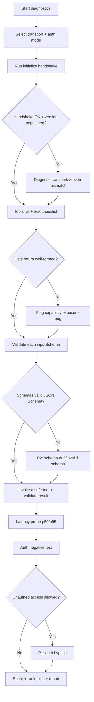
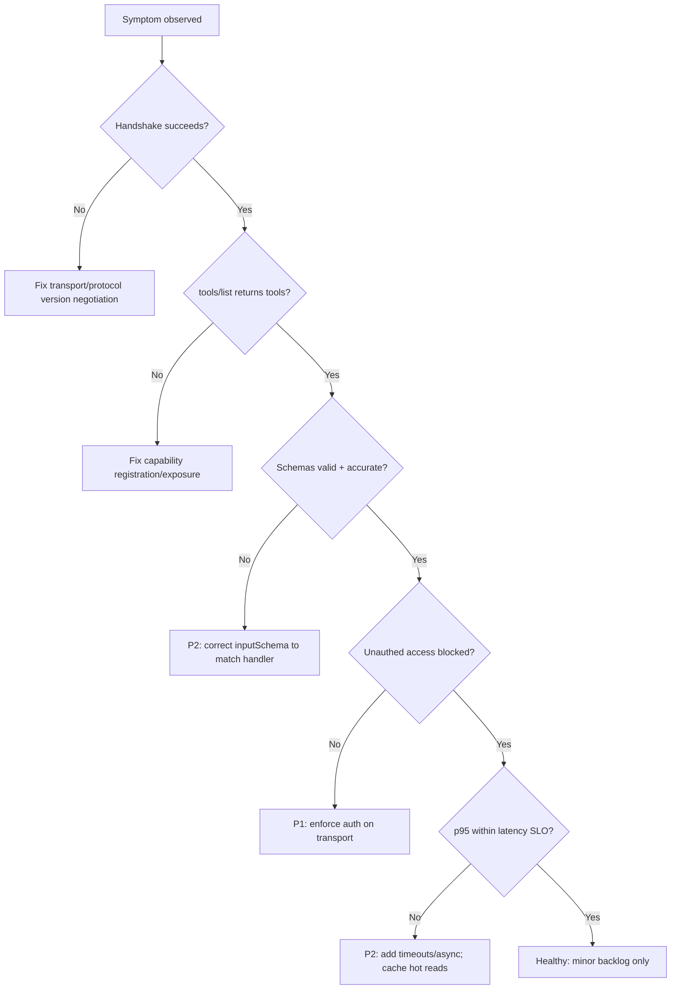

# MCP Server Diagnostics

> A systematic health check of a Model Context Protocol (MCP) server — tools and
> resources exposure, transport (stdio/SSE/HTTP), authentication, latency, and
> schema validation — producing a diagnosis and prioritized remediation plan so
> AI agents can use the server reliably and safely.

## Objective

Determine whether an MCP server is *correctly exposing its capabilities,
transporting them reliably, authenticating properly, responding within latency
budgets, and returning schema-valid results*, then deliver a diagnosis with a
ranked fix list. "Done" means the JSON-RPC handshake succeeds, `tools/list` and
`resources/list` return well-formed, schema-valid definitions, tool calls
round-trip within the latency SLO, auth is enforced on protected transports, and
error responses follow the MCP/JSON-RPC error contract.

## Business Context

MCP is the emerging standard by which agents (Claude Code, Cursor, OpenHands,
and custom MCP agents) discover and invoke external tools and data. When an MCP
server is misconfigured, the failure is silent and expensive: agents either
can't see tools (capability invisible), call them with malformed arguments
(schema drift), hang on slow transports (blocked agent loops), or — worst —
expose privileged tools without auth, letting any connected agent execute
dangerous operations. Because agents chain tool calls autonomously, one broken
or insecure MCP server can derail an entire automation or create a security
incident. This runbook keeps the agent-tool boundary reliable and safe, directly
protecting agent success rate and reducing the blast radius of a compromised or
buggy server.

## Problem Statement

Common failure modes: the server advertises tools whose `inputSchema` doesn't
match what the handler actually expects (agents send valid-looking args that get
rejected); SSE/HTTP transports drop long-lived connections or lack keep-alives;
auth is absent on a network-exposed HTTP transport; latency is unbounded because
a "tool" performs a synchronous 30-second API call with no timeout; and error
responses return prose instead of structured JSON-RPC errors, so agents can't
recover. Symptoms: "the agent says it has no tools," intermittent tool-call
timeouts, and 500s with empty bodies.

This runbook diagnoses one MCP server across its declared transports. **Out of
scope:** authoring new tools, building the server, and end-to-end agent behavior
evaluation (see the agent-evaluation-framework runbook).

## Success Criteria

- [ ] The `initialize` handshake succeeds and negotiates a supported protocol
      version and capabilities.
- [ ] `tools/list` and `resources/list` (and `prompts/list` if advertised)
      return without error and every entry has a valid JSON Schema.
- [ ] A representative `tools/call` round-trips successfully and returns
      schema-valid, correctly typed content.
- [ ] The active transport (stdio / SSE / streamable HTTP) is confirmed healthy
      with keep-alive/reconnect behavior verified.
- [ ] Authentication/authorization is enforced on any network-exposed transport
      (OAuth2 / bearer / mTLS as applicable).
- [ ] p95 tool-call latency is within the declared SLO and error responses
      conform to the JSON-RPC error contract.

## Trigger Conditions

- Alert: agents reporting "no tools available" or elevated tool-call error rate.
- Schedule: pre-deployment gate for a new/updated MCP server.
- Manual: onboarding an MCP server into an agent fleet.
- Event: security review of a network-exposed MCP endpoint.

## Inputs Required

| Input | Description | Example | Required |
|-------|-------------|---------|----------|
| `server_name` | MCP server identifier | `github-mcp` | Yes |
| `transport` | Transport under test | `streamable-http` | Yes |
| `endpoint` | URL or launch command | `https://mcp.internal/mcp` | Yes |
| `auth_mode` | Expected auth | `oauth2-bearer` | Yes |
| `expected_tools` | Tools that should exist | `create_issue,list_prs` | No |
| `latency_slo_ms` | p95 tool-call budget | `2000` | Yes |

## Required Access

| Scope | Purpose | Read/Write | Sensitivity |
|-------|---------|-----------|-------------|
| MCP endpoint | Handshake + list + call | Read/Invoke | Medium |
| Server logs | Correlate failures | Read | Medium |
| Source repo | Inspect tool schemas/handlers | Read | Low |
| Auth provider config | Verify token/scope enforcement | Read | High |

## Assumptions

- The MCP server is deployed and reachable over the declared transport.
- Test invocations can be made against non-destructive (read/idempotent) tools;
  destructive tools are exercised only in a sandbox.
- The protocol version the client speaks is compatible or negotiable.
- Credentials for auth testing are available in a secret store, not hard-coded.

## Risks

| Risk | Likelihood | Impact | Mitigation |
|------|-----------|--------|------------|
| Test call triggers a destructive tool | Medium | High | Only call read/idempotent tools; use a sandbox for mutating ones |
| Leaking a bearer token in logs/report | Medium | High | Redact tokens; reference secret names only |
| Overloading server with latency probes | Low | Medium | Cap probe rate; use small bounded loops |
| Misreading a transport gap as a server bug | Medium | Medium | Test each transport independently before concluding |

## Constraints

- Do not invoke destructive tools against production; sandbox only.
- Never print raw credentials; redact all `Authorization` headers in evidence.
- Respect rate limits declared by the server; keep probe loops small.
- Read-only against server source and auth config.

## Agent Persona

Adopt the persona of a **Principal AI Platform Engineer** who owns the
agent-tooling substrate. You think in protocols and contracts: JSON-RPC 2.0,
JSON Schema, and transport semantics. Tone: precise, security-conscious, and
contract-driven. You verify claims with actual requests, you treat any
unauthenticated privileged tool as a P1, and you never trust a `tools/list`
without validating each schema. Follow
[`docs/AI_AGENT_STANDARDS.md`](../../docs/AI_AGENT_STANDARDS.md) for redaction
and safe-invocation rules.

## Planning Instructions

1. Identify the transport(s) the server declares and the expected auth mode.
2. Classify each advertised tool as read/idempotent vs mutating so you know
   which are safe to invoke live.
3. Externalize a test plan (handshake → list → validate schemas → safe call →
   latency probe → auth negative test); when `human_in_the_loop` is `required`,
   get approval before invoking any tool.
4. Prepare the JSON Schema validator and the JSON-RPC request templates.

## Execution Instructions

Perform the `initialize` handshake (streamable HTTP transport example):

```bash
curl -s -X POST "$ENDPOINT" \
  -H "Content-Type: application/json" \
  -H "Accept: application/json, text/event-stream" \
  -H "Authorization: Bearer $MCP_TOKEN" \
  -d '{"jsonrpc":"2.0","id":1,"method":"initialize","params":{
        "protocolVersion":"2025-06-18",
        "capabilities":{},
        "clientInfo":{"name":"runbook-diagnostics","version":"1.0.0"}}}' | jq .
```

List capabilities and inspect schemas:

```bash
# List tools
curl -s -X POST "$ENDPOINT" -H "Authorization: Bearer $MCP_TOKEN" \
  -H "Content-Type: application/json" \
  -d '{"jsonrpc":"2.0","id":2,"method":"tools/list","params":{}}' \
  | jq '.result.tools[] | {name, hasSchema: (.inputSchema != null)}'

# List resources
curl -s -X POST "$ENDPOINT" -H "Authorization: Bearer $MCP_TOKEN" \
  -H "Content-Type: application/json" \
  -d '{"jsonrpc":"2.0","id":3,"method":"resources/list","params":{}}' | jq '.result.resources'
```

Validate each tool's `inputSchema` is a valid JSON Schema:

```bash
# Extract schemas and validate with a JSON Schema validator (ajv)
curl -s -X POST "$ENDPOINT" -H "Authorization: Bearer $MCP_TOKEN" \
  -H "Content-Type: application/json" \
  -d '{"jsonrpc":"2.0","id":2,"method":"tools/list","params":{}}' \
  | jq -c '.result.tools[].inputSchema' \
  | while read -r schema; do echo "$schema" | ajv compile -s /dev/stdin 2>&1; done
```

Invoke a safe (read/idempotent) tool and validate the response:

```bash
curl -s -X POST "$ENDPOINT" -H "Authorization: Bearer $MCP_TOKEN" \
  -H "Content-Type: application/json" \
  -d '{"jsonrpc":"2.0","id":4,"method":"tools/call","params":{
        "name":"list_prs","arguments":{"repo":"acme/web","state":"open"}}}' | jq '.result.content'
```

Measure latency across N calls:

```bash
for i in $(seq 1 20); do
  curl -s -o /dev/null -w "%{time_total}\n" -X POST "$ENDPOINT" \
    -H "Authorization: Bearer $MCP_TOKEN" -H "Content-Type: application/json" \
    -d '{"jsonrpc":"2.0","id":5,"method":"tools/call","params":{"name":"list_prs","arguments":{"repo":"acme/web","state":"open"}}}'
done | sort -n | awk '{a[NR]=$1} END{print "p50="a[int(NR*0.5)]" p95="a[int(NR*0.95)]}'
```

Auth negative test (must be rejected without a token):

```bash
# Expect 401/403 or a JSON-RPC error — a 200 here is a P1 security finding
curl -s -o /dev/null -w "%{http_code}\n" -X POST "$ENDPOINT" \
  -H "Content-Type: application/json" \
  -d '{"jsonrpc":"2.0","id":6,"method":"tools/list","params":{}}'
```

For a stdio server, launch and speak JSON-RPC over stdin/stdout:

```bash
# stdio transport: newline-delimited JSON-RPC over the process pipes
echo '{"jsonrpc":"2.0","id":1,"method":"initialize","params":{"protocolVersion":"2025-06-18","capabilities":{},"clientInfo":{"name":"diag","version":"1.0.0"}}}' \
  | npx @modelcontextprotocol/inspector --cli node build/index.js
```

## Investigation Workflow



## Analysis Framework

Score five dimensions to a 0–100 health score:

| Dimension | Good state | Weight |
|-----------|-----------|--------|
| Handshake & protocol | `initialize` succeeds, version negotiated | 15 |
| Capability exposure | tools/resources/prompts list cleanly | 20 |
| Schema validity | Every tool has a valid, accurate JSON Schema | 20 |
| Transport health | Keep-alive/reconnect, no dropped streams | 15 |
| Auth & latency | Enforced auth + p95 within SLO + JSON-RPC errors | 30 |

Reasoning rules:

- An unauthenticated network-exposed transport that returns tool results is a
  **P1 security finding** regardless of anything else.
- Schema *validity* (parses as JSON Schema) is necessary but not sufficient;
  verify *accuracy* by sending a well-formed call and confirming it's accepted.
- Transport matters: stdio has no network auth (rely on process isolation);
  SSE/streamable-HTTP must have auth and keep-alives. Judge each on its own model.
- Latency outliers usually come from a tool doing synchronous I/O with no
  timeout; recommend timeouts + async patterns.
- Error responses must be JSON-RPC error objects (`error.code`, `error.message`),
  not HTTP 500 with a prose body — agents parse the former to recover.

## Decision Tree



## Validation Steps

- [ ] Re-run `initialize` and confirm a stable, negotiated protocol version.
- [ ] Validate 100% of advertised tool schemas compile as JSON Schema.
- [ ] Confirm a safe tool call returns schema-valid content of the declared type.
- [ ] Confirm the unauthenticated request is rejected (401/403 or JSON-RPC error).
- [ ] Confirm p95 latency from the probe loop is under `latency_slo_ms`.
- [ ] Confirm a deliberately malformed call returns a structured JSON-RPC error.

## Expected Outputs

- MCP server diagnostics report with a 0–100 health score.
- A capability inventory (tools/resources/prompts) with schema-validity status.
- A transport + auth matrix (transport → auth enforced? → keep-alive verified?).
- A latency distribution (p50/p95/p99) versus SLO.
- A ranked remediation backlog.

## Deliverables

A single diagnostics report following
[`templates/report-template.md`](../../templates/report-template.md), with all
credentials and tokens redacted per
[`docs/AI_AGENT_STANDARDS.md`](../../docs/AI_AGENT_STANDARDS.md). Include the
health scorecard, capability inventory, transport/auth matrix, and ranked backlog.

## Escalation Process

- **P1 (page):** Auth bypass on a network-exposed transport, or a destructive
  tool reachable without authorization. Notify the server owner + security
  within 1 hour; recommend taking the endpoint offline pending a fix.
- **P2 (ticket):** Schema drift, latency SLO breaches, non-conformant errors.
  File tickets tagged `mcp`.
- **P3 (backlog):** Cosmetic description gaps, missing tool annotations.
- If credentials for the auth test are unavailable, escalate to the owning team
  rather than skipping the security check.

## Rollback Strategy

Diagnostics are read/invoke-only against non-destructive tools; no server
configuration is changed, so there is nothing to roll back. If a probe loop is
found to have stressed the server or hit a rate limit, stop it immediately, note
the observed limit, and reduce probe concurrency for subsequent runs. Any
sandbox invocation of a mutating tool must be cleaned up per that tool's own
teardown (documented in the report).

## Post-Execution Review

- Was the failure a server bug, a transport issue, or a client version mismatch?
  Record the discriminator so triage is faster next time.
- Did schema drift trace back to a handler change without a schema update? If so,
  recommend a contract test in CI.
- Was auth enforcement consistent across all transports the server exposes?
- Which checks here should be codified into a reusable MCP conformance harness?

## Metrics

| Metric | Definition | Target |
|--------|-----------|--------|
| Handshake success | % successful `initialize` | 100% |
| Schema validity | % tools with valid JSON Schema | 100% |
| Tool-call success | % safe calls returning valid content | > 99% |
| p95 tool latency | 95th percentile call time | < SLO |
| Auth enforcement | Unauthed calls correctly rejected | 100% |
| Error conformance | % errors as JSON-RPC error objects | 100% |

## Example Execution

**Inputs:** `server_name=github-mcp`, `transport=streamable-http`,
`endpoint=https://mcp.internal/mcp`, `auth_mode=oauth2-bearer`,
`latency_slo_ms=2000`.

**Agent reasoning (abridged):** Handshake negotiated protocol `2025-06-18`.
`tools/list` returned 9 tools; 8 had valid schemas but `create_issue` declared
`labels` as `type: string` while the handler expected an array — schema drift
that would make well-formed agent calls fail. The latency probe showed p50=180ms
but p95=6.4s because `search_code` performed an unbounded synchronous GitHub
search with no timeout. The auth negative test returned **200 with real data**
when the bearer token was omitted — an auth bypass, because the reverse proxy
route for `/mcp` was missing the auth middleware.

**Sample report excerpt:**

```text
MCP Health: 44/100
  Handshake: 15/15
  Capability exposure: 18/20
  Schema validity: 12/20   (create_issue.labels type mismatch)
  Transport: 11/15         (SSE keep-alive OK; no reconnect backoff)
  Auth+latency: 0+... /30   (AUTH BYPASS: unauthed calls return data; p95=6.4s)

Top remediations (ranked):
  R1 [P1] Restore auth middleware on /mcp route; unauthed access returns data.
  R2 [P2] Fix create_issue inputSchema: labels -> {type: array, items: string}.
  R3 [P2] Add 3s timeout + pagination to search_code; p95 6.4s -> target <2s.
  R4 [P3] Add reconnect backoff to SSE client guidance.
```

## References

- [`docs/AI_AGENT_STANDARDS.md`](../../docs/AI_AGENT_STANDARDS.md)
- [`templates/report-template.md`](../../templates/report-template.md)
- [Agent Evaluation Framework](./agent-evaluation-framework.md)
- [Model Context Protocol specification](https://modelcontextprotocol.io/specification)
- [MCP Inspector](https://github.com/modelcontextprotocol/inspector)
- [JSON-RPC 2.0 specification](https://www.jsonrpc.org/specification)
- [JSON Schema](https://json-schema.org/)
