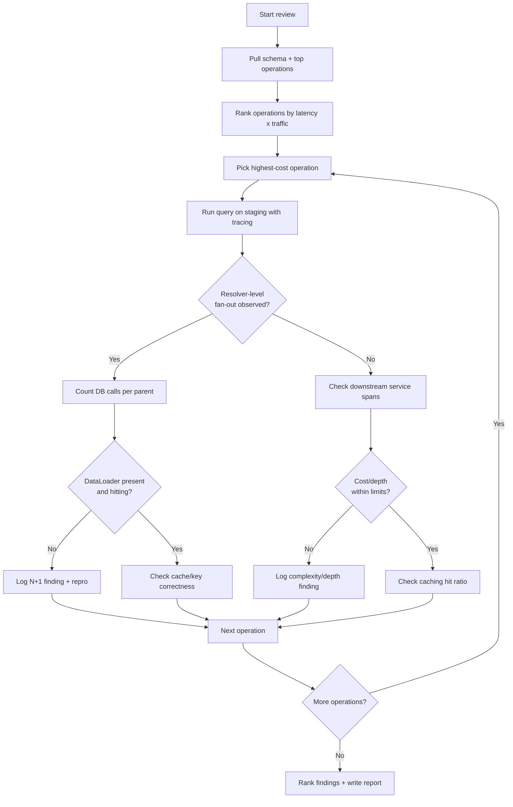
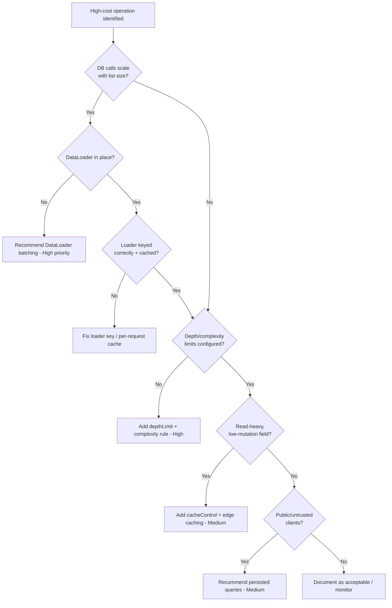

# GraphQL Performance Review

> A structured playbook for an AI agent to audit a GraphQL API for N+1 resolvers, missing DataLoader batching, unbounded query complexity/depth, absent persisted queries, weak caching, and schema-design anti-patterns — then produce a prioritized, evidence-backed remediation plan.

## Objective

Identify and quantify the top performance and abuse-resistance defects in a
GraphQL API, and produce a prioritized remediation plan that reduces resolver
fan-out (N+1), bounds worst-case query cost, and improves cache hit ratio.
"Done" means every claimed defect is backed by a reproduction (a query plus a
trace or resolver-call count) and each recommendation carries an estimated
latency/throughput impact and effort estimate.

## Business Context

GraphQL shifts query shaping from the server to the client. That flexibility is
a product accelerator — mobile and web teams ship faster without waiting for
bespoke REST endpoints — but it moves the performance blast radius to the
server, where a single innocent-looking nested query can trigger thousands of
database round trips. For a commerce or SaaS platform, an unbatched
`order -> lineItems -> product -> inventory` traversal can turn one HTTP request
into 5,000 SQL statements, saturating the primary database and degrading p99
latency for *every* tenant. Uncontrolled query depth and complexity are also a
denial-of-service vector: an anonymous client can request deeply recursive
selections and exhaust CPU. This review protects three business outcomes:
customer-facing latency (conversion and retention), infrastructure cost (fewer
wasted DB queries and CPU cycles), and platform safety (resistance to
accidental and malicious expensive queries).

## Problem Statement

The GraphQL gateway or service exhibits one or more of: elevated p95/p99
latency on specific operations, database connection pool exhaustion correlated
with GraphQL traffic, CPU spikes on the API tier, low CDN/edge cache hit ratio,
or incident reports of a single query degrading the whole service. The review
must locate the *mechanisms* (N+1, missing batching, unbounded cost, no
caching, chatty schema) and rank them.

Out of scope: rewriting the persistence layer, migrating datastores, changing
the client applications' feature behavior, and tuning unrelated REST endpoints.
This runbook analyzes and recommends; it does not deploy schema changes to
production without human approval.

## Success Criteria

- [ ] Every identified N+1 hotspot is reproduced with a concrete query and a
      measured resolver/DB call count (before number captured).
- [ ] Query complexity and depth limits are evaluated against the current
      config; a recommended max-depth and max-cost is proposed with rationale.
- [ ] Persisted-query / trusted-document posture is assessed and a
      recommendation made.
- [ ] Caching layers (CDN, response cache, `@cacheControl` hints, DataLoader
      per-request cache) are inventoried with current hit ratios.
- [ ] A ranked remediation table exists with estimated latency/throughput
      impact and S/M/L effort.
- [ ] Deliverable report produced from `../../templates/report-template.md`.

## Trigger Conditions

- Alert: p99 latency on a GraphQL operation breaches SLO (e.g. > 800ms for 10m).
- Alert: database `connections_in_use` > 85% correlated with GraphQL request rate.
- Schedule: quarterly architecture health review of the graph.
- Manual: pre-launch review before exposing a new schema domain or public API.
- Ticket: incident postmortem action item citing an expensive query.

## Inputs Required

| Input | Description | Example | Required |
|-------|-------------|---------|----------|
| `service_name` | Target GraphQL service | `graph-gateway` | Yes |
| `schema_source` | SDL file, introspection endpoint, or registry ref | `apollo://graph-gateway@current` | Yes |
| `staging_endpoint` | Non-prod GraphQL URL for reproduction | `https://staging.api.example.com/graphql` | Yes |
| `top_operations` | List of highest-traffic named operations | `GetOrderHistory, ProductSearch` | Yes |
| `trace_source` | APM/tracing system with resolver spans | `Datadog APM` / `Apollo Studio` | Recommended |
| `slo_targets` | Latency and error SLOs | `p99 < 400ms` | Recommended |

## Required Access

| Scope | Purpose | Read/Write | Sensitivity |
|-------|---------|-----------|-------------|
| Source repository | Inspect resolvers, schema, DataLoader wiring | Read | Low |
| Schema registry (Apollo/Hive) | Retrieve SDL, operation stats, usage | Read | Low |
| APM / tracing | Resolver-level spans and DB call counts | Read | Medium |
| Staging GraphQL endpoint | Reproduce queries safely | Read (query) | Medium |
| CDN / cache dashboard | Inspect cache hit ratio and TTLs | Read | Low |

## Assumptions

- A staging environment mirrors production schema and resolver logic closely
  enough to reproduce N+1 behavior.
- Tracing includes per-resolver or per-DB-statement spans; if not, the agent
  instruments a local run instead and flags the observability gap.
- The service uses a mainstream server (Apollo Server, GraphQL Yoga,
  Mercurius, graphql-ruby, gqlgen, Strawberry, Hot Chocolate) with
  recognizable DataLoader/batching idioms.
- Reproduction queries can be executed against staging without violating data
  privacy rules; the agent uses synthetic or anonymized identifiers.

## Risks

| Risk | Likelihood | Impact | Mitigation |
|------|-----------|--------|------------|
| Reproduction query overloads staging DB | Medium | Medium | Run against staging only, low concurrency, off-peak |
| Introspection disabled blocks schema retrieval | Medium | Low | Fall back to SDL file in repo or registry |
| Complexity limit set too low breaks legitimate clients | Medium | High | Derive limits from real p99 operation cost, not guesses |
| Misattributing latency to GraphQL vs downstream service | Medium | Medium | Correlate resolver spans with downstream spans before concluding |
| Persisted-query rollout breaks ad-hoc clients | Low | High | Recommend allowlist in report-only mode first |

## Constraints

- No writes to production. No mutations executed during reproduction.
- No load testing against production endpoints; staging only, capped
  concurrency.
- Respect data residency and PII rules — never log raw user records from
  reproduction responses.
- Any schema change recommendation must preserve backward compatibility or be
  flagged as a breaking change requiring a deprecation cycle.

## Agent Persona

Adopt the persona of a **Principal API Platform Engineer** who has operated a
federated GraphQL graph at scale. You are precise, evidence-driven, and
skeptical of your own hypotheses: you never claim an N+1 exists without a
resolver-call count proving it. You reason about trade-offs (cache TTL vs
freshness, complexity limits vs client flexibility) explicitly and quantify
impact. You communicate in the structured tone defined by
[`docs/AI_AGENT_STANDARDS.md`](../../docs/AI_AGENT_STANDARDS.md), separating
observations from interpretations and always ranking recommendations by
impact-to-effort ratio.

## Planning Instructions

Before touching anything, externalize a plan:

1. Enumerate the top operations by traffic and by latency from the registry/APM.
2. For each, list the resolver chain you expect to traverse and where fan-out
   is likely.
3. Identify which observability signals you will collect (resolver spans, DB
   statement counts, cache hit ratios).
4. Draft the reproduction queries you will run on staging.
5. State the thresholds you will judge against (max depth, max complexity,
   acceptable p99, target cache hit ratio).
6. If `human_in_the_loop` requires approval for any staging execution beyond
   read queries, request it now.

## Execution Instructions

Start with read-only inspection, then reproduce, then measure.

Step 1 — Retrieve the schema and operation stats:

```bash
# Introspect the schema (read-only)
npx get-graphql-schema https://staging.api.example.com/graphql > schema.graphql

# Or pull from Apollo registry
rover graph fetch graph-gateway@current > schema.graphql

# List top operations by usage from Apollo Studio
rover graph check graph-gateway@current --query-count-limit 100
```

Step 2 — Reproduce a suspected N+1 with a representative query:

```graphql
query GetOrderHistory($userId: ID!) {
  user(id: $userId) {
    orders(first: 50) {
      nodes {
        id
        lineItems {
          quantity
          product {
            name
            inventory {   # likely N+1: one query per product
              available
            }
          }
        }
      }
    }
  }
}
```

Step 3 — Count resolver/DB calls. With Apollo Server tracing or SQL logging:

```bash
# Enable statement logging on staging DB session and count per request
# (Postgres example) then run the query once and count product/inventory reads
grep -c "SELECT .* FROM inventory" staging-pg.log
```

Step 4 — Inspect the resolver for missing batching:

```ts
// ANTI-PATTERN: per-parent DB call (N+1)
const resolvers = {
  Product: {
    inventory: (product, _args, ctx) =>
      ctx.db.inventory.findByProductId(product.id), // one query per product
  },
};

// FIX: DataLoader batches all product ids into one query per tick
const inventoryLoader = new DataLoader(async (productIds: readonly string[]) => {
  const rows = await ctx.db.inventory.findByProductIds(productIds);
  const byId = new Map(rows.map((r) => [r.productId, r]));
  return productIds.map((id) => byId.get(id) ?? null);
});
```

Step 5 — Evaluate complexity/depth limits and persisted queries:

```ts
import depthLimit from "graphql-depth-limit";
import { createComplexityLimitRule } from "graphql-validation-complexity";

const server = new ApolloServer({
  schema,
  validationRules: [
    depthLimit(8),                                  // bound recursion
    createComplexityLimitRule(1000, {               // bound total cost
      scalarCost: 1,
      objectCost: 2,
      listFactor: 10,
    }),
  ],
  persistedQueries: { ttl: null },                  // APQ / trusted documents
});
```

## Investigation Workflow



## Analysis Framework

Correlate three signal families before concluding:

1. **Fan-out signals** — resolver-call counts and DB statement counts per
   request. An N+1 shows a linear relationship between a list field's length
   and downstream call count. Rule of thumb: if a list of N items produces
   `k*N + c` DB calls where `k >= 1`, it is unbatched. A healthy batched
   resolver produces `c` calls independent of N.
2. **Cost signals** — measured query complexity (weighted node count) and
   depth. Compare against configured limits. If no limits exist, treat that as
   a high-severity abuse-resistance gap regardless of current latency.
3. **Cache signals** — CDN/edge hit ratio, `@cacheControl` coverage, and
   DataLoader per-request cache hits. Low coverage on high-read, low-mutation
   fields is a cheap win.

Rank hypotheses by **impact/effort**. Prefer per-request DataLoader batching
(usually S/M effort, large impact) over schema redesign (L effort). Guard
against confirmation bias: a slow operation may be slow because of a downstream
gRPC call, not GraphQL — always confirm with span attribution before blaming a
resolver.

Use this severity rubric:

| Signal | Threshold | Severity |
|--------|-----------|----------|
| DB calls scale linearly with list size | `k*N`, N can exceed 50 | High |
| No max query depth configured | any | High |
| No max complexity/cost rule | any | High |
| Cache hit ratio on read-heavy field | < 40% | Medium |
| No persisted/trusted documents on public API | any | Medium |
| Deprecated fields still heavily queried | > 5% traffic | Low |

## Decision Tree



## Validation Steps

- [ ] Re-run each reproduction query after applying the fix in staging and
      confirm DB call count dropped (e.g. `450 -> 3` for a 50-item list).
- [ ] Confirm depth/complexity limits reject a crafted abusive query with a
      clear error and accept all real top operations.
- [ ] Verify cache hit ratio improved on the targeted field via the CDN/APM
      dashboard over a 24h window.
- [ ] Confirm no legitimate operation regressed (run the top-20 operations
      against staging and diff response shapes).
- [ ] Confirm p95/p99 latency for the target operation improved in staging load
      test at representative concurrency.

## Expected Outputs

- A resolver-level findings log with reproduction queries and before-metrics.
- A complexity/depth/persisted-query posture assessment.
- A caching inventory (layer, field, TTL, hit ratio).
- A ranked remediation table with impact and effort.
- Draft PRs or diffs for the highest-impact, lowest-risk fixes (DataLoader
  wiring, validation rules) for human review.

## Deliverables

A single agent execution report following
[`../../templates/report-template.md`](../../templates/report-template.md),
including: executive summary, observations (measured call counts, hit ratios),
findings (numbered, evidence-linked), a recommendations table, and a validation
results section with before/after metrics. Attach reproduction queries and
proposed diffs in the appendix.

## Escalation Process

- If a fix requires a **breaking schema change**, escalate to the schema owner
  and API governance channel with a deprecation plan; do not merge.
- If reproduction reveals a live **DoS exposure** (no limits on a public
  endpoint), raise a P1 security ticket immediately and notify the on-call API
  lead in `#api-oncall`.
- If observability lacks resolver-level spans, escalate an instrumentation gap
  to the platform observability team.
- Severity mapping: DoS-capable public endpoint = P1; SLO-breaching N+1 on a
  top operation = P2; cache/schema hygiene = P3.

## Rollback Strategy

All analysis is read-only, so nothing to roll back from investigation. For any
change merged during remediation:

1. DataLoader wiring and validation rules are behind normal deploy — revert the
   PR and redeploy the previous image (`git revert <sha>` then CI deploy).
2. If a complexity/depth limit causes legitimate query rejections in staging,
   raise the limit or move the rule to a report-only/log-only mode
   (`validationRules` logging variant) rather than removing it.
3. If a cache TTL causes stale data complaints, reduce the TTL or add the field
   to a no-cache allowlist. Confirm rollback by re-running the top operations
   and checking error rate returns to baseline.

## Post-Execution Review

- Which operation was the single biggest contributor to DB load, and did fixing
  it move the p99?
- Were the complexity weights realistic, or did they need calibration against
  real traffic?
- What should be added to CI to prevent regressions (e.g. a schema-cost linter,
  a DataLoader lint rule, a persisted-query check)?
- Should the graph adopt automatic persisted queries or trusted documents as a
  default going forward?

## Metrics

| Metric | Definition | Target |
|--------|-----------|--------|
| N+1 elimination | DB calls per top operation after fix | 90%+ reduction |
| p99 latency (target op) | Server-side p99 for the operation | < 400ms |
| Query cost bound | Max accepted complexity score | Enforced, ≤ 1000 |
| Max depth | Enforced query depth limit | ≤ 8 |
| Cache hit ratio | Edge + response cache hits on read fields | > 70% |
| Time to review | Wall-clock for full review | < 1 business day |

## Example Execution

Inputs: `service_name=graph-gateway`, `top_operations=[GetOrderHistory]`,
staging endpoint provided.

Agent reasoning (abridged): "GetOrderHistory is the No. 1 operation by traffic
and No. 2 by p99 (1.4s). The resolver chain `orders -> lineItems -> product ->
inventory` is a fan-out risk. Running the query for a user with 50 orders
averaging 4 line items produced **803 SQL statements** — 1 for orders, 200 for
line items, 200 for products, 402 for inventory. The `Product.inventory`
resolver calls `findByProductId` per parent with no DataLoader. No depth or
complexity limit is configured on the public endpoint."

Sample report excerpt:

```text
# Findings
1. F1 — N+1 on Product.inventory. 402 inventory reads for a 200-item list.
   Repro: GetOrderHistory(userId=synthetic-42). No DataLoader present.
   Fix: inventoryLoader batching -> expected 402 -> 1 read. Effort: S.
2. F2 — No query depth/complexity limit on public endpoint (DoS risk, P1).
   A depth-15 recursive query returned 200 OK in 6.2s. Fix: depthLimit(8) +
   complexity rule (max 1000). Effort: S.
3. F3 — 0% edge cache on Product.name/description (immutable-ish, read-heavy).
   Fix: @cacheControl(maxAge: 300) + CDN. Effort: M. Expected hit ratio > 80%.

# Recommendations
| ID | Recommendation | Impact | Effort | Risk if ignored |
|----|----------------|--------|--------|-----------------|
| R1 | Add inventoryLoader + productLoader | -99% inventory DB calls | S | DB pool exhaustion |
| R2 | Enforce depth(8)+complexity(1000) | Closes DoS vector | S | Public DoS |
| R3 | cacheControl + CDN on product fields | -30% p99 | M | Wasted compute |
```

## References

- [`docs/AI_AGENT_STANDARDS.md`](../../docs/AI_AGENT_STANDARDS.md)
- [`templates/report-template.md`](../../templates/report-template.md)
- [`platform-engineering-review.md`](./platform-engineering-review.md)
- Apollo Server performance & caching docs
- graphql-depth-limit / graphql-validation-complexity
- DataLoader (Facebook) batching pattern
