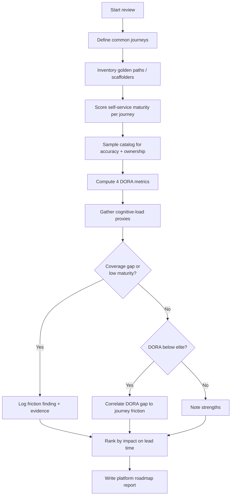
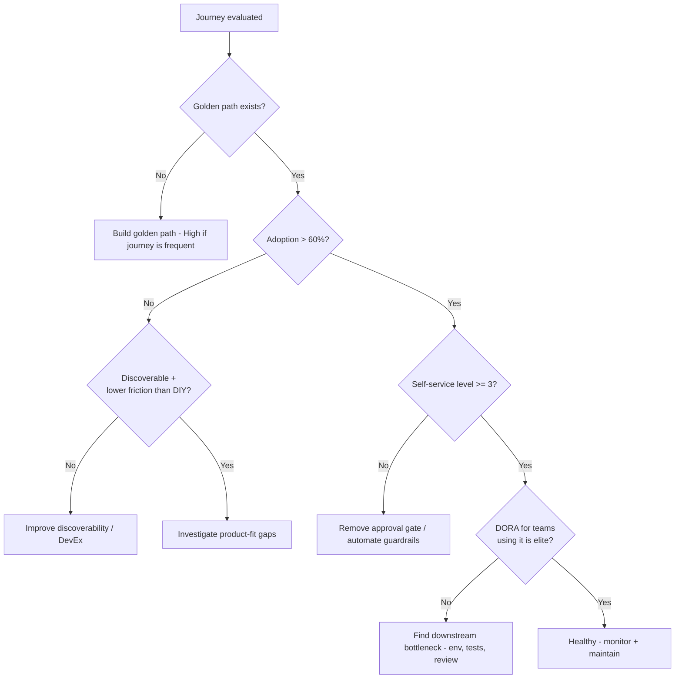

# Platform Engineering Review

> A playbook for an AI agent to assess the health of an Internal Developer Platform (IDP): the coverage and quality of golden paths, self-service maturity, developer cognitive load, catalog hygiene, and DORA outcomes — producing an evidence-backed platform improvement roadmap.

## Objective

Assess whether the Internal Developer Platform is actually reducing developer
cognitive load and increasing delivery throughput, and produce a prioritized
roadmap of platform investments. "Done" means golden-path coverage is measured,
self-service maturity is scored, cognitive-load and DORA signals are gathered,
and each recommendation is tied to a specific friction point with expected
impact on lead time or developer satisfaction.

## Business Context

Platform engineering exists to pay down the "you build it, you run it" tax.
When every stream-aligned team must independently solve CI/CD, secrets, infra
provisioning, observability, and compliance, cognitive load explodes and
delivery slows. A well-run IDP provides **golden paths** — paved, opinionated,
self-service routes from idea to production — so product teams spend their
finite cognitive budget on business logic, not YAML. The business impact is
direct: shorter lead time for changes, higher deployment frequency, lower
change-failure rate, and faster recovery (the four DORA metrics), plus improved
developer retention. Conversely, a neglected platform becomes shelfware: teams
route around it, shadow tooling proliferates, and the platform team becomes a
ticket-driven bottleneck. This review determines which state the organization
is in and what to invest in next, framed by Team Topologies (platform teams
reducing cognitive load for stream-aligned teams).

## Problem Statement

Leadership perceives that delivery is slower than it should be, onboarding
takes too long, or the platform team is overwhelmed with support tickets. The
review must determine: what fraction of common developer journeys are covered
by golden paths; how self-service they are (ticket vs API vs UI); how much
cognitive load teams carry; whether the software catalog is accurate; and how
DORA metrics compare to elite benchmarks.

Out of scope: reorganizing teams, selecting a specific vendor, migrating cloud
providers, and building the platform features themselves. This runbook diagnoses
and recommends.

## Success Criteria

- [ ] Golden-path inventory produced with coverage % of common journeys.
- [ ] Self-service maturity scored per journey (Level 0–4).
- [ ] Cognitive-load signals gathered (survey + tooling sprawl + ticket volume).
- [ ] Backstage/catalog hygiene assessed (ownership, freshness, orphan rate).
- [ ] Four DORA metrics measured and benchmarked against elite thresholds.
- [ ] Prioritized roadmap with impact-on-lead-time and effort per item.
- [ ] Deliverable report produced from `../../templates/report-template.md`.

## Trigger Conditions

- Schedule: quarterly platform health review.
- Manual: platform team requests an external/agent perspective before roadmap
  planning.
- Signal: developer NPS/eNPS or DevEx survey drops below threshold.
- Signal: onboarding time-to-first-PR or time-to-first-deploy exceeds target.
- Signal: platform support ticket volume trending up quarter over quarter.

## Inputs Required

| Input | Description | Example | Required |
|-------|-------------|---------|----------|
| `catalog_source` | Backstage/Port catalog export or API | `https://backstage.example.com` | Yes |
| `cicd_metrics_source` | Deploy frequency, lead time source | `GitHub + Datadog CI` | Yes |
| `journey_list` | Common developer journeys to evaluate | `new service, add DB, add cron` | Yes |
| `survey_data` | DevEx / cognitive-load survey results | `Q2 DevEx survey CSV` | Recommended |
| `ticket_source` | Platform support ticket system | `Jira project PLAT` | Recommended |
| `slo_targets` | Org DORA / DevEx targets | `lead time < 1d` | Recommended |

## Required Access

| Scope | Purpose | Read/Write | Sensitivity |
|-------|---------|-----------|-------------|
| Source repositories | Inspect templates, scaffolders, IaC modules | Read | Low |
| Backstage/Port catalog | Assess ownership, freshness, golden paths | Read | Low |
| CI/CD + VCS metrics | Compute DORA metrics | Read | Medium |
| Ticketing system | Quantify support burden & friction | Read | Medium |
| Survey data | Cognitive load and DevEx signals | Read | Medium |

## Assumptions

- A software catalog exists (Backstage, Port, or equivalent) or can be
  reconstructed from repositories; absence is itself a finding.
- CI/CD and VCS systems expose enough history (≥ 90 days) to compute DORA
  metrics reliably.
- Survey data, if present, is recent (≤ 1 quarter) and representative.
- The agent can read scaffolder templates and IaC modules to judge golden-path
  quality, not just existence.

## Risks

| Risk | Likelihood | Impact | Mitigation |
|------|-----------|--------|------------|
| Vanity metrics mislead (activity, not outcomes) | Medium | High | Anchor on DORA + cognitive load, not tool counts |
| Survey bias (loud minority) | Medium | Medium | Triangulate survey with ticket + DORA data |
| Catalog stale so coverage looks worse/better than reality | High | Medium | Spot-check catalog entries against repos |
| Recommending platform features nobody wants | Medium | High | Tie every recommendation to a measured friction point |
| DORA computed from incomplete data | Medium | High | Validate data completeness before benchmarking |

## Constraints

- Read-only across all systems; no changes to catalog, pipelines, or templates.
- Respect confidentiality of survey free-text; aggregate and anonymize.
- Do not name-and-shame individual teams; findings are systemic.
- Recommendations must respect existing compliance/security guardrails; golden
  paths cannot bypass required controls.

## Agent Persona

Adopt the persona of a **Principal Platform Engineer / DevEx lead** fluent in
Team Topologies, the DORA research, and the Backstage ecosystem. You are
outcome-obsessed and allergic to vanity metrics: you evaluate the platform by
whether it demonstrably reduces cognitive load and improves flow, not by how
many plugins it has. You treat golden paths as products with users, and you
measure adoption, not just availability. Communicate per
[`docs/AI_AGENT_STANDARDS.md`](../../docs/AI_AGENT_STANDARDS.md), separating
observation from interpretation and ranking by impact-to-effort.

## Planning Instructions

1. Define the set of "common developer journeys" to evaluate (create a service,
   add a datastore, add async messaging, ship a change to prod, add
   observability, rotate a secret, onboard a new engineer).
2. For each journey, decide how you will measure self-service maturity and time
   to complete.
3. Identify data sources for the four DORA metrics and confirm ≥ 90 days of
   history.
4. Plan how you will sample the catalog for accuracy (e.g. 20 random entries).
5. Decide the cognitive-load proxy signals (tooling count per team, ticket
   volume, survey scores, context switches).
6. Externalize the plan and request approval if required.

## Execution Instructions

Step 1 — Inventory golden paths and scaffolders (Backstage example):

```yaml
# catalog-info.yaml — a scaffolder template represents a golden path
apiVersion: scaffolder.backstage.io/v1beta3
kind: Template
metadata:
  name: nodejs-microservice
  title: New Node.js Microservice (Golden Path)
  tags: [recommended, nodejs, golden-path]
spec:
  type: service
  parameters:
    - title: Service details
      required: [name, owner]
  steps:
    - id: fetch
      action: fetch:template
    - id: publish
      action: publish:github
    - id: register
      action: catalog:register
```

```bash
# List scaffolder templates via Backstage API to measure golden-path coverage
curl -s https://backstage.example.com/api/scaffolder/v2/templates \
  | jq '[.[] | {name: .metadata.name, tags: .metadata.tags}]'

# Count catalog entities and orphans (no owner)
curl -s "https://backstage.example.com/api/catalog/entities?filter=kind=component" \
  | jq '[.[] | select(.spec.owner == null or .spec.owner == "")] | length'
```

Step 2 — Compute DORA metrics from VCS + deploy data:

```bash
# Deployment frequency (deploys/day over 90d) from GitHub deployments
gh api "repos/org/service/deployments?environment=production&per_page=100" \
  | jq 'length'

# Lead time for changes: median commit-authored -> deployed
# (pull merged PR timestamps and matching deploy timestamps, compute median)
```

Step 3 — Score self-service maturity per journey using this scale:

```text
Level 0: Manual ticket to platform team, human executes (days)
Level 1: Documented runbook, self-serve but manual + error prone
Level 2: Self-service UI/CLI, but requires approval gate
Level 3: Fully self-service golden path (template + API), guardrails automated
Level 4: Golden path + paved-road defaults + automated compliance + observable
```

Step 4 — Gather cognitive-load proxies:

```bash
# Tooling sprawl: distinct CI systems / IaC tools / deploy mechanisms in use
# Ticket burden: platform support tickets per engineer per month
# Survey: extract mean scores for "I can ship without help" style questions
```

## Investigation Workflow



## Analysis Framework

Triangulate three lenses; never rely on one:

1. **Flow (DORA)** — deployment frequency, lead time for changes, change-failure
   rate, failed-deployment recovery time. Benchmark against DORA "elite":

   | Metric | Elite | High | Medium | Low |
   |--------|-------|------|--------|-----|
   | Deploy frequency | On-demand (multiple/day) | Daily–weekly | Weekly–monthly | < monthly |
   | Lead time for changes | < 1 day | 1 day–1 week | 1 week–1 month | > 1 month |
   | Change-failure rate | 0–15% | 16–30% | 16–30% | > 30% |
   | Failed-deploy recovery | < 1 hour | < 1 day | < 1 day | > 1 week |

2. **Cognitive load** — tooling sprawl, context switches, ticket dependency on
   the platform team, and survey sentiment. High load correlates with long lead
   time and low deploy frequency.

3. **Self-service maturity** — the Level 0–4 score per journey and, crucially,
   *adoption* (what % of new services actually used the golden path). A golden
   path with 10% adoption is a documentation problem or a product-fit problem.

Avoid the vanity-metric trap: number of Backstage plugins, lines of Terraform
modules, and template count are inputs, not outcomes. Rank findings by expected
reduction in lead time or ticket volume per unit of platform effort.

## Decision Tree



## Validation Steps

- [ ] Golden-path coverage % recomputed and cross-checked against actual new
      services created in last quarter.
- [ ] DORA metrics validated for data completeness (no missing deploy events).
- [ ] Catalog accuracy sample (≥ 20 entries) verified against real repos.
- [ ] Each recommendation traced to a specific measured friction point.
- [ ] Roadmap reviewed by platform team lead for feasibility (human step).

## Expected Outputs

- Golden-path inventory with coverage and adoption per journey.
- Self-service maturity scorecard (Level 0–4 per journey).
- DORA scorecard with benchmark tier.
- Cognitive-load summary (tooling sprawl, ticket burden, survey sentiment).
- Catalog hygiene report (ownership %, freshness, orphan rate).
- Prioritized platform roadmap.

## Deliverables

An agent execution report following
[`../../templates/report-template.md`](../../templates/report-template.md) with
executive summary, observations (metrics), findings (numbered, evidence-linked),
a recommendations/roadmap table, and validation results. Include the maturity
scorecard and DORA benchmark table as appendices.

## Escalation Process

- If a golden path **bypasses required security/compliance controls**, raise a
  P1 governance finding immediately to security and platform leads.
- If DORA data is too incomplete to benchmark, escalate an instrumentation gap
  to the platform observability owner before drawing conclusions.
- If survey data reveals a systemic burnout/retention risk, escalate to
  engineering leadership via the appropriate confidential channel.
- Severity mapping: control bypass = P1; adoption < 20% on a critical journey =
  P2; catalog hygiene = P3.

## Rollback Strategy

This is a read-only diagnostic review, so there is nothing to roll back from
the investigation itself. If the platform team acts on recommendations and a
change (e.g. a new default in a scaffolder, a removed approval gate) causes
regressions:

1. Revert the scaffolder template or pipeline change via VCS (`git revert`) and
   re-publish the template.
2. Restore a removed approval gate by re-enabling the environment protection
   rule.
3. Confirm rollback by scaffolding a test service through the golden path and
   verifying guardrails fire and DORA signals return to baseline.

## Post-Execution Review

- Which single friction point, if removed, would most improve lead time?
- Are golden paths treated as products with owners, roadmaps, and adoption
  metrics — or as one-off templates?
- What manual toil could be converted to Level 3+ self-service next quarter?
- Is the platform team a bottleneck (ticket-driven) or an enabler
  (product-driven)?

## Metrics

| Metric | Definition | Target |
|--------|-----------|--------|
| Golden-path coverage | % of common journeys with a Level 3+ path | > 80% |
| Golden-path adoption | % new services using the path | > 70% |
| Lead time for changes | Median commit-to-prod | < 1 day (elite) |
| Deploy frequency | Prod deploys per day | On-demand |
| Change-failure rate | % deploys causing incident | < 15% |
| Recovery time | Median time to restore after failed deploy | < 1 hour |
| Time-to-first-deploy | New engineer onboarding to first prod deploy | < 5 days |
| Platform ticket burden | Support tickets per engineer/month | Trending down |

## Example Execution

Inputs: catalog at Backstage, GitHub + Datadog CI metrics, journeys = [create
service, add Postgres, ship to prod, add dashboards].

Agent reasoning (abridged): "Golden paths exist for 'create service' (Level 3,
72% adoption) but 'add Postgres' is Level 1 (a wiki page + ticket, 3.4 day
median wait) and 'add dashboards' is Level 0. DORA: deploy frequency is daily
(high), but lead time median is 4.1 days (medium tier), and the bottleneck is
provisioning a database + manual dashboard setup, not code review (median PR
review 6h). Platform ticket volume is 38/month, of which 61% are DB
provisioning requests — a clear self-service gap."

Sample report excerpt:

```text
# Findings
1. F1 — 'Add datastore' journey is Level 1 (ticket-driven). Median wait 3.4d;
   61% of platform tickets are DB provisioning. Impact: dominant lead-time
   contributor. Fix: Crossplane/Terraform golden path via scaffolder. Effort: L.
2. F2 — 'Add dashboards' is Level 0. No paved observability path; teams
   copy-paste. Fix: template with default SLO dashboards. Effort: M.
3. F3 — Catalog orphan rate 18% (no owner). Fix: ownership backfill + CI
   check on catalog-info.yaml. Effort: S.

# Recommendations
| ID | Recommendation | Impact | Effort | Risk if ignored |
|----|----------------|--------|--------|-----------------|
| R1 | Self-service DB provisioning golden path | -2.5d lead time | L | Platform bottleneck |
| R2 | Observability golden path template | Faster MTTR, less toil | M | Inconsistent monitoring |
| R3 | Enforce ownership in catalog CI | Accurate catalog | S | Orphaned services |
```

## References

- [`docs/AI_AGENT_STANDARDS.md`](../../docs/AI_AGENT_STANDARDS.md)
- [`templates/report-template.md`](../../templates/report-template.md)
- [`graphql-performance-review.md`](./graphql-performance-review.md)
- DORA "Accelerate" State of DevOps research
- Team Topologies (Skelton & Pais)
- Backstage software catalog & scaffolder docs
