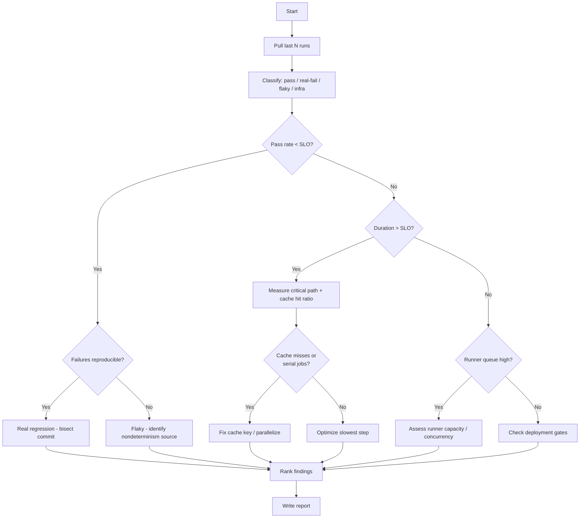
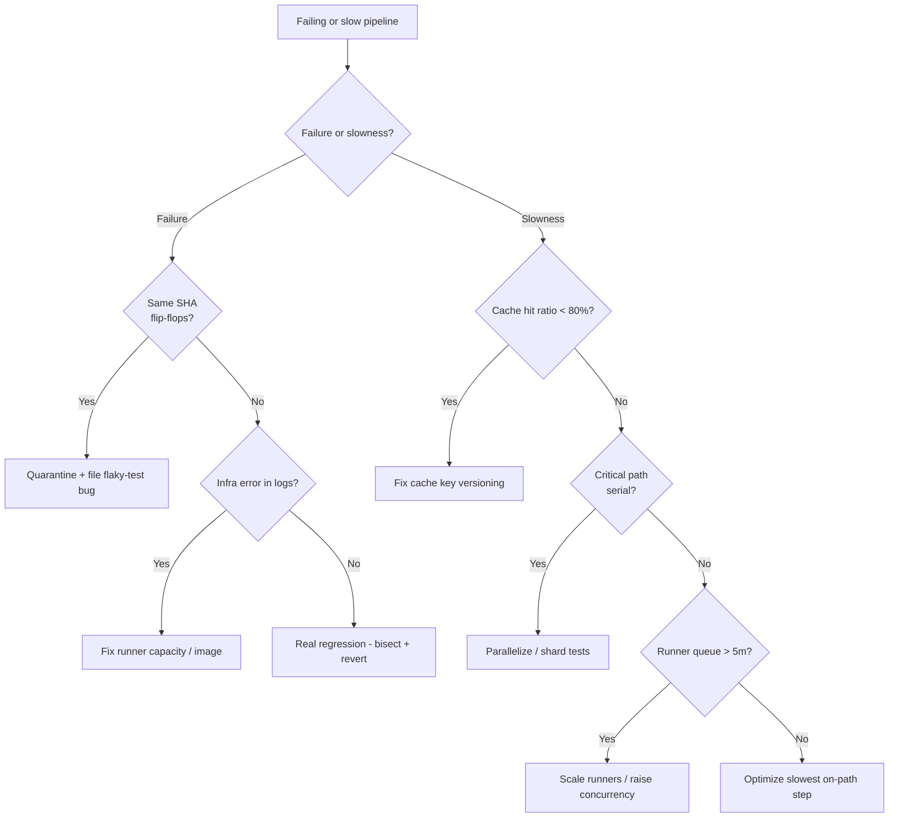

# CI/CD Pipeline Debugging

> A playbook for an AI agent to diagnose an unhealthy CI/CD pipeline — flaky tests, slow builds, cache misses, runner exhaustion, and misconfigured deployment gates — and produce a prioritized fix plan that restores fast, trustworthy delivery.

## Objective

Restore a CI/CD pipeline to a fast, reliable, trustworthy state by identifying
the root cause of failures or slowness and producing a prioritized remediation
plan. "Done" means the dominant failure/slowness mechanism is identified with
evidence (logs, timings, flake rate), and each recommendation has an estimated
impact on pipeline duration or pass rate.

## Business Context

The CI/CD pipeline is the assembly line of software delivery. When it is slow,
lead time for changes balloons and engineers batch work, increasing risk. When
it is flaky, trust erodes: engineers re-run red builds reflexively, ignore
failures, and eventually merge around the pipeline — defeating its purpose as a
quality gate. Both failure modes directly degrade DORA metrics (deployment
frequency and lead time) and burn engineer hours and CI compute dollars. A
10-minute pipeline that runs 200 times a day costing 5 minutes of wasted wait
each equals ~16 engineer-hours daily. Restoring pipeline health is one of the
highest-leverage reliability investments a platform team can make.

## Problem Statement

The pipeline exhibits one or more of: intermittent test failures that pass on
re-run (flakiness), long wall-clock duration, frequent cache misses, runner
queue starvation or OOM/timeout on runners, or deployment gates that block or
wrongly pass. The review must localize the mechanism and rank fixes.

Out of scope: rewriting the application's test suite wholesale, migrating CI
providers, and changing production infrastructure. This runbook diagnoses and
recommends; it may open PRs for low-risk fixes (cache keys, parallelization,
retry policy) subject to human review.

## Success Criteria

- [ ] The dominant failure or slowness mechanism is identified with evidence.
- [ ] Flaky tests, if present, are quantified (flake rate) and top offenders
      listed.
- [ ] Pipeline critical path (longest chain of dependent jobs) is measured.
- [ ] Cache hit ratio and effectiveness are measured.
- [ ] Runner utilization/queue time assessed.
- [ ] Deployment-gate configuration validated (approvals, checks, environments).
- [ ] Prioritized remediation table with impact on duration/pass rate.
- [ ] Deliverable report produced from `../../templates/report-template.md`.

## Trigger Conditions

- Alert: pipeline pass rate on `main` drops below threshold (e.g. < 90%).
- Alert: median pipeline duration exceeds SLO (e.g. > 15m).
- Signal: runner queue time > 5m sustained.
- Manual: developers report chronic flakiness or "just re-run it" culture.
- Ticket: release blocked by a stuck or failing deployment gate.

## Inputs Required

| Input | Description | Example | Required |
|-------|-------------|---------|----------|
| `repo` | Target repository | `org/checkout-service` | Yes |
| `ci_provider` | CI system | `GitHub Actions` | Yes |
| `pipeline_ref` | Workflow / pipeline file | `.github/workflows/ci.yml` | Yes |
| `time_window` | Analysis window of runs | `last 200 runs / 14d` | Yes |
| `branch` | Primary branch to analyze | `main` | Recommended |
| `slo_targets` | Duration/pass-rate targets | `p50 < 10m, pass > 95%` | Recommended |

## Required Access

| Scope | Purpose | Read/Write | Sensitivity |
|-------|---------|-----------|-------------|
| Source repository | Read workflow files, test config | Read | Low |
| CI run history & logs | Analyze failures, timings | Read | Medium |
| CI metrics/API | Compute pass rate, duration, flake rate | Read | Medium |
| Artifact/cache store | Inspect cache hit ratio | Read | Low |
| Runner fleet metrics | Assess queue time and utilization | Read | Medium |

## Assumptions

- CI provider exposes run history and per-step timings via API or UI.
- At least 100 recent runs exist to compute meaningful flake and duration stats.
- The agent can distinguish infra failures (runner OOM, network) from test
  failures via logs.
- Caching is configured in a recognizable way (actions/cache, provider cache).

## Risks

| Risk | Likelihood | Impact | Mitigation |
|------|-----------|--------|------------|
| Adding retries masks real bugs as "flaky" | High | High | Quarantine + track, never blanket-retry |
| Aggressive caching serves stale artifacts | Medium | High | Version cache keys by lockfile hash |
| Parallelization introduces test interdependence bugs | Medium | Medium | Isolate state; run in CI before merge |
| Loosening a gate to unblock a release lets a defect through | Medium | High | Never bypass gates without human approval |
| Misreading infra flake as test flake | Medium | Medium | Correlate with runner metrics |

## Constraints

- No changes to production deploy gates without explicit human approval.
- No disabling of required status checks to "unblock" without escalation.
- Cache changes must be reversible via key versioning, not destructive purges
  during peak hours.
- Respect secrets: never print secret values from CI logs in the report.

## Agent Persona

Adopt the persona of a **Principal CI/CD / Developer Productivity Engineer**.
You treat the pipeline as a product whose users are developers and whose SLOs
are duration and trustworthiness. You are ruthless about distinguishing genuine
flakiness (nondeterminism) from infra instability from real regressions, and
you refuse to hide bugs behind retries. You quantify everything: flake rate,
critical path, cache hit ratio, queue time. Communicate per
[`docs/AI_AGENT_STANDARDS.md`](../../docs/AI_AGENT_STANDARDS.md).

## Planning Instructions

1. Pull the last N runs and classify outcomes: pass, real-failure,
   flaky (fail-then-pass on re-run), infra-failure.
2. Compute pass rate, flake rate, p50/p95 duration, and the critical path.
3. Identify the top 5 slowest jobs and top 5 flakiest tests.
4. Inventory caching and measure hit ratio.
5. Inspect deployment-gate configuration.
6. Externalize the plan; request approval for any gate-touching change.

## Execution Instructions

Step 1 — Pull run history and compute pass/flake rate (GitHub Actions):

```bash
# Last 200 runs on main with conclusions and timing
gh run list --repo org/checkout-service --branch main --limit 200 \
  --json databaseId,conclusion,createdAt,updatedAt,name \
  | jq '[.[] | {id: .databaseId, conclusion, name}]' > runs.json

# Pass rate
jq '[.[] | select(.conclusion=="success")] | length' runs.json

# Identify flaky: same commit failed then succeeded on re-run
gh run view <run-id> --repo org/checkout-service --json jobs \
  | jq '.jobs[] | {name, conclusion, startedAt, completedAt}'
```

Step 2 — Measure the critical path and slow steps:

```bash
# Per-step timings for a representative run
gh api repos/org/checkout-service/actions/runs/<run-id>/jobs \
  | jq '.jobs[] | {name, steps: [.steps[] | {name, started_at, completed_at}]}'
```

Step 3 — Inspect and fix caching (actions/cache with lockfile-hashed key):

```yaml
# .github/workflows/ci.yml — correct, versioned cache key
- name: Cache node modules
  uses: actions/cache@v4
  with:
    path: ~/.npm
    key: npm-${{ runner.os }}-${{ hashFiles('**/package-lock.json') }}
    restore-keys: |
      npm-${{ runner.os }}-
```

Step 4 — Quarantine flaky tests (do not blanket-retry the whole suite):

```yaml
# Retry only known-flaky, quarantined tests; track them for real fixes
- name: Run test suite
  run: npm test -- --shard=${{ matrix.shard }}/4   # parallelize by sharding
- name: Run quarantined flaky tests (non-blocking, tracked)
  run: npm test -- --group=quarantine --retries=2
  continue-on-error: true
```

Step 5 — Validate deployment gates (environment protection):

```bash
# Inspect required reviewers, wait timers, and required checks on prod env
gh api repos/org/checkout-service/environments/production \
  | jq '{protection: .protection_rules, reviewers: .protection_rules}'

# Confirm required status checks on main branch protection
gh api repos/org/checkout-service/branches/main/protection \
  | jq '.required_status_checks.contexts'
```

## Investigation Workflow



## Analysis Framework

Classify every failing run into exactly one bucket before reasoning:

1. **Real regression** — deterministic failure tied to a specific commit. Use
   `git bisect` logic across run history to find the introducing change.
2. **Flaky** — same SHA passes and fails across runs. Root causes: shared
   mutable state, time/timezone assumptions, network/ordering dependence,
   under-provisioned resources, async race conditions. Quantify flake rate:
   `flaky_runs / total_runs`.
3. **Infra failure** — runner OOM, disk full, image pull error, network
   timeout, provider incident. Correlate with runner metrics; do not count as
   test flakiness.

For slowness, compute the **critical path** (longest chain of dependent jobs),
not total CPU-time. A pipeline is only as fast as its critical path;
parallelizing off-path jobs does nothing. Rank optimizations by their effect on
that path. Common wins: cache dependency installs, shard tests, use larger/
warmer runners for the bottleneck job, skip unaffected jobs via path filters,
and move slow integration tests off the merge-blocking path where safe.

| Symptom | Likely cause | First check |
|---------|-------------|-------------|
| Pass-then-fail same SHA | Test flakiness | Shared state / ordering |
| Every run OOM at same step | Runner memory | Runner size / leak |
| Long install step | Cache miss | Cache key vs lockfile hash |
| Long total, short critical path | Off-path noise | Parallelize / ignore |
| Gate always pending | Missing required check name | Branch protection config |

## Decision Tree



## Validation Steps

- [ ] After quarantining flaky tests, main pass rate rises above SLO over the
      next 50 runs.
- [ ] After cache fix, install step duration drops and cache hit ratio > 80%.
- [ ] After parallelization, critical path (not just total) duration decreases.
- [ ] Deployment gate correctly blocks a deliberately failing check and passes
      a healthy one (verified in a test PR).
- [ ] No masked regressions: quarantined tests are tracked with owners and due
      dates, not forgotten.

## Expected Outputs

- Run classification summary (pass/flaky/infra/regression counts and rates).
- Top flaky tests and top slow jobs with timings.
- Cache inventory with hit ratio and recommended key changes.
- Runner utilization/queue assessment.
- Deployment-gate validation results.
- Ranked remediation table with expected impact.

## Deliverables

An agent execution report following
[`../../templates/report-template.md`](../../templates/report-template.md):
executive summary, observations (rates and timings), numbered evidence-linked
findings, recommendations table, and validation results with before/after
duration and pass rate. Attach proposed workflow diffs in the appendix.

## Escalation Process

- If a **real regression** is on `main` blocking all deploys, escalate P1 to
  the code owner and revert the introducing commit if authorized.
- If unblocking a release would require **bypassing a required gate**, escalate
  to the release manager; never bypass unilaterally.
- If the failure is a **CI provider incident**, post status to `#eng-ci` and
  pause non-critical merges.
- Severity mapping: main red blocking deploys = P1; chronic flakiness eroding
  trust = P2; slow-but-green pipeline = P3.

## Rollback Strategy

For any change merged during remediation:

1. Cache key changes are safe by design — reverting the key value restores prior
   behavior; no destructive purge required.
2. Parallelization/sharding changes: revert the workflow PR (`git revert`) if
   sharding introduces cross-test contamination.
3. Retry/quarantine policy: remove the `continue-on-error` and quarantine group
   to restore strict gating.
4. Confirm rollback by running the pipeline on a test branch and verifying
   pass rate and duration return to the pre-change baseline.

## Post-Execution Review

- What was the single biggest contributor to wasted developer wait time?
- Is there a flaky-test policy (quarantine + SLA to fix) or does flakiness
  accumulate silently?
- Should slow integration tests move off the merge-blocking path?
- What guardrails prevent cache-key regressions (e.g. lint for hashFiles)?

## Metrics

| Metric | Definition | Target |
|--------|-----------|--------|
| Pipeline pass rate | % green runs on main | > 95% |
| Flake rate | flaky runs / total runs | < 1% |
| p50 duration | Median pipeline wall-clock | < 10m |
| p95 duration | 95th percentile duration | < 20m |
| Cache hit ratio | dependency cache hits | > 80% |
| Runner queue time | Median wait before start | < 1m |
| MTTR (red main) | Time to green after main breaks | < 30m |

## Example Execution

Inputs: `repo=org/checkout-service`, `ci_provider=GitHub Actions`, window = last
200 runs on `main`.

Agent reasoning (abridged): "Pass rate is 84% (below 95% SLO). Of 32 failures,
21 are the same SHA flipping between pass/fail — flaky. The top offender is
`test/payment.spec.ts::processes concurrent refunds`, which shares a module-level
`Date.now()` stub and fails ~30% of runs. p50 duration is 18m; the critical path
is dominated by an 8m `npm ci` step with a cache hit ratio of 22% because the
cache key uses `${{ github.sha }}` (changes every commit) instead of the lockfile
hash. Runner queue time is healthy (18s)."

Sample report excerpt:

```text
# Findings
1. F1 — Cache key busts every commit (key uses github.sha). Hit ratio 22%,
   adds ~7m/run. Fix: key on hashFiles('**/package-lock.json'). Effort: S.
2. F2 — 3 flaky tests cause 66% of failures (shared Date stub, race). Fix:
   quarantine + isolate state; file bugs with owners. Effort: M.
3. F3 — Serial test job on critical path. Fix: shard into 4. Effort: S.

# Recommendations
| ID | Recommendation | Impact | Effort | Risk if ignored |
|----|----------------|--------|--------|-----------------|
| R1 | Fix cache key to lockfile hash | -7m p50 | S | Wasted compute + wait |
| R2 | Quarantine + fix 3 flaky tests | +11pp pass rate | M | Erodes trust |
| R3 | Shard test job 4x | -4m critical path | S | Slow feedback |
```

## References

- [`docs/AI_AGENT_STANDARDS.md`](../../docs/AI_AGENT_STANDARDS.md)
- [`templates/report-template.md`](../../templates/report-template.md)
- [`deployment-failure-analysis.md`](./deployment-failure-analysis.md)
- GitHub Actions caching & concurrency docs
- Google Testing Blog on flaky tests
- DORA "Accelerate" metrics
