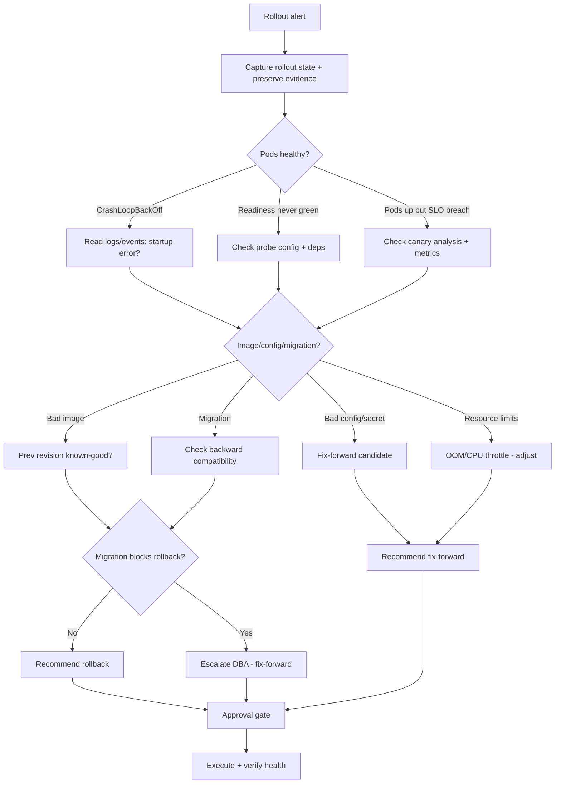
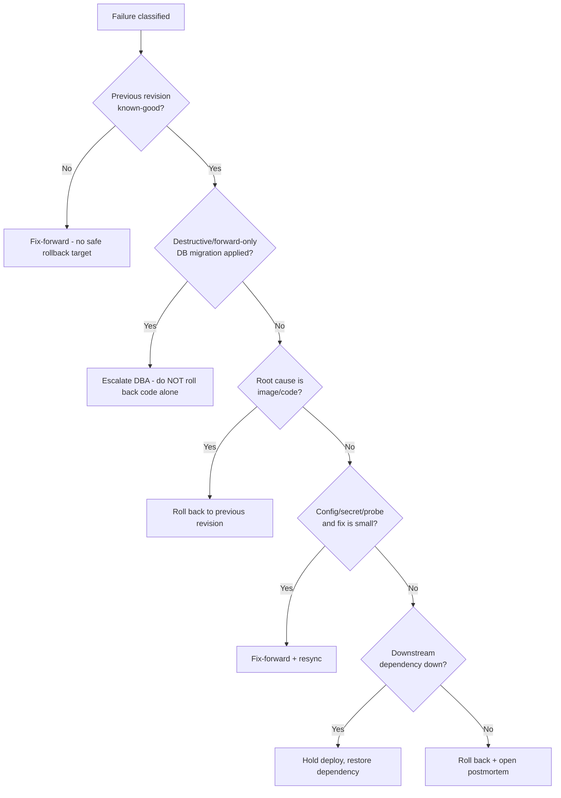

# Deployment Failure Analysis

> A playbook for an AI agent to diagnose a failed or stalled rollout — canary, blue-green, or rolling — determine whether to roll back or roll forward, and safely restore service while preserving evidence for a postmortem.

## Objective

Determine the root cause of a failed or stalled deployment and drive the service
back to a healthy state with the lowest-risk action (rollback or targeted
roll-forward), while preserving evidence. "Done" means the failing rollout is
either safely rolled back or fixed forward, the service meets its health SLOs,
and the failure mechanism is documented with evidence for a postmortem.

## Business Context

Deployment is the moment of highest change-risk in the software lifecycle. A bad
rollout can take down a revenue-critical service, corrupt data, or breach SLAs
in minutes. Progressive delivery strategies — canary, blue-green, and rolling
updates — exist to limit blast radius, but they only help if health checks,
analysis, and automated rollback are configured correctly. This runbook targets
two of the four DORA metrics directly: **change-failure rate** and **time to
restore service**. Elite performers recover in under an hour; the difference is
almost always a disciplined, pre-decided rollback path plus fast, accurate
diagnosis. Getting this right protects revenue, customer trust, and the error
budget.

## Problem Statement

A deployment has failed or stalled: pods crash-loop, readiness probes never go
green, a canary's error rate or latency exceeds its analysis threshold, a
blue-green cutover regressed, or the rollout is stuck partway with mixed
versions serving traffic. The review must localize the cause (bad image, config/
secret, migration, dependency, resource limits, probe misconfiguration) and
choose the safest recovery.

Out of scope: root-causing application logic bugs beyond identifying the failing
component, and long-term architecture changes. This runbook restores service and
documents the failure; deep code fixes are follow-up work.

## Success Criteria

- [ ] Deployment status and failure mode are captured with evidence.
- [ ] Root-cause category identified (image/config/migration/deps/resources/probe).
- [ ] Recovery decision made and executed (rollback or fix-forward) with approval.
- [ ] Post-recovery health verified against SLOs (error rate, latency, saturation).
- [ ] No mixed-version or split-brain state remains.
- [ ] Evidence preserved (logs, events, metrics snapshots) for postmortem.
- [ ] Deliverable report produced from `../../templates/report-template.md`.

## Trigger Conditions

- Alert: rollout `progressDeadlineExceeded` or Argo Rollout `Degraded`.
- Alert: canary analysis failed (error rate/latency breach) and paused/aborted.
- Alert: post-deploy error rate or latency SLO breach.
- Signal: pods `CrashLoopBackOff` or readiness never satisfied after deploy.
- Manual: release manager reports a stuck or regressed cutover.

## Inputs Required

| Input | Description | Example | Required |
|-------|-------------|---------|----------|
| `service_name` | Target service/workload | `checkout-api` | Yes |
| `namespace` | Kubernetes namespace | `payments-prod` | Yes |
| `deploy_tool` | Rollout controller | `Argo Rollouts` / `ArgoCD` | Yes |
| `strategy` | Rollout strategy | `canary` / `blue-green` / `rolling` | Yes |
| `release_ref` | Failing release / image tag / git SHA | `checkout-api:1.42.0` | Yes |
| `slo_targets` | Health thresholds | `err < 1%, p99 < 400ms` | Yes |

## Required Access

| Scope | Purpose | Read/Write | Sensitivity |
|-------|---------|-----------|-------------|
| Observability (metrics/logs/traces) | Assess health, error rate, latency | Read | Medium |
| CI/CD & deploy logs | Correlate rollout events | Read | Medium |
| Kubernetes cluster | Inspect pods, events, rollouts | Read | Medium |
| ArgoCD / Argo Rollouts | Inspect sync/rollout state | Read | Medium |
| Deployment controls | Execute rollback/abort | Write (gated) | High |

## Assumptions

- The service is deployed via a recognizable controller (Argo Rollouts, ArgoCD,
  Flux, or native Kubernetes Deployment).
- A known-good previous revision exists to roll back to.
- Health checks (readiness/liveness) and, for canary, analysis metrics are
  defined — absence is itself a finding.
- Database migrations, if any, are backward-compatible or the agent flags the
  risk before rolling back.

## Risks

| Risk | Likelihood | Impact | Mitigation |
|------|-----------|--------|------------|
| Rollback across an incompatible DB migration corrupts data | Medium | Critical | Verify migration compatibility before rollback; escalate if forward-only |
| Rollback masks a config drift that recurs | Medium | Medium | Capture root cause before rolling forward again |
| Aborting canary mid-shift leaves mixed versions | Medium | High | Use controller abort/undo, verify 100% on one revision |
| Acting without approval on prod write | Low | Critical | human_in_the_loop = required; gate all writes |
| Health probe passing but app broken | Medium | High | Validate with real SLO metrics, not just probes |

## Constraints

- `human_in_the_loop` is **required**: every mutating action (rollback, abort,
  scale) needs explicit human approval before execution.
- Preserve evidence before destructive actions (dump events/logs first).
- Never delete the failing ReplicaSet/revision until postmortem evidence is
  captured.
- Respect change-freeze windows unless this is an active incident recovery.
- Never roll back across a non-reversible database migration without DBA signoff.

## Agent Persona

Adopt the persona of a **Principal SRE / Release Engineer** running an active
deployment incident. You are calm, methodical, and bias toward the
lowest-blast-radius recovery. You always preserve evidence before you mutate,
you never guess when you can observe, and you treat "roll back vs roll forward"
as a decision with a data-driven answer (is the previous revision known-good?
is there an incompatible migration?). You communicate crisp status updates per
[`docs/AI_AGENT_STANDARDS.md`](../../docs/AI_AGENT_STANDARDS.md) and require
human approval for every write.

## Planning Instructions

1. Establish the timeline: when did the deploy start, when did health degrade,
   what changed (image, config, migration)?
2. Capture current rollout state and preserve evidence (events, logs, metrics).
3. Classify the failure mode using the analysis framework.
4. Determine whether a known-good previous revision exists and whether a
   migration blocks rollback.
5. Draft the recovery decision (rollback vs fix-forward) with rationale.
6. Present the plan for human approval before any mutating action.

## Execution Instructions

Step 1 — Capture rollout state and preserve evidence (read-only first):

```bash
# Argo Rollouts status (canary/blue-green)
kubectl argo rollouts get rollout checkout-api -n payments-prod --watch=false

# Native deployment + rollout history
kubectl rollout status deploy/checkout-api -n payments-prod --timeout=10s
kubectl rollout history deploy/checkout-api -n payments-prod

# Pod state + recent events (preserve as evidence)
kubectl get pods -n payments-prod -l app=checkout-api -o wide
kubectl describe pods -n payments-prod -l app=checkout-api > evidence-pods.txt
kubectl get events -n payments-prod --sort-by=.lastTimestamp | tail -50
kubectl logs -n payments-prod -l app=checkout-api --tail=200 --previous > evidence-logs.txt
```

Step 2 — Inspect ArgoCD sync + health:

```bash
argocd app get checkout-api --output wide
argocd app history checkout-api
argocd app diff checkout-api           # config drift vs desired
```

Step 3 — Check the canary analysis run (why it failed):

```bash
kubectl argo rollouts get rollout checkout-api -n payments-prod
kubectl get analysisrun -n payments-prod -l rollout=checkout-api
kubectl describe analysisrun <name> -n payments-prod   # metric values vs thresholds
```

Step 4 — After approval, execute the lowest-risk recovery. Rollback:

```bash
# Argo Rollouts: abort the bad rollout, then undo to previous stable
kubectl argo rollouts abort checkout-api -n payments-prod
kubectl argo rollouts undo checkout-api -n payments-prod

# ArgoCD: roll back to last-known-good revision
argocd app rollback checkout-api <good-revision-id>

# Native deployment rollback to prior revision
kubectl rollout undo deploy/checkout-api -n payments-prod --to-revision=<n>
```

Step 5 — Or fix-forward (e.g. corrected config/secret) with approval:

```bash
# Example: patch a bad env/config then let the controller resync
kubectl set env deploy/checkout-api -n payments-prod FEATURE_X=false
argocd app sync checkout-api
```

## Investigation Workflow



## Analysis Framework

Correlate the deploy timeline with health signals. The failure mode almost
always falls into one category — identify it before choosing recovery:

1. **Bad image / code** — crash on startup, panics, missing binary. Logs show
   stack traces at boot. Usually rollback.
2. **Config / secret** — wrong env var, missing secret, bad feature flag. App
   starts but errors on first request, or fails to connect. Often fix-forward.
3. **Database migration** — schema change incompatible with old or new code.
   The critical question for rollback safety: is the migration
   backward-compatible? If the new code applied a destructive migration,
   rolling back the code without the schema is dangerous — escalate.
4. **Dependency / downstream** — a dependency (cache, queue, external API) is
   unavailable; the deploy is a red herring. Do not roll back blindly.
5. **Resource limits** — OOMKilled or CPU throttling under new load. Adjust
   requests/limits.
6. **Probe misconfiguration** — readiness/liveness thresholds too aggressive;
   app is actually healthy. Fix the probe, not the app.

For canary/blue-green, read the **analysis run**: which metric breached which
threshold, and by how much? A 2% error rate against a 1% threshold on 50 requests
may be noise; against 50k requests it is real. Distinguish signal from sample
size.

| Symptom | Category | Recovery bias |
|---------|----------|---------------|
| CrashLoop with boot stack trace | Bad image | Rollback |
| 500s only after new config | Config/secret | Fix-forward |
| Errors referencing missing column | Migration | Escalate DBA |
| OOMKilled events | Resource limits | Adjust + redeploy |
| Readiness fails, app logs healthy | Probe | Fix probe |
| Downstream 503s, app fine | Dependency | Fix dependency, hold deploy |

## Decision Tree



## Validation Steps

- [ ] After recovery, 100% of traffic serves a single healthy revision (no
      mixed versions / split brain).
- [ ] Error rate returns below SLO (e.g. < 1%) over a 15m window.
- [ ] p95/p99 latency within SLO over a 15m window.
- [ ] No `CrashLoopBackOff`, no `OOMKilled`, readiness green on all pods.
- [ ] Canary analysis (if re-attempted) passes its thresholds.
- [ ] Evidence bundle (events, logs, metrics snapshot) archived for postmortem.

## Expected Outputs

- Rollout timeline and failure-mode classification.
- Evidence bundle (pod describe, events, previous-container logs, metric graphs).
- Recovery decision record (rollback vs fix-forward) with rationale and
  approver.
- Post-recovery health verification against SLOs.
- Postmortem seed (contributing factors, action items).

## Deliverables

An agent execution report following
[`../../templates/report-template.md`](../../templates/report-template.md):
executive summary, observations (rollout state, metrics), numbered
evidence-linked findings, the recovery decision and who approved it, and
validation results with before/after error rate and latency. Attach the
evidence bundle in the appendix.

## Escalation Process

- If recovery requires rolling back across a **destructive/forward-only
  migration**, escalate to the DBA/on-call data owner before any action — this
  is P1.
- If the service is down and no known-good revision exists, declare an incident
  and engage the service owner and incident commander.
- If the failure is a **downstream dependency outage**, escalate to that
  service's on-call and hold the deploy.
- Severity mapping: customer-facing outage = P1; degraded/partial (canary
  contained) = P2; stalled rollout with no user impact = P3. Announce status in
  the incident channel at each state change.

## Rollback Strategy

Rollback is often the primary recovery here, so treat it as first-class:

1. Preserve evidence first (`kubectl describe`, `--previous` logs, metric
   snapshots) — never destroy the failing revision before capture.
2. Abort the in-flight rollout to stop further traffic shift
   (`kubectl argo rollouts abort`), then `undo`/`rollback` to the last stable
   revision.
3. For blue-green, switch the active service selector back to the green (old)
   stack rather than deleting anything.
4. Confirm success: single revision serving 100% traffic, SLOs green for 15m,
   no crash/OOM events.
5. If rollback itself fails (e.g. previous image also unhealthy due to a
   dependency), escalate immediately and hold at the last serving state.

## Post-Execution Review

- Was the failure catchable earlier (better canary metrics, longer analysis)?
- Did automated rollback trigger, or was it manual? Should it be automated?
- Was a database migration involved, and is the migrate/deploy ordering safe
  (expand-contract)?
- What guardrail (pre-deploy smoke test, tighter analysis, progressive traffic)
  would have contained this?

## Metrics

| Metric | Definition | Target |
|--------|-----------|--------|
| Time to restore | Detection to healthy service | < 1 hour (elite) |
| Change-failure rate | % deploys needing remediation | < 15% |
| Rollback duration | Abort/undo to 100% healthy | < 10m |
| Detection lead | Deploy start to failure detected | < 5m |
| Blast radius | Max % traffic on bad revision | < canary weight |
| Evidence completeness | Postmortem-ready artifacts captured | 100% |

## Example Execution

Inputs: `service_name=checkout-api`, `namespace=payments-prod`,
`deploy_tool=Argo Rollouts`, `strategy=canary`, `release_ref=checkout-api:1.42.0`,
SLO `err < 1%, p99 < 400ms`.

Agent reasoning (abridged): "Canary paused at 25% weight; the analysis run
`checkout-api-2f` failed — error rate on the canary was 6.3% vs 1% threshold
over 12k requests (statistically real, not noise). Canary pod logs show
`ENOENT: config/feature-flags.json` — the new image expects a config file that
was not mounted (missing ConfigMap key). No database migration in this release.
A known-good stable revision (1.41.3) is serving the other 75%. Because the
root cause is config, not code, and the stable revision is healthy, the safest
action is to abort the canary (stop the 6.3%-error traffic immediately) and
undo to 1.41.3, then fix the ConfigMap and redeploy — rather than fix-forward
under active error load."

Sample report excerpt:

```text
# Findings
1. F1 — Canary error rate 6.3% vs 1% SLO over 12k reqs. Cause: missing
   ConfigMap key feature-flags.json in 1.42.0 manifest. Evidence: analysisrun
   checkout-api-2f, pod logs ENOENT.
2. F2 — No pre-deploy smoke test would have caught the missing config.
3. F3 — Blast radius correctly contained to 25% canary weight (guardrail worked).

# Action Plan
- [ ] Now (P1): abort canary + undo to 1.41.3 (APPROVED by @release-mgr)
- [ ] This week: add ConfigMap key + config-presence smoke test to CI
- [ ] This quarter: tighten canary analysis window; add progressive 5/25/50/100

# Validation Results
| Check | Expected | Actual | Pass? |
|-------|----------|--------|-------|
| Single revision at 100% | 1.41.3 | 1.41.3 | ✅ |
| Error rate (15m) | < 1% | 0.2% | ✅ |
| p99 latency (15m) | < 400ms | 310ms | ✅ |
```

## References

- [`docs/AI_AGENT_STANDARDS.md`](../../docs/AI_AGENT_STANDARDS.md)
- [`templates/report-template.md`](../../templates/report-template.md)
- [`ci-cd-pipeline-debugging.md`](./ci-cd-pipeline-debugging.md)
- Argo Rollouts progressive delivery docs
- ArgoCD sync/rollback docs
- DORA "Accelerate" metrics (change-failure rate, time to restore)
