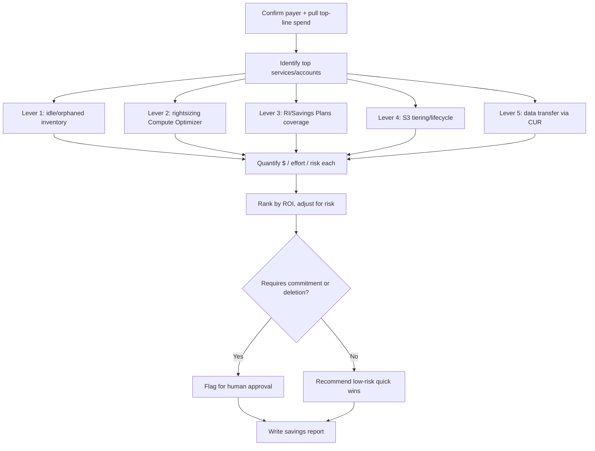
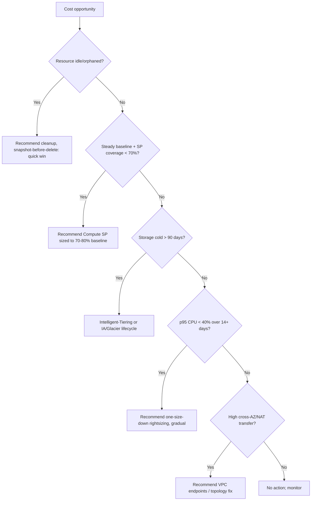

# AWS Cost Optimization

> A FinOps operational playbook for autonomous agents to analyze AWS spend via Cost Explorer, CUR, and Compute Optimizer, then produce a prioritized, evidence-backed savings plan across rightsizing, commitment discounts, storage tiering, and idle-resource elimination.

## Objective

Identify and quantify AWS cost-savings opportunities across five levers —
EC2/RDS rightsizing, Reserved Instances (RIs) and Savings Plans coverage,
S3 storage tiering and lifecycle, idle/orphaned resource elimination, and data
transfer waste — and deliver a ranked remediation plan with estimated monthly
savings, effort, and risk. "Done" means all Success Criteria are checked and a
report is committed. This runbook recommends; it does not purchase or delete.

## Business Context

Cloud spend is one of the largest controllable operating expenses. Unmanaged AWS
accounts routinely carry 20–35% waste: over-provisioned instances, low
commitment-discount coverage paying full on-demand rates, cold data sitting in
S3 Standard, and forgotten resources (unattached EBS volumes, idle NAT
gateways, unassociated Elastic IPs, stopped-but-billed instances). A disciplined
FinOps review converts that waste into margin without touching reliability. For
a $500K/month AWS bill, capturing even 20% is $1.2M/year — a material P&L impact
that funds headcount and product investment. The FinOps Foundation framework
(Inform → Optimize → Operate) grounds this work.

## Problem Statement

Spend grows faster than utilization: teams launch generously sized instances "to
be safe," commitment coverage lapses as workloads change, lifecycle policies are
never set, and decommissioned projects leave billing tails. Symptoms: EC2
average CPU < 10%, Savings Plans coverage < 60%, S3 Standard holding objects not
touched in 90+ days, and a long tail of unattached volumes and idle load
balancers. This runbook detects, quantifies, and ranks these. **Out of scope:**
executing purchases (RI/SP commitments), deleting resources, and application
refactoring — those require human approval and separate change control.

## Success Criteria

- [ ] Top 10 services and top 10 linked accounts by cost are identified with month-over-month trend.
- [ ] EC2/RDS rightsizing recommendations are pulled from Compute Optimizer with estimated savings.
- [ ] Current RI/Savings Plans coverage and utilization are quantified with a recommended commitment.
- [ ] S3 tiering/lifecycle opportunities are quantified (Standard → IA/Glacier/Intelligent-Tiering).
- [ ] Idle/orphaned resources (unattached EBS, idle NAT/ELB, unassociated EIP, old snapshots) are inventoried with cost.
- [ ] Each opportunity has estimated monthly savings, effort, and risk.
- [ ] A ranked savings table (P0–P3 by ROI) is delivered in the report template.
- [ ] No purchase, deletion, or resize was executed.

## Trigger Conditions

- Schedule: monthly FinOps review; quarterly commitment planning.
- Alert: AWS Budgets threshold breach or anomaly detection (Cost Anomaly Detection).
- Manual: pre-renewal of Savings Plans, or executive cost-reduction mandate.
- Event: a linked account's spend jumps > 20% month over month.

## Inputs Required

| Input | Description | Example | Required |
|-------|-------------|---------|----------|
| `payer_account_id` | Management/payer account | `111122223333` | Yes |
| `analysis_window` | Lookback period | `last-90-days` | Yes |
| `aws_profile` | Read-only credentials profile | `finops-ro` | Yes |
| `regions` | Regions in scope | `us-east-1,eu-west-1` | No |
| `savings_target` | Optional reduction goal | `20%` | No |
| `cur_athena_db` | CUR Athena database | `athena_cur` | No |

## Required Access

| Scope | Purpose | Read/Write | Sensitivity |
|-------|---------|-----------|-------------|
| Cost Explorer (`ce:Get*`) | Cost/usage, RI/SP coverage & recommendations | Read | Medium |
| Compute Optimizer (`compute-optimizer:Get*`) | Rightsizing recommendations | Read | Low |
| `ec2:Describe*`, `rds:Describe*`, `s3:List*`/`GetBucket*` | Resource inventory & utilization | Read | Low |
| Athena/S3 read on CUR | Granular line-item analysis | Read | Medium |
| CloudWatch `GetMetric*` | Utilization metrics for idle detection | Read | Low |

## Assumptions

- Cost Explorer and Compute Optimizer are enabled on the payer account (14+ days of data).
- The `finops-ro` profile can read across linked accounts via an org role.
- CUR is delivered to S3 and queryable via Athena (for granular analysis).
- CloudWatch retains at least 14 days of metrics for utilization judgments.
- If Cost Explorer/Compute Optimizer are not enabled, the agent escalates to have them turned on first.

## Risks

| Risk | Likelihood | Impact | Mitigation |
|------|-----------|--------|------------|
| Rightsizing a spiky workload causes throttling | Medium | High | Use p95/max over 14+ days, not average; recommend gradual step-down |
| Over-committing Savings Plans locks in spend | Medium | High | Recommend conservative coverage (70–80%) at compute SP, not EC2-instance SP |
| Deleting a "orphaned" volume that is a backup | Low | High | Recommend snapshot-before-delete; never auto-delete |
| Lifecycle move breaks a low-latency read path | Low | Medium | Verify access patterns before Glacier; prefer Intelligent-Tiering |

## Constraints

- Read-only: no `purchase-*`, no `delete-*`, no `modify-instance-type`.
- All commitment recommendations require human approval before purchase.
- Respect data-retention/compliance policies before recommending deletion or archival.
- Keep Cost Explorer API usage within paid-request budget (each request costs $0.01).

## Agent Persona

Adopt the persona of a **Principal FinOps Engineer** fluent in the FinOps
Foundation framework, AWS pricing models, and the reliability trade-offs of
each lever. Always pair a savings figure with a risk and an effort estimate.
Never recommend a change that trades meaningful reliability for marginal
savings. Prefer reversible, low-risk wins first (idle cleanup, Intelligent-
Tiering, compute Savings Plans) over risky ones (aggressive rightsizing).
Follow [`docs/AI_AGENT_STANDARDS.md`](../../docs/AI_AGENT_STANDARDS.md). Quantify
everything in dollars per month.

## Planning Instructions

1. Confirm caller identity is the payer account; echo `analysis_window` and regions.
2. Pull top-line spend by service/account/trend to focus effort where the money is.
3. Sequence the five levers by expected ROI and risk (idle first, rightsizing last).
4. Decide data source per lever: Cost Explorer for coverage, Compute Optimizer for rightsizing, CUR/Athena for granular, CloudWatch for idle.
5. Externalize the plan and, when HITL is required, wait for approval before deep analysis.
6. Define the ROI ranking rubric ($/month saved ÷ effort, adjusted for risk).

## Execution Instructions

```bash
# 0. Confirm payer + top-line spend by service (last 90 days, monthly)
aws sts get-caller-identity --profile "$P"
aws ce get-cost-and-usage --profile "$P" \
  --time-period Start=2026-05-13,End=2026-08-13 --granularity MONTHLY \
  --metrics UnblendedCost \
  --group-by Type=DIMENSION,Key=SERVICE \
  --query 'ResultsByTime[-1].Groups[].{svc:Keys[0],amt:Metrics.UnblendedCost.Amount}' \
  --output table

# 1. Rightsizing (EC2) via Compute Optimizer
aws compute-optimizer get-ec2-instance-recommendations --profile "$P" \
  --query 'instanceRecommendations[?finding==`OVER_PROVISIONED`].{id:instanceArn,
    current:currentInstanceType,
    rec:recommendationOptions[0].instanceType,
    savings:recommendationOptions[0].savingsOpportunity.estimatedMonthlySavings.value}' \
  --output table

# 2. Savings Plans coverage + recommendation
aws ce get-savings-plans-coverage --profile "$P" \
  --time-period Start=2026-07-13,End=2026-08-13 \
  --query 'SavingsPlansCoverages[0].Coverage'
aws ce get-savings-plans-purchase-recommendation --profile "$P" \
  --savings-plans-type COMPUTE_SP --term-in-years ONE_YEAR \
  --payment-option NO_UPFRONT --lookback-period-in-days SIXTY_DAYS \
  --query 'SavingsPlansPurchaseRecommendation.SavingsPlansPurchaseRecommendationSummary'

# 3. S3 tiering: buckets + storage class distribution (via CUR/Athena or metrics)
aws s3api list-buckets --profile "$P" --query 'Buckets[].Name'
aws cloudwatch get-metric-statistics --profile "$P" --namespace AWS/S3 \
  --metric-name BucketSizeBytes --start-time 2026-08-06T00:00:00Z \
  --end-time 2026-08-13T00:00:00Z --period 86400 --statistics Average \
  --dimensions Name=BucketName,Value=my-bucket Name=StorageType,Value=StandardStorage

# 4. Idle / orphaned resources
aws ec2 describe-volumes --profile "$P" --filters Name=status,Values=available \
  --query 'Volumes[].{id:VolumeId,gb:Size,az:AvailabilityZone}' --output table
aws ec2 describe-addresses --profile "$P" \
  --query 'Addresses[?AssociationId==null].[PublicIp,AllocationId]' --output table
aws ec2 describe-nat-gateways --profile "$P" \
  --filter Name=state,Values=available --query 'NatGateways[].NatGatewayId'

# 5. Granular waste via CUR in Athena (data transfer, per-resource)
# SELECT line_item_product_code, sum(line_item_unblended_cost) cost
# FROM athena_cur.cur WHERE line_item_usage_type LIKE '%DataTransfer%'
# GROUP BY 1 ORDER BY 2 DESC LIMIT 20;
```

## Investigation Workflow



## Analysis Framework

Rank opportunities by risk-adjusted ROI = estimated monthly savings ÷ effort,
discounted by reliability risk. Sequence and thresholds:

- **Idle/orphaned (lowest risk):** unattached EBS ($0.08/GB-mo gp3), idle NAT
  ($0.045/hr ≈ $32/mo + data), unassociated EIP ($3.6/mo each), stopped
  instances still holding EBS, snapshots older than retention policy. Recommend
  first; near-zero reliability risk with snapshot-before-delete.
- **Storage tiering:** objects not accessed in 90+ days → S3 Intelligent-Tiering
  (auto, safe) or explicit IA/Glacier lifecycle for known-cold prefixes.
- **Commitment discounts:** if on-demand spend on steady baseline is high and
  Savings Plans coverage < 70%, recommend a 1-year No-Upfront Compute Savings
  Plan sized to 70–80% of the stable baseline (never 100% — leave headroom).
- **Rightsizing (highest care):** only when p95 CPU < 40% and p95 memory < 50%
  over 14+ days; recommend one size down, gradual, with rollback.
- **Data transfer:** cross-AZ/cross-region and NAT egress; often fixed by
  VPC endpoints or architecture, higher effort.

Avoid over-committing and avoid rightsizing on averages (spiky workloads spike).

## Decision Tree



## Validation Steps

- [ ] Reconcile the sum of top-service costs against the total bill for the window.
- [ ] Confirm rightsizing recommendations use p95/max, not average, utilization.
- [ ] Verify each "idle" resource truly has zero traffic/attachment over the window.
- [ ] Confirm no purchase/delete/modify command was executed.
- [ ] Sanity-check total estimated savings against the `savings_target` if provided.

## Expected Outputs

- Top-10 service/account spend tables with trend.
- Rightsizing candidate list with current → recommended type and $ savings.
- Savings Plans coverage gap and a sized commitment recommendation.
- S3 tiering opportunity with estimated $ savings.
- Idle/orphaned inventory with monthly cost.
- Ranked savings table by risk-adjusted ROI.

## Deliverables

A report following
[`templates/report-template.md`](../../templates/report-template.md), including
the spend breakdown, the ranked savings table with $/effort/risk per line, and
an action plan separating "safe now" (cleanup, Intelligent-Tiering) from
"requires approval" (commitments, rightsizing). Attach the CUR/Athena queries
used so figures are reproducible.

## Escalation Process

- **Commitment purchases (Savings Plans/RIs):** route to FinOps lead + finance
  for approval; include break-even and downside analysis.
- **Deletions:** route to the owning team; require explicit sign-off and a
  snapshot/backup step.
- **Anomalies (sudden spike):** if a spike indicates possible compromise (e.g.
  crypto-mining), escalate to security immediately, not just FinOps.
- Include account, service, resource, evidence, $ impact, and recommended action.

## Rollback Strategy

Read-only analysis has nothing to roll back. For downstream actions taken by
humans: rightsizing rolls back by modifying the instance type back to the prior
size (brief restart); Savings Plans cannot be cancelled — hence conservative
sizing; deleted resources roll back from the pre-deletion snapshot; lifecycle
transitions roll back by restoring objects from Glacier and updating the policy.
Confirm rollback by re-checking utilization/availability metrics.

## Post-Execution Review

- Which savings were realized vs. estimated (accuracy of the model)?
- Can idle-resource cleanup be automated with guardrails (tag-based reaper)?
- Should Intelligent-Tiering be the default on new buckets via policy?
- Is commitment coverage now on a managed cadence tied to renewals?

## Metrics

| Metric | Definition | Target |
|--------|-----------|--------|
| Identified savings | $/month of ranked opportunities | Maximize |
| Realized savings | $/month actually captured post-action | > 80% of identified |
| SP/RI coverage | % of eligible compute on commitments | 70–80% |
| SP/RI utilization | % of purchased commitment used | > 95% |
| Waste ratio | Idle+over-provisioned $ ÷ total spend | < 10% |
| Analysis duration | Wall-clock to complete | < 4h |

## Example Execution

**Inputs:** `payer_account_id=111122223333`, `analysis_window=last-90-days`,
`aws_profile=finops-ro`, `savings_target=20%`. Total bill ≈ $480K/month.

**Agent reasoning (abridged):** top services: EC2 $210K, RDS $61K, S3 $44K, data
transfer $33K. Compute Optimizer flags 140 over-provisioned EC2 instances →
$38K/mo if right-sized (recommend gradual). Compute SP coverage is 41%; a
1-year No-Upfront Compute SP sized to 75% of the $150K steady baseline saves
~$27K/mo net. S3: 380 TB in Standard untouched 90+ days → Intelligent-Tiering
saves ~$9K/mo. Idle: 62 unattached gp3 volumes (18 TB, $1.4K/mo), 4 idle NAT
gateways ($130/mo + transfer), 23 unassociated EIPs ($83/mo). Total identified
≈ $75K/mo (~16%); with data-transfer VPC-endpoint fixes, approaches the 20%
target.

**Sample report excerpt:**

```text
R1 (safe now) — Delete 62 unattached gp3 volumes after snapshot. Savings ~$1,400/mo.
  Effort S; risk Low. Evidence: describe-volumes status=available, 0 attachments 90d.

R2 (approval) — Purchase 1yr No-Upfront Compute Savings Plan @ $/hr covering 75%
  of baseline. Net savings ~$27,000/mo. Effort S; risk Medium (commitment).
  Evidence: SP coverage 41%; on-demand baseline $150K/mo steady 60d.

R3 (safe now) — Enable S3 Intelligent-Tiering on 3 cold buckets (380 TB).
  Savings ~$9,000/mo. Effort S; risk Low. Evidence: 0 GET on prefixes 90d.
```

## References

- [`docs/AI_AGENT_STANDARDS.md`](../../docs/AI_AGENT_STANDARDS.md)
- [`templates/report-template.md`](../../templates/report-template.md)
- [EKS Audit runbook](../kubernetes/eks-audit.md)
- [Azure Cost Optimization](./azure-cost-optimization.md), [GCP Cost Optimization](./gcp-cost-optimization.md)
- AWS Cost Explorer, Compute Optimizer, CUR docs; FinOps Foundation framework
