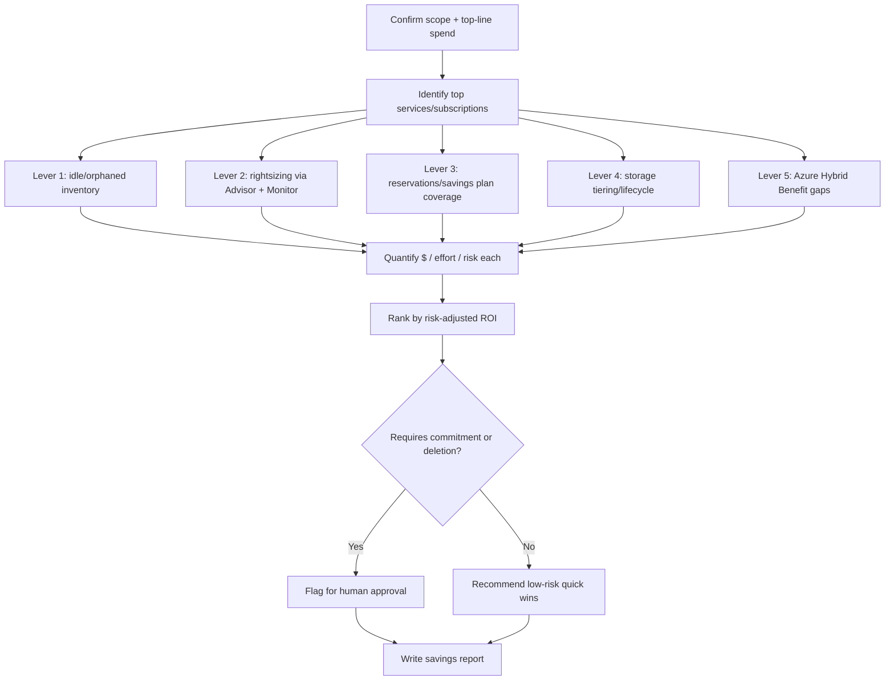
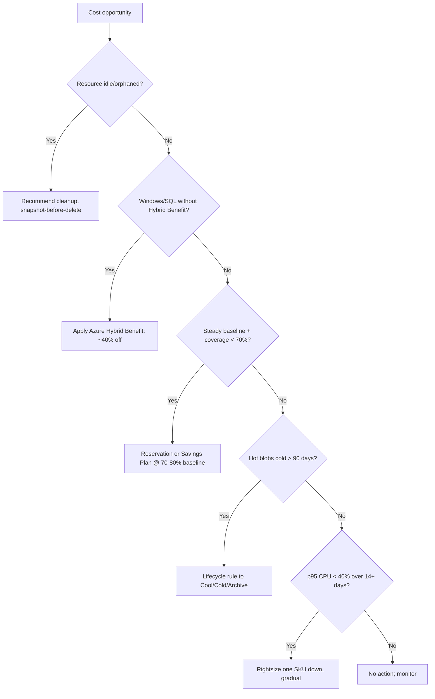

# Azure Cost Optimization

> A FinOps operational playbook for autonomous agents to analyze Azure spend via Cost Management, Advisor, and Monitor, then produce a prioritized, evidence-backed savings plan across rightsizing, reservations/savings plans, storage tiering, and idle-resource elimination.

## Objective

Identify and quantify Azure cost-savings opportunities across five levers —
VM/managed-disk rightsizing, Azure Reservations and Savings Plans for compute,
storage tiering and lifecycle, idle/orphaned resource elimination, and
license optimization (Azure Hybrid Benefit) — and deliver a ranked remediation
plan with estimated monthly savings, effort, and risk. "Done" means all Success
Criteria are checked and a report is committed. This runbook recommends; it does
not purchase or delete.

## Business Context

Azure spend is a major controllable OpEx line. Enterprise Agreement and
pay-as-you-go subscriptions typically carry 20–30% waste: oversized VMs,
low reservation/savings-plan coverage, hot-tier blobs that are actually cold,
unattached managed disks and public IPs, and Windows/SQL licenses paying retail
instead of using Azure Hybrid Benefit. A structured FinOps review, aligned to
the Microsoft Cloud Adoption Framework's cost pillar and the FinOps Foundation,
converts waste to margin without harming reliability. On a $400K/month Azure
bill, 20% savings is nearly $1M/year of recovered budget.

## Problem Statement

Spend outpaces utilization: teams pick VM sizes defensively, reservation
coverage erodes as workloads shift, lifecycle management policies are never set
on storage accounts, and decommissioned resources leave a billing tail.
Symptoms: VM average CPU < 10%, reservation coverage < 60%, hot-tier blobs not
read in 90+ days, unattached disks and orphaned public IPs, and SQL/Windows
workloads not using Hybrid Benefit. This runbook detects, quantifies, and ranks
these. **Out of scope:** purchasing reservations/savings plans, deleting
resources, and application refactoring — all require human approval.

## Success Criteria

- [ ] Top cost drivers by service and subscription/resource group are identified with trend.
- [ ] VM/disk rightsizing recommendations are pulled from Azure Advisor with estimated savings.
- [ ] Reservation and Savings Plan coverage/utilization are quantified with a recommended commitment.
- [ ] Storage tiering opportunities (Hot → Cool/Cold/Archive) are quantified.
- [ ] Idle/orphaned resources (unattached disks, orphaned public IPs, empty App Service plans, idle load balancers) are inventoried with cost.
- [ ] Azure Hybrid Benefit eligibility gaps are identified with savings.
- [ ] A ranked savings table (P0–P3 by ROI) is delivered in the report template.
- [ ] No purchase, deletion, or resize was executed.

## Trigger Conditions

- Schedule: monthly FinOps review; quarterly reservation planning.
- Alert: Cost Management budget threshold breach or anomaly alert.
- Manual: pre-renewal of reservations or an executive cost mandate.
- Event: a subscription's spend jumps > 20% month over month.

## Inputs Required

| Input | Description | Example | Required |
|-------|-------------|---------|----------|
| `billing_scope` | Billing account / EA / MCA scope | `/providers/Microsoft.Billing/...` | Yes |
| `subscription_ids` | Subscriptions in scope | `sub-a,sub-b` | Yes |
| `analysis_window` | Lookback period | `last-90-days` | Yes |
| `tenant_id` | Entra tenant | `00000000-...` | Yes |
| `savings_target` | Optional reduction goal | `20%` | No |

## Required Access

| Scope | Purpose | Read/Write | Sensitivity |
|-------|---------|-----------|-------------|
| Cost Management Reader | Cost/usage queries, forecasts | Read | Medium |
| Advisor read (`Microsoft.Advisor/*/read`) | Rightsizing & reservation recs | Read | Low |
| Azure `Reader` on subscriptions | Resource inventory | Read | Medium |
| Azure Monitor read | VM/disk utilization metrics | Read | Low |
| Reservations read | Coverage & utilization reports | Read | Low |

## Assumptions

- Cost Management is enabled and the principal has Cost Management Reader at billing scope.
- Azure Advisor has enough history (7+ days) to produce recommendations.
- Azure Monitor retains sufficient metric history for utilization judgments.
- The agent can run `az` CLI (with `costmanagement` / `advisor` extensions).
- If Advisor or Cost Management access is missing, the agent escalates to enable it first.

## Risks

| Risk | Likelihood | Impact | Mitigation |
|------|-----------|--------|------------|
| Rightsizing a bursty VM causes throttling | Medium | High | Use p95/max over 14+ days; recommend one SKU down, gradual |
| Over-committing reservations locks spend | Medium | High | Size to 70–80% of stable baseline; prefer 1-year, shared scope |
| Deleting a disk that is a detached backup | Low | High | Snapshot-before-delete; never auto-delete |
| Archive tier rehydration latency surprises | Low | Medium | Prefer Cool/Cold for semi-cold; Archive only for truly cold |

## Constraints

- Read-only: no `az reservations` purchase, no `az resource delete`, no `az vm resize`.
- Commitment recommendations require human approval before purchase.
- Respect data-retention/compliance before recommending deletion or archival.
- Keep Cost Management query API within throttling limits (batch queries).

## Agent Persona

Adopt the persona of a **Principal FinOps Engineer** fluent in Azure pricing
(EA/MCA, reservations vs. savings plans, Hybrid Benefit) and the reliability
trade-offs of each lever. Always pair a savings figure with a risk and effort
estimate. Prefer reversible, low-risk wins first (idle cleanup, tiering, savings
plans) over risky rightsizing. Follow
[`docs/AI_AGENT_STANDARDS.md`](../../docs/AI_AGENT_STANDARDS.md). Quantify
everything in dollars per month.

## Planning Instructions

1. Confirm access at `billing_scope`; echo subscriptions and `analysis_window`.
2. Pull top-line cost by service and subscription/RG to focus effort.
3. Sequence the levers by ROI and risk (idle first, rightsizing last).
4. Choose data source per lever: Cost Management for spend/coverage, Advisor for rightsizing/reservation recs, Monitor for utilization.
5. Externalize the plan; when HITL is required, wait for approval before deep analysis.
6. Define the ROI ranking rubric ($/month ÷ effort, adjusted for risk).

## Execution Instructions

```bash
# 0. Confirm scope + top-line spend by service (last 90 days)
az account show -o json | jq '{tenant:.tenantId, sub:.id}'
az costmanagement query --type ActualCost --timeframe Custom \
  --time-period from=2026-05-13 to=2026-08-13 \
  --scope "/subscriptions/$SUB" \
  --dataset-aggregation '{"totalCost":{"name":"Cost","function":"Sum"}}' \
  --dataset-grouping name=ServiceName type=Dimension -o json

# 1. Advisor cost recommendations (rightsizing + reservations + idle)
az advisor recommendation list --category Cost -o json \
  | jq -r '.[] | "\(.shortDescription.problem)\timpact=\(.impact)\tresource=\(.impactedValue)"'

# 2. Reservation coverage + utilization
az consumption reservation summary list --grain monthly \
  --start-date 2026-07-01 --end-date 2026-08-01 -o table
# Recommendations:
az reservations reservation-order-id list -o json 2>/dev/null | jq 'length'

# 3. Storage tiering: find hot blobs that are cold
az storage account list -o json | jq -r '.[] | "\(.name)\t\(.accessTier)"'
# Blob last-access requires lifecycle mgmt / last-access tracking enabled:
az storage account blob-service-properties show --account-name "$SA" \
  --query 'lastAccessTimeTrackingPolicy'

# 4. Idle / orphaned resources
az disk list --query "[?diskState=='Unattached'].{name:name,gb:diskSizeGb,rg:resourceGroup}" -o table
az network public-ip list --query "[?ipConfiguration==null].{name:name,rg:resourceGroup,sku:sku.name}" -o table
az network lb list --query "[?length(loadBalancingRules)==\`0\`].{name:name,rg:resourceGroup}" -o table

# 5. Azure Hybrid Benefit eligibility (Windows VMs paying retail)
az vm list -o json \
  | jq -r '.[] | select(.storageProfile.osDisk.osType=="Windows")
    | "\(.name)\tAHB=\(.licenseType // "None")"'

# 6. VM utilization for rightsizing (p95 CPU over 14 days)
az monitor metrics list --resource "$VM_ID" --metric "Percentage CPU" \
  --interval PT1H --aggregation Average --start-time 2026-07-30T00:00:00Z -o json
```

## Investigation Workflow



## Analysis Framework

Rank by risk-adjusted ROI = monthly savings ÷ effort, discounted by reliability
risk. Sequence and thresholds:

- **Idle/orphaned (lowest risk):** unattached managed disks (billed per GB by
  tier), orphaned Standard public IPs (~$3–4/mo each), empty App Service plans,
  load balancers with no rules, and stopped-but-not-deallocated VMs (still
  billing compute). Recommend first with snapshot-before-delete.
- **Storage tiering:** enable last-access tracking; move Hot blobs unread 90+
  days to Cool/Cold, and truly cold archival data to Archive with lifecycle
  management rules.
- **Commitment discounts:** if steady baseline is high and reservation/savings-
  plan coverage < 70%, recommend a 1-year reservation (specific SKU, stable
  workloads) or an Azure Savings Plan for Compute (flexible) sized to 70–80% of
  baseline, shared scope.
- **Rightsizing (highest care):** only when p95 CPU < 40% and memory headroom is
  ample over 14+ days; recommend one SKU down (or a newer, cheaper family like
  Dpsv5), gradual, with rollback.
- **Azure Hybrid Benefit:** apply existing Windows Server/SQL licenses to
  eligible VMs and SQL — often 40%+ compute savings, zero reliability risk.

Avoid over-committing and never rightsize on averages.

## Decision Tree



## Validation Steps

- [ ] Reconcile top-service costs against total spend for the window.
- [ ] Confirm rightsizing uses p95/max, not average, utilization.
- [ ] Verify each "idle" resource has no attachment/traffic over the window.
- [ ] Confirm no purchase/delete/resize command was executed.
- [ ] Check that Hybrid Benefit candidates actually have available licenses.

## Expected Outputs

- Top cost driver tables by service and subscription with trend.
- Rightsizing candidate list with current → recommended SKU and $ savings.
- Reservation/savings-plan coverage gap and sized commitment recommendation.
- Storage tiering opportunity with estimated $ savings.
- Idle/orphaned inventory and Hybrid Benefit gaps with monthly cost.
- Ranked savings table by risk-adjusted ROI.

## Deliverables

A report following
[`templates/report-template.md`](../../templates/report-template.md), including
the spend breakdown, the ranked savings table with $/effort/risk per line, and
an action plan separating "safe now" (cleanup, tiering, Hybrid Benefit) from
"requires approval" (reservations, rightsizing). Include the Cost Management
queries so figures are reproducible.

## Escalation Process

- **Commitment purchases (reservations/savings plans):** route to FinOps lead +
  finance with break-even and downside analysis.
- **Deletions:** route to the owning team; require sign-off and a snapshot step.
- **Anomalies (sudden spike):** if it suggests compromise, escalate to security
  immediately, not just FinOps.
- Include subscription, resource group, resource, evidence, $ impact, and action.

## Rollback Strategy

Read-only analysis has nothing to roll back. Downstream: rightsizing rolls back
by resizing to the prior SKU (brief restart); reservations/savings plans cannot
be cancelled — hence conservative sizing; deleted resources restore from the
pre-deletion snapshot; Hybrid Benefit toggles off instantly; archive
transitions roll back by rehydrating blobs and updating the lifecycle rule.
Confirm via utilization/availability metrics.

## Post-Execution Review

- Realized vs. estimated savings (model accuracy)?
- Can idle cleanup be automated with a tag-based reaper and guardrails?
- Should lifecycle management and last-access tracking be default on new storage accounts?
- Is Hybrid Benefit applied automatically to all eligible new VMs via policy?

## Metrics

| Metric | Definition | Target |
|--------|-----------|--------|
| Identified savings | $/month of ranked opportunities | Maximize |
| Realized savings | $/month captured post-action | > 80% of identified |
| Commitment coverage | % eligible compute on reservations/SP | 70–80% |
| Commitment utilization | % of purchased commitment used | > 95% |
| Waste ratio | Idle+over-provisioned $ ÷ total spend | < 10% |
| Analysis duration | Wall-clock to complete | < 4h |

## Example Execution

**Inputs:** `subscription_ids=sub-prod,sub-data`, `analysis_window=last-90-days`,
`savings_target=20%`. Total bill ≈ $410K/month.

**Agent reasoning (abridged):** top services: Virtual Machines $180K, Storage
$52K, SQL Database $48K, App Service $30K. Advisor flags 96 underutilized VMs →
$29K/mo if right-sized (gradual, p95 CPU < 20%). Reservation/savings-plan
coverage is 38%; an Azure Savings Plan for Compute sized to 75% of the $120K
baseline saves ~$22K/mo. 140 Windows VMs lack Hybrid Benefit → ~$18K/mo at ~40%
off compute. Storage: 210 TB Hot unread 90+ days → Cool tier saves ~$6K/mo.
Idle: 88 unattached disks ($2.1K/mo), 41 orphaned public IPs ($150/mo), 12
stopped-not-deallocated VMs still billing. Total identified ≈ $77K/mo (~19%).

**Sample report excerpt:**

```text
R1 (safe now) — Apply Azure Hybrid Benefit to 140 eligible Windows VMs.
  Savings ~$18,000/mo. Effort S; risk Low. Evidence: licenseType=None, licenses available.

R2 (approval) — Purchase Azure Savings Plan for Compute (1yr, shared) covering
  75% of baseline. Net savings ~$22,000/mo. Effort S; risk Medium.
  Evidence: coverage 38%; steady $120K/mo baseline over 60d.

R3 (safe now) — Delete 88 unattached managed disks after snapshot. Savings ~$2,100/mo.
  Effort S; risk Low. Evidence: diskState=Unattached across sub-prod/sub-data.
```

## References

- [`docs/AI_AGENT_STANDARDS.md`](../../docs/AI_AGENT_STANDARDS.md)
- [`templates/report-template.md`](../../templates/report-template.md)
- [AKS Audit runbook](../kubernetes/aks-audit.md)
- [AWS Cost Optimization](./aws-cost-optimization.md), [GCP Cost Optimization](./gcp-cost-optimization.md)
- Azure Cost Management, Advisor, and Azure Hybrid Benefit docs; FinOps Foundation framework
