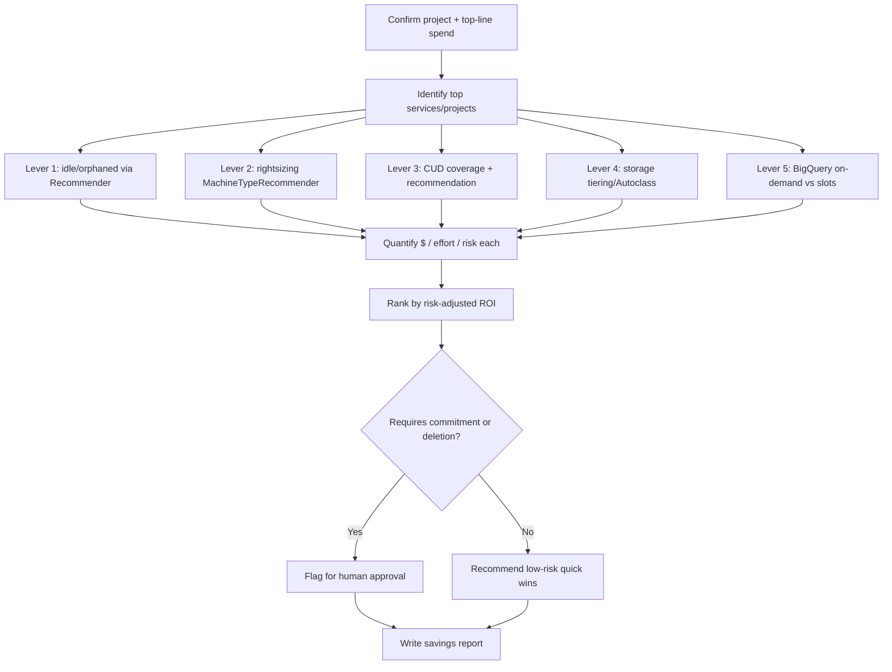
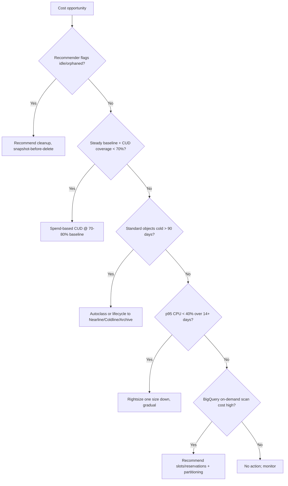

# GCP Cost Optimization

> A FinOps operational playbook for autonomous agents to analyze Google Cloud spend via Cloud Billing, BigQuery billing export, and the Recommender API, then produce a prioritized, evidence-backed savings plan across rightsizing, committed use discounts, storage tiering, and idle-resource elimination.

## Objective

Identify and quantify Google Cloud cost-savings opportunities across five
levers — Compute Engine/GKE rightsizing, Committed Use Discounts (CUDs) and
Sustained Use Discounts, Cloud Storage tiering and lifecycle, idle/orphaned
resource elimination, and BigQuery/data-processing efficiency — and deliver a
ranked remediation plan with estimated monthly savings, effort, and risk.
"Done" means all Success Criteria are checked and a report is committed. This
runbook recommends; it does not purchase or delete.

## Business Context

Google Cloud spend is a significant controllable OpEx line. Projects and folders
typically carry 20–30% waste: oversized VMs, low CUD coverage paying on-demand
after Sustained Use Discounts, Standard-class buckets holding cold objects,
orphaned persistent disks and unused static IPs, and BigQuery on-demand queries
that would be cheaper on capacity slots. A structured FinOps review, aligned to
the Google Cloud Architecture Framework's cost pillar and the FinOps Foundation,
converts waste to margin without harming reliability. On a $350K/month GCP bill,
20% savings is $840K/year of recovered budget that funds product work.

## Problem Statement

Spend outpaces utilization: teams pick large machine types defensively, CUD
coverage lapses as workloads change, lifecycle rules are never set on buckets,
decommissioned resources leave a billing tail, and analysts run repeated
on-demand BigQuery scans. Symptoms: VM average CPU < 10%, CUD coverage < 60%,
Standard-class objects unread 90+ days, orphaned disks and reserved-but-unused
static IPs, and BigQuery bytes-scanned costs dominating analytics spend. This
runbook detects, quantifies, and ranks these. **Out of scope:** purchasing CUDs,
deleting resources, and query/application refactoring — all require human
approval.

## Success Criteria

- [ ] Top cost drivers by service and project/folder are identified with trend (via BigQuery billing export).
- [ ] VM/GKE rightsizing recommendations are pulled from the Recommender API with estimated savings.
- [ ] CUD coverage/utilization is quantified with a recommended commitment (spend-based or resource-based).
- [ ] Cloud Storage tiering opportunities (Standard → Nearline/Coldline/Archive) are quantified.
- [ ] Idle/orphaned resources (unattached disks, unused static IPs, idle VMs, old snapshots/images) are inventoried with cost.
- [ ] BigQuery efficiency (on-demand vs. capacity slots, bytes scanned) is assessed.
- [ ] A ranked savings table (P0–P3 by ROI) is delivered in the report template.
- [ ] No purchase, deletion, or resize was executed.

## Trigger Conditions

- Schedule: monthly FinOps review; quarterly CUD planning.
- Alert: Cloud Billing budget threshold breach or anomaly.
- Manual: pre-renewal of CUDs or an executive cost mandate.
- Event: a project's spend jumps > 20% month over month.

## Inputs Required

| Input | Description | Example | Required |
|-------|-------------|---------|----------|
| `billing_account_id` | Cloud Billing account | `01ABCD-234567-89EFGH` | Yes |
| `project_ids` | Projects in scope (or `all`) | `acme-prod,acme-data` | Yes |
| `analysis_window` | Lookback period | `last-90-days` | Yes |
| `billing_export_dataset` | BigQuery billing export | `billing.gcp_billing_export_v1` | Yes |
| `savings_target` | Optional reduction goal | `20%` | No |

## Required Access

| Scope | Purpose | Read/Write | Sensitivity |
|-------|---------|-----------|-------------|
| `roles/billing.viewer` | Billing account cost data | Read | Medium |
| `roles/bigquery.dataViewer` on export | Granular cost line items | Read | Medium |
| `roles/recommender.viewer` | Rightsizing/CUD/idle recommendations | Read | Low |
| `roles/compute.viewer` | Resource inventory | Read | Low |
| `roles/monitoring.viewer` | VM/disk utilization metrics | Read | Low |

## Assumptions

- BigQuery billing export (standard usage cost) is enabled with 90+ days of history.
- The Recommender API is enabled on the projects in scope.
- Cloud Monitoring retains sufficient metric history for utilization judgments.
- The agent can run `gcloud` and `bq` as a billing/recommender viewer.
- If billing export or Recommender is not enabled, the agent escalates to enable it first.

## Risks

| Risk | Likelihood | Impact | Mitigation |
|------|-----------|--------|------------|
| Rightsizing a bursty VM causes throttling | Medium | High | Use p95/max over 14+ days; recommend one size down, gradual |
| Over-committing CUDs locks spend | Medium | High | Size to 70–80% of stable baseline; prefer flexible spend-based CUDs |
| Deleting a disk that is a detached backup | Low | High | Snapshot-before-delete; never auto-delete |
| Archive-class retrieval cost/latency surprise | Low | Medium | Prefer Nearline/Coldline for semi-cold; Archive only for truly cold |

## Constraints

- Read-only: no `gcloud compute commitments create`, no `gcloud ... delete`, no `set-machine-type`.
- CUD purchases require human approval before commitment.
- Respect data-retention/compliance before recommending deletion or archival.
- Keep BigQuery billing-export query bytes small (partition filters) to avoid meta-cost.

## Agent Persona

Adopt the persona of a **Principal FinOps Engineer** fluent in GCP pricing
(Sustained Use Discounts, resource-based vs. spend-based CUDs, per-second
billing) and the reliability trade-offs of each lever. Always pair a savings
figure with a risk and effort estimate. Prefer reversible, low-risk wins first
(idle cleanup, storage lifecycle, spend-based CUDs) over risky rightsizing.
Follow [`docs/AI_AGENT_STANDARDS.md`](../../docs/AI_AGENT_STANDARDS.md). Quantify
everything in dollars per month.

## Planning Instructions

1. Confirm billing viewer access; echo `project_ids` and `analysis_window`.
2. Query the BigQuery billing export for top spend by service and project.
3. Sequence the levers by ROI and risk (idle first, rightsizing last).
4. Choose data source per lever: billing export for spend, Recommender for rightsizing/CUD/idle, Monitoring for utilization.
5. Externalize the plan; when HITL is required, wait for approval before deep analysis.
6. Define the ROI ranking rubric ($/month ÷ effort, adjusted for risk).

## Execution Instructions

```bash
# 0. Confirm project + top-line spend by service (BigQuery billing export)
gcloud config get-value project
bq query --use_legacy_sql=false '
  SELECT service.description AS svc, ROUND(SUM(cost),2) AS cost
  FROM `billing.gcp_billing_export_v1`
  WHERE _PARTITIONTIME >= TIMESTAMP("2026-05-13")
  GROUP BY svc ORDER BY cost DESC LIMIT 10'

# 1. Rightsizing recommendations (Compute Engine)
gcloud recommender recommendations list \
  --project="$PROJECT" --location=us-central1-a \
  --recommender=google.compute.instance.MachineTypeRecommender \
  --format="table(description, primaryImpact.costProjection.cost.units)"

# 2. Committed Use Discount recommendations + current coverage
gcloud recommender recommendations list \
  --project="$PROJECT" --location=global \
  --recommender=google.compute.commitment.UsageCommitmentRecommender \
  --format="table(description, primaryImpact.costProjection.cost.units)"
gcloud compute commitments list --format="table(name,region,plan,status,resources)"

# 3. Storage tiering: bucket classes + lifecycle
gsutil ls -L -b gs://my-bucket | grep -E "Storage class|Lifecycle"
# Objects not read recently require Autoclass or lifecycle age rules:
gsutil autoclass get gs://my-bucket 2>/dev/null

# 4. Idle / orphaned resources (Recommender + inventory)
gcloud recommender recommendations list --project="$PROJECT" --location=us-central1-a \
  --recommender=google.compute.disk.IdleResourceRecommender --format=table
gcloud compute disks list --filter="-users:*" \
  --format="table(name,sizeGb,zone,type)"                 # unattached
gcloud compute addresses list --filter="status=RESERVED AND -users:*" \
  --format="table(name,address,region)"                   # unused static IPs
gcloud recommender recommendations list --project="$PROJECT" --location=us-central1-a \
  --recommender=google.compute.instance.IdleResourceRecommender --format=table

# 5. BigQuery efficiency (on-demand bytes scanned vs. slots)
bq query --use_legacy_sql=false '
  SELECT user_email, ROUND(SUM(total_bytes_billed)/POW(2,40),2) AS tib_billed
  FROM `region-us`.INFORMATION_SCHEMA.JOBS_BY_PROJECT
  WHERE creation_time >= TIMESTAMP_SUB(CURRENT_TIMESTAMP(), INTERVAL 30 DAY)
  GROUP BY user_email ORDER BY tib_billed DESC LIMIT 10'
```

## Investigation Workflow



## Analysis Framework

Rank by risk-adjusted ROI = monthly savings ÷ effort, discounted by reliability
risk. Sequence and thresholds:

- **Idle/orphaned (lowest risk):** the IdleResourceRecommender flags idle VMs,
  unattached persistent disks (billed per GB), reserved-but-unused static IPs
  (~$7.30/mo each), and stale snapshots/images. Recommend first with
  snapshot-before-delete.
- **Storage tiering:** enable Autoclass or lifecycle age rules to move Standard
  objects unread 90+ days to Nearline (30-day min), Coldline (90-day), or
  Archive (365-day) — mind minimum storage durations and retrieval fees.
- **Commitment discounts:** GCP applies Sustained Use Discounts automatically;
  beyond that, if steady baseline is high and CUD coverage < 70%, recommend a
  1-year spend-based CUD (flexible across families/regions) or resource-based
  CUD for stable, specific machine types — sized to 70–80% of baseline.
- **Rightsizing (highest care):** the MachineTypeRecommender uses 8 days of
  data; validate against p95 CPU/memory over 14+ days before recommending a
  smaller type or a newer family (e.g. C3/T2D), gradual, with rollback.
- **BigQuery:** if on-demand bytes-scanned cost is high and predictable,
  recommend capacity (editions/slots) or reservations; enforce partitioning and
  clustering to cut bytes scanned.

Avoid over-committing and never rightsize on averages.

## Decision Tree



## Validation Steps

- [ ] Reconcile top-service costs against the billing-export total for the window.
- [ ] Confirm rightsizing uses p95/max, not average, utilization.
- [ ] Verify each "idle" resource has no attachment/traffic over the window.
- [ ] Confirm no commitment/delete/resize command was executed.
- [ ] Sanity-check total estimated savings against `savings_target` if provided.

## Expected Outputs

- Top cost driver tables by service and project with trend.
- Rightsizing candidate list with current → recommended machine type and $ savings.
- CUD coverage gap and a sized commitment recommendation.
- Storage tiering opportunity with estimated $ savings.
- Idle/orphaned inventory and BigQuery efficiency findings with monthly cost.
- Ranked savings table by risk-adjusted ROI.

## Deliverables

A report following
[`templates/report-template.md`](../../templates/report-template.md), including
the spend breakdown, the ranked savings table with $/effort/risk per line, and
an action plan separating "safe now" (cleanup, Autoclass, partitioning) from
"requires approval" (CUDs, rightsizing). Include the BigQuery billing-export
queries so figures are reproducible.

## Escalation Process

- **Commitment purchases (CUDs):** route to FinOps lead + finance with
  break-even and downside analysis.
- **Deletions:** route to the owning team; require sign-off and a snapshot step.
- **Anomalies (sudden spike):** if it suggests compromise (e.g. crypto-mining in
  a compromised project), escalate to security immediately, not just FinOps.
- Include project, resource, evidence, $ impact, and recommended action.

## Rollback Strategy

Read-only analysis has nothing to roll back. Downstream: rightsizing rolls back
by setting the machine type back to the prior size (brief stop/start); CUDs
cannot be cancelled — hence conservative sizing; deleted resources restore from
the pre-deletion snapshot; storage-class transitions roll back by rewriting
objects to the prior class (mind retrieval fees). Confirm via
utilization/availability metrics.

## Post-Execution Review

- Realized vs. estimated savings (model accuracy)?
- Can idle cleanup be automated with a labelled reaper and guardrails?
- Should Autoclass be default on new buckets and partitioning enforced on new BigQuery tables?
- Is CUD coverage on a managed cadence tied to renewals and workload forecasts?

## Metrics

| Metric | Definition | Target |
|--------|-----------|--------|
| Identified savings | $/month of ranked opportunities | Maximize |
| Realized savings | $/month captured post-action | > 80% of identified |
| CUD coverage | % eligible compute on commitments | 70–80% |
| CUD utilization | % of purchased commitment used | > 95% |
| Waste ratio | Idle+over-provisioned $ ÷ total spend | < 10% |
| Analysis duration | Wall-clock to complete | < 4h |

## Example Execution

**Inputs:** `project_ids=acme-prod,acme-data`, `analysis_window=last-90-days`,
`billing_export_dataset=billing.gcp_billing_export_v1`, `savings_target=20%`.
Total bill ≈ $360K/month.

**Agent reasoning (abridged):** top services: Compute Engine $150K, BigQuery
$58K, Cloud Storage $40K, GKE $34K. MachineTypeRecommender flags 74
over-provisioned VMs → $24K/mo (gradual, p95 CPU < 20%). CUD coverage is 44%; a
1-year spend-based CUD sized to 75% of the $100K baseline saves ~$20K/mo.
BigQuery: 3 analysts drive 210 TiB/mo on-demand scans → moving to slots +
partitioning saves ~$12K/mo. Storage: 180 TB Standard unread 90+ days →
Autoclass/Coldline saves ~$5K/mo. Idle: 52 unattached disks ($1.6K/mo), 30
unused static IPs ($219/mo), IdleResourceRecommender flags 9 idle VMs
($3.2K/mo). Total identified ≈ $66K/mo (~18%).

**Sample report excerpt:**

```text
R1 (safe now) — Delete 52 unattached disks + release 30 unused static IPs after snapshot.
  Savings ~$1,819/mo. Effort S; risk Low. Evidence: disks with -users:*, addresses RESERVED unused.

R2 (approval) — Purchase 1yr spend-based CUD covering 75% of $100K baseline.
  Net savings ~$20,000/mo. Effort S; risk Medium. Evidence: CUD coverage 44%, steady baseline 60d.

R3 (safe now) — Enable BigQuery partitioning/clustering + move 3 heavy users to slots.
  Savings ~$12,000/mo. Effort M; risk Low. Evidence: 210 TiB on-demand scans/mo, unpartitioned tables.
```

## References

- [`docs/AI_AGENT_STANDARDS.md`](../../docs/AI_AGENT_STANDARDS.md)
- [`templates/report-template.md`](../../templates/report-template.md)
- [GKE Audit runbook](../kubernetes/gke-audit.md)
- [AWS Cost Optimization](./aws-cost-optimization.md), [Azure Cost Optimization](./azure-cost-optimization.md)
- GCP Cloud Billing, Recommender API, and Cloud Storage classes docs; FinOps Foundation framework
